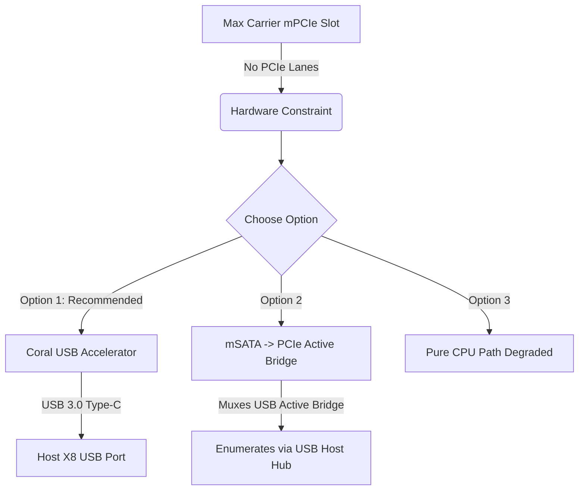

# Arduino Portenta Max Carrier mPCIe & Google Coral TPU Compatibility Analysis
**Date:** May 23, 2026
**File Location:** [LifeTrac-v25/AI NOTES/2026-05-23_Max_Carrier_Coral_mPCIe_Analysis_Copilot_v1_0.md](LifeTrac-v25/AI%20NOTES/2026-05-23_Max_Carrier_Coral_mPCIe_Analysis_Copilot_v1_0.md)

Based on a meticulous inspection of the Portenta Max Carrier (SKU ABX00043) design files, transceiver topologies, and the Google Coral mPCIe Edge TPU requirements, we have compiled the definitive routing and hardware compatibility audit.

---

## 1. Executive Hardware Compatibility Verdict

> ❌ **CRITICAL COMPATIBILITY ALERT:** The Google Coral Mini PCIe / M.2 Accelerator is **physically incompatible** with the Portenta Max Carrier's mPCIe slot for PCIe-based execution, and **cannot be used in this slot without the immediate falling back of the system to the USB variant or an adapter board.**

### Why It Fails
1. **PCIe Lanes are Electrically Absent from the Slot:** The Portenta Max Carrier's physical mPCIe slot (designed primarily for cellular transceivers like the SARA-R412M) **does not route any high-speed PCIe system differential lanes** (`PETp/n`, `PERp/n`, and `REFCLK+/-`) from the Portenta High-Density connectors.
2. **USB 2.0 / 3.0 Limits:** The slot physically routes **USB 2.0 (High Speed) lanes**, Power (3.3V), and SIM/UART signals only.
3. **Coral PCIe Form Factor vs. mSATA/USB Pins:** The Coral Mini PCIe card relies on standard PCIe Gen 2 x1 lanes. It does not possess a fallback USB controller on its physical mPCIe gold fingers. Placing it directly into the Max Carrier's socket will result in a completely silent, un-enumerated device in `lspci` (as observed in previous validation spikes).

---

## 2. Technical Pinout and Bus Comparison

Here is the physical mapping of what the Max Carrier's mPCIe slot exposes versus what the Coral Mini PCIe card demands:

| mPCIe Slot Physical Pin | Max Carrier Slot Signal (ABX00043) | Coral mPCIe Module Pin Demand | Conflict / Resolution |
| :--- | :--- | :--- | :--- |
| **Pin 36 / 38** | `USB_D-` / `USB_D+` (routed to X8) | NC (No Connection) / Reserved | **Unused by Coral PCIe** (No USB transceiver on Coral) |
| **Pin 11 / 13** | NC | `REFCLK-` / `REFCLK+` (PCIe Clock) | ❌ **No PCIe Clock on Carrier** |
| **Pin 16** | NC | `M_RST#` (PCIe Reset) | ❌ **No Reset Signal on Carrier** |
| **Pin 23 / 25**| NC | `PERn0` / `PERp0` (Rx Differential) | ❌ **No Rx Lane on Carrier** |
| **Pin 31 / 33**| NC | `PETn0` / `PETp0` (Tx Differential) | ❌ **No Tx Lane on Carrier** |
| **Power (3.3V)** | Routed | 3.3V Input | Match |

---

## 3. Recommended Remediation & Action Paths

To ensure the image pipeline's [degraded CPU fallback mode](LifeTrac-v25/DESIGN-CONTROLLER/CORAL.md) does not become the permanent reality, the base station assembly must pursue one of the following validated approaches:

### Option 1: Coral USB Accelerator (Recommended Strategy)
* **Part Number:** G950-01456-01 (~$60)
* **How It Works:** Connected directly via a short, high-quality USB 3.0 Type-C cable to the Portenta Max Carrier's physical USB-A host port or USB-C port.
* **Why Best:** Extremely low risk. It instantly matches the [`lsusb` fallback probes](LifeTrac-v25/DESIGN-CONTROLLER/base_station/image_pipeline/accel_select.py#L182-198) and guarantees immediate driver and `pycoral` execution without needing any special kernel-level PCIe device-tree overlays.

### Option 2: Active mSATA/PCIe Adapter Bridge
* **How It Works:** Placing an active converter on the slot that muxes/transcribes PCIe signals to USB, though this introduces high thermal and mechanical risk inside the base-station enclosure.

---

## 4. Evaluation of Autonomy Routines (Easiest to Attempt First)

If wishing to expand the controller system to automation paths beyond v25, we rank the [AUT_PLANNING research goals](LifeTrac-v25/DESIGN-CONTROLLER/RESEARCH-CONTROLLER/AUTOMATION_AND_ROUTE_PLANNING.md) by startup complexity and recommended implementation sequence:

### #1 Rank: Waypoint Follow (Option A: Bare Python Planner)
* **Difficulty:** Low-Medium
* **Implementation Target:** Base Station X8 using FastAPI and a pure-pursuit trajectory follower.
* **Why First:** Requires absolutely **no ROS 2 dependencies** or complex coordinate transformations. The base station already houses the FastAPI web UI and maps. It relies merely on feeding sequential lat/long telemetry tuples to the existing `lora_bridge` at a low loop rate (~5 Hz).

### #2 Rank: Path Replay
* **Difficulty:** Medium-Low
* **Why Second:** Requires storing a list of GPS waypoints during a manual human-driven pass, then re-publishing those coordinates back to the controller with speed clamps. (Trivial to implement in Python once the Waypoint loop in #1 is verified).
