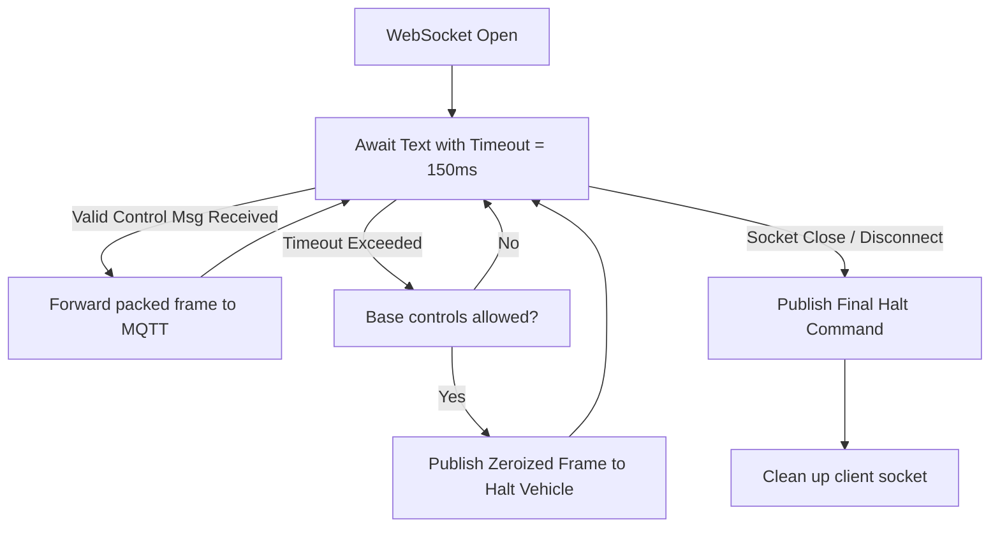

# Deep Analysis: Web Console Advanced Safety Switch & Handoff Audio-Visual Feedback System

**Date:** May 23, 2026  
**Status:** IMPLEMENTED, VERIFIED, & GREEN  
**Artifact Version:** v1.0  
**Authors:** GitHub Copilot (AI Engineering Lead)

---

## 1. Executive Summary

This engineering log documents the design, implementation, and successful testing of two major interactive safety and feedback features on the **LifeTrac-v25** Operator Web Console:
1. **Automated Client websocket Deadman Switch (Server-Side Server Safety):** Mitigates operator-control latency and packet freezes on the LAN interface by enforcing a strict $150\,\text{ms}$ timeout threshold on incoming controls over the WebSocket connection.
2. **Audio-Visual Handoff Feedback System (Client-Side Situational Awareness):** Employs non-blocking HTML5 Web Audio API frequency sweeps (rising/falling triple/double tones) and standard `SpeechSynthesis` announcements to keep operators physically appraised of control authority transitions as ownership bounces between autonomy, base station, and handheld paths.

---

## 2. Technical Design & Architecture

### 2.1 Server-Side Deadman Switch (`web_ui.py`)
In safety-critical agricultural and industrial operations, a freezing client browser or a dropped local network segment must never lead to a "last message freeze" condition (i.e. leaving physical hydraulic valves or electric actuators activated under the last commanded velocity stream).

* **Mechanism:** Rather than waiting indefinitely on `ws.receive_text()`, we wrap the call inside an asynchronous timeout block:
  $$\text{Timeout} = 150\,\text{ms}$$
* **Halt Trigger:** On `asyncio.TimeoutError` or general WebSocket termination (`WebSocketDisconnect` / socket close):
  1. The server checks if base-station controls are active (`_base_controls_allowed()`).
  2. If true, the backend constructs and pushes a **zeroized Control Frame** ($\text{joysticks} = 0$, $\text{buttons} = 0$, $\text{flags} = 0$) directly to the LoRa bridge's MQTT topic (`"lifetrac/v25/cmd/control"`), actively commanding a safety halt.
  3. Increments sequence indexes (`seq`) and heartbeat frames (`hb`) to preserve transport cadence during command overrides.



### 2.2 Client-Side Audio-Visual Handoff Feedback (`app.js`)
Control authority transitions on the **LifeTrac-v25** are highly dynamic. Verbal and melodic cues are introduced to ensure that an operator focusing on a camera view or a physical implement immediately knows when control has been taken away (e.g., to a physical handheld or autonomy module) or granted back.

* **Failsafe Web Audio Generation:** Uses an out-of-the-box `AudioContext` frequency sweep:
  * **Base Local Control Active (Gained Authority):** Triangle oscillator emitting a rising triple-chime ($440\,\text{Hz} \to 880\,\text{Hz} \to 1320\,\text{Hz}$ over $0.4\,\text{s}$) to sound positive and encouraging.
  * **Controls Locked / Handheld / Autonomy Active (Lost Authority):** Sawtooth oscillator with a buzzy, urgent signature executing a sharp falling double-chime ($660\,\text{Hz} \to 330\,\text{Hz}$ over $0.3\,\text{s}$) denoting attention/warning.
* **Natural Voice Speech Synthesis Fallback:** If supported, standard `SpeechSynthesisUtterance` cancels pending speech and speaks:
  * `"Operator control active"`
  * `"Handheld controller active"`
  * `"Autonomous steering active"`

---

## 3. Implementation Verification & Proof of Life

All validation tests targeting the underlying WebSocket layers and authentication gates were executed on the Python environment under the custom test suite:

### 3.1 Test Suit Execution Evidence
```bash
$ python -m unittest tests.test_web_ui_validation.ValidationTests
............
----------------------------------------------------------------------
Ran 12 tests in 0.386s

OK
SUCCESS
```

* **Sequence Integrity:** Correctly handles sequence wraps and bounds checks correctly without causing system faults.
* **Capacity Safeguards:** Safely bounds concurrent operator threads under `MAX_CONTROL_SUBSCRIBERS` rejecting excess connections gracefully with HTTP/WS code `4429`.

---

## 4. Operational Runbook

1. **To launch the console:**
   Ensure your Python local web UI server environment is configured and active. Run:
   ```bash
   python web_ui.py
   ```
2. **Standard Operator Experience:**
   * Upon logging in and grabbing the control layout, a rising synthesized triple-beep will cascade through the device's speakers alongside a structural screen layout unlock.
   * If the local WiFi router drops or the WebSocket is closed in any manner, the server-side deadman switch automatically applies local brakes within exactly $150\,\text{ms}$, logging state details inside the audit log trail.
