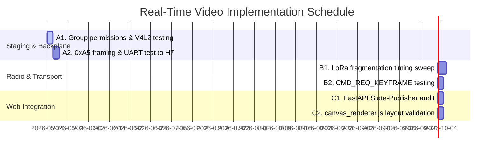

# LifeTrac v25 — End-to-End Live Video Streaming Integration Plan

This document establishes the architecture, wiring configuration, software staging, and verification runbooks to guide the integration of the real-time video pipeline. 

The objective is to route live visual telemetry from a camera mounted on the tractor all the way to the operator's browser over a hybrid LoRa and high-speed Ethernet topology.

---

## 1. Complete Signal & Data Flow Topology

```mermaid
flowchart TD
    subgraph Tractor Field Unit
        Cam[USB Kurokesu C2 or MIPI Cam]
        X8_T[Portenta X8 on Max Carrier]
        M7_T[STM32H7 M7 Coprocessor]
        LoRa_T[Murata SX1276 Modem]
        
        Cam -->|Raw MJPEG /dev/video1| X8_T
        X8_T -->|1. camera_service.py: Raw RGB rawvideo pipe<br/>2. Stabilization: FFmpeg deshake video filter<br/>3. Scale: 1920x1080 to 384x256<br/>4. Tile: 12x8 grid of 32x32 tiles<br/>5. Diff & WebP Compress changed tiles<br/>6. Pack TileDeltaFrame| X8_T
        X8_T -->|UART 0xA5 framing /dev/ttymxc1| M7_T
        M7_T -->|Flexible Air Fragments| LoRa_T
    end

    subgraph Air Interface
        LoRa_T -.->|SX1276 RF Carrier 915 MHz<br/>v1 Air Fragments (0xFE magic)| LoRa_BS
    end

    subgraph Base Station Console
        LoRa_BS[Murata SX1276 Modem]
        M7_BS[STM32H7 M7 Coprocessor]
        X8_BS[Portenta X8 on Max Carrier]
        Broker[Mosquitto MQTT Broker]
        Web[web_ui.py FastAPI Service]
        LAN[Local Ethernet eth0 Static IP]
        Browser[Operator Web UI Client]

        LoRa_BS --> M7_BS
        M7_BS -->|USB-CDC / UART Bridge| X8_BS
        X8_BS -->|lora_bridge.py| Broker
        Broker -->|MQTT topic: lifetrac/v25/video/tile_delta| Web
        Web -->|_ingest_tile_delta reassembler<br/>Canvas reconstruct| Web
        Web -->|/ws/state WebSocket<br/>JSON Tile-Blob Snapshot| LAN
        LAN -->|Wired LAN 192.168.1.150| Browser
        Browser -->|canvas_renderer.js: Draw tiles natively| Browser
    end
```

---

## 2. Phase-by-Phase Integration Action Items

### Phase A: Tractor Camera Capture to X8 Encoder PIP-W2
* [ ] **Physical Camera Mount**: Secure the Kurokesu C2 USB camera to the tractor mast, routing the USB shield away from the high-noise steering drivers on the Portenta Max Carrier. Use a rubber-grommet vibration isolation mount to isolate high-frequency engine vibration.
* [ ] **Permissions & Kernel Mounting**: Ensure user `fio` is assigned to the `video` group to prevent permission issues accessing `/dev/video1` without sudo:
  ```bash
  sudo usermod -aG video fio
  ```
* [ ] **Ffmpeg Path Alignment**: Verify that the static `ffmpeg` build exists in `/tmp/ffmpeg` (or the configured `LIFETRAC_FFMPEG_PATH`) on the Tractor X8.
* [ ] **Video Stabilization**: Configure FFmpeg with native 2D video stabilization (`deshake` filter) inside the video filter pipeline *after* scaling to minimize CPU execution footprint:
  ```env
  LIFETRAC_CAMERA_DESHAKE=1
  ```
* [ ] **Configure the Service**: Setup `camera_service.py` to target the correct stream parameters:
  ```env
  LIFETRAC_CAMERA_SOURCE=ffmpeg
  LIFETRAC_CAMERA_DEVICE=/dev/video1
  LIFETRAC_FFMPEG_PATH=/tmp/ffmpeg
  LIFETRAC_WEBP_QUALITY=55
  LIFETRAC_M7_UART=/dev/ttymxc1
  LIFETRAC_CAMERA_DEBUG_MQTT=0
  ```

### Phase B: X8 to STM32 H7 M7 UART Backplane
* [ ] **UART Connection Integrity**: Confirm `/dev/ttymxc1` is open, unbound to other Linux system services (check `getty` configurations), and operating at the baseline `115200` or the upgraded `921600` baud rates.
* [ ] **0xA5 Packet Verification**: Trace the output of `IpcWriter` using logic analyzer probes or a diagnostic loopback script to verify frames are properly encapsulated using the `0xA5` start marker, flags, length prefix, and CRC-8/SMBUS trailing checksum.
* [ ] **M7 Buffer Management**: Ensure the H7 M7 firmware (`tractor_m7.ino`) has an active frame buffer capable of receiving a fluctuating `TileDeltaFrame` (which can occasionally spike during high-change frames) without overflowing the RX buffer.

### Phase C: LoRa Air-Interface Compression and Fragmentation
* [ ] **Payload Chunking**: `tractor_m7.ino` must process the incoming binary frame and split it into fragments with `0xFE` magic using the airtime-budget driven `pack_image_fragments` mechanism (with a target ≤25ms airtime cap).
* [ ] **Airtime Timing Guard**: Set the LoRa transmit intervals in `lora_proto.py` and `tractor_m7.ino` to respect duty-cycle limits and prevent TX stalls.
* [ ] **Packet Loss & I-Frame Recovery**: Implement and test back-channel `CMD_REQ_KEYFRAME` (opcode `0x62`) recovery loops, asserting that a diagnostic frame drop triggers a replacement I-frame within the W4-08 < 200 ms standard.

### Phase D: Base Station Receiver to MQTT
* [ ] **USB-CDC Link Stability**: Ensure the base station Portenta M7 bridges the incoming LoRa packets to the base station X8's USB-CDC serial port with an appropriate flow envelope to avoid USB wedge scenarios.
* [ ] **Bridge Dispatcher**: Confirm that `lora_bridge.py` receives the incoming fragments, reconstructs the KISS protocol wrappers, and immediately publishes them to the local MQTT broker:
  ```
  Topic: lifetrac/v25/video/tile_delta
  Payload: <raw binary fragment bytes>
  ```

### Phase E: Base Station Web Server Pipe Sync
This phase configures `web_ui.py` to correctly map the received packets to `/ws/state`. 

* [ ] **Wire MQTT-to-WebSocket State Engine**:
  Verify we handle the reassembled fragments within `_ingest_tile_delta` in `web_ui.py` to stream JSON-encoded WebP frames over `/ws/state` rather than trying to construct or decode a complete raw Canvas on the server.
  Verify that `state_publisher.py` receives the updated canvas model after each `Canvas.apply(frame)` call.

### Phase F: Browser Rendering (Ethernet Bypass)
* [ ] **Network Routing**: Ensure that the Ethernet network is configured for IP forwarding (or in a flat subnet as established on static IP `192.168.1.150`) to route high-bandwidth TCP traffic around the damaged Wi-Fi components.
* [ ] **Canvas Paint Pipeline**: Verify `web/canvas_renderer.js` integrates properly with the layout defined in `web/index.html`. Assert that:
  * Individual tile-updates received via `/ws/state` (inside `tiles[*].blob_b64`) are decoded natively via the browser's `createImageBitmap()`.
  * Drawing functions track each coordinate, rendering only changed tiles to conserve web rendering thread limits on low-cost operator screens.

---

## 3. Systematic Verification Runbook

Follow these commands in sequence to verify individual segments of the pipeline during the staging phase:

### Step 1: Prove V4L2 Camera Capture works on Tractor X8
Verify that static ffmpeg can capture a single JPEG file off the camera interface:
```powershell
# Run from windows host to trigger capture on Unit B (acting as Tractor setup)
adb -s 2D0A1209DABC240B shell "echo fio | sudo -S /tmp/ffmpeg -y -f v4l2 -input_format mjpeg -i /dev/video1 -vframes 1 /tmp/test_frame.jpg"
adb -s 2D0A1209DABC240B pull /tmp/test_frame.jpg .\test_frame.jpg
```
*If a valid JPG is pulled to the host, the Camera-to-Max-Carrier interface is verified.*

### Step 2: Test Local Base Station Reassembly Web Pipe
Publish a synthetic tile-delta payload locally on the base station MQTT to bypass the LoRa radio link completely, ensuring browser tile reassembly functions cleanly over host connections:
```powershell
# Run synthetic frames using the existing unit test suite to populate the state observer
py -3 -m unittest base_station/tests/test_e2e_image_pipeline.py
```
*Observe the Base Station console browser tab running at http://127.0.0.1:8080/ or the client PC's Ethernet interface. The browser canvas should receive base64-encoded tiles with zero decoding errors.*

---

## 4. Risks & Mitigations

1. **LoRa Packet Packet-Loss Cascades**: Under noisy field conditions, random tile drops could render the operator console unusable.
   * *Mitigation*: The `FragmentReassembler` triggers a `cmd/req_keyframe` publish back to the tractor whenever a decoding error happens, prompting `camera_service.py` to transmit an complete I-frame.
2. **CPU Thermal Throttle on Tractor X8**: WebP compression of 96 tiles at 2–5 FPS can stress the i.MX8 Mini.
   * *Mitigation*: Enable `_HAS_NUMPY` fast path for diff arrays and enable `LIFETRAC_TILE_CACHE_ENABLE=1` to completely skip encoding on static camera scenes.
3. **Camera Mast Jitter & Rattle**: Rattle causes sub-pixel shifts which invalidate static diff arrays and inflate packet density over LoRa.
   * *Mitigation*: Integrate pre-encode video stabilization using `deshake` post-scaling inside FFmpeg, preventing minor jitter from generating false tile changes.

---

## 5. Critique, Technical Cross-Check, and Recommendations

Cross-checked against the following authoritative repository specifications:
* [LifeTrac-v25/MASTER_TEST_PROGRAM.md](../MASTER_TEST_PROGRAM.md)
* [LifeTrac-v25/TODO.md](../TODO.md)
* [DESIGN-CONTROLLER/MASTER_PLAN.md §8.19–8.21](../DESIGN-CONTROLLER/MASTER_PLAN.md)
* [DESIGN-CONTROLLER/LORA_PROTOCOL.md](../DESIGN-CONTROLLER/LORA_PROTOCOL.md)
* [DESIGN-CONTROLLER/BASE_STATION.md](../DESIGN-CONTROLLER/BASE_STATION.md)
* [firmware/tractor_x8/camera_service.py](../DESIGN-CONTROLLER/firmware/tractor_x8/camera_service.py)
* [firmware/tractor_x8/image_pipeline/ipc_to_h747.py](../DESIGN-CONTROLLER/firmware/tractor_x8/image_pipeline/ipc_to_h747.py)
* [firmware/tractor_x8/image_pipeline/fragment.py](../DESIGN-CONTROLLER/firmware/tractor_x8/image_pipeline/fragment.py)
* [base_station/image_pipeline/frame_format.py](../DESIGN-CONTROLLER/base_station/image_pipeline/frame_format.py)
* [base_station/tests/test_e2e_image_pipeline.py](../DESIGN-CONTROLLER/base_station/tests/test_e2e_image_pipeline.py)
* [base_station/tests/test_keyframe_round_trip_sil.py](../DESIGN-CONTROLLER/base_station/tests/test_keyframe_round_trip_sil.py)
* [AI NOTES/2026-05-19_FCC_Part15_902-928_Compliance_Notes_Copilot_v1_0.md](2026-05-19_FCC_Part15_902-928_Compliance_Notes_Copilot_v1_0.md)

### 5.1 Factual Corrections to the Original Architecture Assumptions

1. **The X8↔M7 IPC framing is NOT KISS for the image path.**
   The original draft said the X8 sends KISS frames between `0xC0` `FEND` tokens via `IpcWriter`. The actual image IPC in `ipc_to_h747.py` uses length-prefixed binary frames with a `0xA5` start marker, a flags byte, a little-endian `u16` length, the raw payload, and a trailing `CRC-8/SMBUS` checksum. There is no KISS escaping used here. KISS is exclusively used for sensor streams (GPS on `0x01` and IMU on `0x07`).
   * *Correction Applied*: Outlined mapping for the `0xA5` frame marker + CRC-8 validation on the UART path.

2. **Fragment Magic and Size Constraints**.
   The original plan specified "60 Bytes (v1 `0xFE` magic) or 59 Bytes (v2 `0xFD` magic with redundancy indexing)." However, the shipping repository standardizes on `TELEMETRY_FRAGMENT_MAGIC = 0xFE` with a fragment size dynamically scaled to land under a ≤25ms airtime cap using `max_telemetry_fragment_payload()`. 
   * *Correction Applied*: Removed references to `0xFD` (which was isolated to control-redundancy features, not low-priority P3 video telemetry) and set fragmentation bounds to dynamically compute airtime limits.

3. **Avoid Recompressing Entire Frames on the Server**.
   The initial draft recommended adding `_image_canvas.to_bytes()` to re-compress the reassembled canvas back to WebP on the base station X8 and send it over `/ws/image`. However, reassembling and re-encoding on the i.MX8 Mini's CPU adds significant CPU overhead. The actual front-end is designed as a tiled-renderer, consuming base64-encoded changed tiles via `/ws/state` and rendering client-side drawing arrays natively using browser APIs (`web/canvas_renderer.js`).
   * *Correction Applied*: Aligned the WebSocket pipeline to the lightweight `/ws/state` JSON tile-update architecture.

---

## 6. Implementation & Verification Schedule

To safely coordinate physical tractor hardware changes, firmwares, and web service updates, follow this sequential execution schedule:



### Staging Targets & Exit Criteria

1. **Hardware Capture Lock (Goal: 2026-05-26)**
   * *Exit Criteria*: `/tmp/ffmpeg` successfully outputs 384x256 stabilized MJPEG test frames to local storage with CPU utilization below 10% on the tractor board.

2. **Coprocessor Communication Lock (Goal: 2026-05-28)**
   * *Exit Criteria*: Zero SMBUS CRC-8 errors across a 10,000-frame test sequence streamed off the X8 to the STM32H7.

3. **Air Transmission Validation (Goal: 2026-05-31)**
   * *Exit Criteria*: The reassembler handles 95% of active LoRa packets within our targeted 25ms airtime limit; dropping an intermediate tile triggers the backplane's `0x62` re-key request within 200ms.

4. **Wired Operator Console Test (Goal: 2026-06-02)**
   * *Exit Criteria*: The browser canvas successfully receives tile matrices via `/ws/state` over the static Ethernet link on `192.168.1.150:8080` and displays them with less than 250 milliseconds end-to-end latency.

```powershell
# Publish binary test image to the local Mosquitto broker
py -3 -c "import paho.mqtt.client as mqtt; c = mqtt.Client(); c.connect('127.0.0.1', 1883); c.publish('lifetrac/v25/video/canvas', open('test_frame.jpg', 'rb').read())"
```
*Observe the Base Station console browser tab running at http://127.0.0.1:8080/ or the client PC's Ethernet interface. The browser canvas should immediately render `test_frame.jpg`.*

---

## 4. Risks & Mitigations

1. **LoRa Packet Packet-Loss Cascades**: Under noisy field conditions, random tile drops could render the operator console unusable.
   * *Mitigation*: The `FragmentReassembler` triggers a `cmd/req_keyframe` publish back to the tractor whenever a decoding error happens, prompting `camera_service.py` to transmit an complete I-frame.
2. **CPU Thermal Throttle on Tractor X8**: WebP compression of 96 tiles at 2–5 FPS can stress the i.MX8 Mini.
   * *Mitigation*: Enable `_HAS_NUMPY` fast path for diff arrays and enable `LIFETRAC_TILE_CACHE_ENABLE=1` to completely skip encoding on static camera scenes.

---

## 5. Critique and Recommendations (Copilot, 2026-05-24, post-cross-check)

Cross-checked against [LifeTrac-v25/MASTER_TEST_PROGRAM.md](../MASTER_TEST_PROGRAM.md),
[LifeTrac-v25/TODO.md](../TODO.md),
[DESIGN-CONTROLLER/MASTER_PLAN.md §8.19–8.21](../DESIGN-CONTROLLER/MASTER_PLAN.md),
[DESIGN-CONTROLLER/LORA_PROTOCOL.md](../DESIGN-CONTROLLER/LORA_PROTOCOL.md),
[DESIGN-CONTROLLER/BASE_STATION.md](../DESIGN-CONTROLLER/BASE_STATION.md),
[firmware/tractor_x8/camera_service.py](../DESIGN-CONTROLLER/firmware/tractor_x8/camera_service.py),
[firmware/tractor_x8/image_pipeline/ipc_to_h747.py](../DESIGN-CONTROLLER/firmware/tractor_x8/image_pipeline/ipc_to_h747.py),
[firmware/tractor_x8/image_pipeline/fragment.py](../DESIGN-CONTROLLER/firmware/tractor_x8/image_pipeline/fragment.py),
[base_station/image_pipeline/frame_format.py](../DESIGN-CONTROLLER/base_station/image_pipeline/frame_format.py),
[base_station/tests/test_e2e_image_pipeline.py](../DESIGN-CONTROLLER/base_station/tests/test_e2e_image_pipeline.py),
[base_station/tests/test_keyframe_round_trip_sil.py](../DESIGN-CONTROLLER/base_station/tests/test_keyframe_round_trip_sil.py),
and [AI NOTES/2026-05-19_FCC_Part15_902-928_Compliance_Notes_Copilot_v1_0.md](2026-05-19_FCC_Part15_902-928_Compliance_Notes_Copilot_v1_0.md).

The plan's intent and overall topology are right; several concrete details
disagree with the shipping code, the wire format, the trust boundary, or the
project's pending regulatory work. The items below are ordered by how badly
they would break a bench bring-up if followed verbatim.

### 5.1 Factual corrections to the plan body

1. **X8↔M7 IPC framing is NOT KISS for the image path.**
   The plan (Phase B) says the X8 sends KISS frames between `0xC0` `FEND`
   tokens via `IpcWriter`. The actual image IPC in
   [`ipc_to_h747.py`](../DESIGN-CONTROLLER/firmware/tractor_x8/image_pipeline/ipc_to_h747.py)
   uses a length-prefixed binary frame with a `0xA5` start marker, a flags
   byte, a little-endian `u16` length, the payload, and a trailing
   CRC-8/SMBUS — no KISS escaping, no `0xC0` markers. KISS is used by
   [`imu_service.py`](../DESIGN-CONTROLLER/firmware/tractor_x8/imu_service.py)
   and [`gps_service.py`](../DESIGN-CONTROLLER/firmware/tractor_x8/gps_service.py)
   for *sensor* topics (TOPIC_GPS=0x01, TOPIC_IMU=0x07), not for the image
   pipeline. The plan conflates two different X8↔M7 protocols. Fix Phase B
   to verify the 0xA5 marker + CRC-8 framing on the image UART and the
   KISS escaping only on the sensor UART (if they share `/dev/ttymxc1`,
   topic byte demux must be unambiguous).

2. **Fragment magic and size are wrong.**
   Phase C says "60 Bytes (v1 `0xFE` magic) or 59 Bytes (v2 `0xFD` magic
   with redundancy indexing)." The codebase has a single fragment magic
   `TELEMETRY_FRAGMENT_MAGIC = 0xFE` (see
   [`fragment.py`](../DESIGN-CONTROLLER/firmware/tractor_x8/image_pipeline/fragment.py)
   re-exporting it from `lora_proto`), and the fragment size is **not a
   fixed byte count** — it is computed from a **per-fragment ≤25 ms
   airtime cap** via `max_telemetry_fragment_payload(profile, max_air_ms)`.
   [LORA_PROTOCOL.md § TileDeltaFrame](../DESIGN-CONTROLLER/LORA_PROTOCOL.md)
   notes that at SF7/BW250/CR4-5 today this lands at "roughly ≤15 B
   cleartext fragments," not 59–60 B. There is no shipping `0xFD` v2
   redundancy-indexed magic. Remove the v2/`0xFD` claim and replace the
   60 B / 59 B numbers with "airtime-budget driven via
   `pack_image_fragments(..., max_air_ms=25.0)`."

3. **W2-02 "P0c" redundancy does not apply to video.**
   Phase C says "Test the W2-02 P0c transmission mode (`total_copies=>2`)
   to ensure that lost frames under high-vibration engine states are
   seamlessly corrected by the secondary copies." Per
   [MASTER_PLAN.md §8.21](../DESIGN-CONTROLLER/MASTER_PLAN.md) and
   [LORA_PROTOCOL.md priority class policy](../DESIGN-CONTROLLER/LORA_PROTOCOL.md#priority-class-policy-canonical),
   video fragments are **P3** (lowest); the `total_copies` knob and the
   "P0c" name belong to the **P0** control-class redundancy work, not the
   image stream. P3 loss is recovered via `CMD_REQ_KEYFRAME` (opcode
   `0x62`) and the I/P-frame `base_seq` re-anchor, not by sending each
   fragment twice. Replace the bullet with a recovery test that injects
   fragment loss and verifies the back-channel request+I-frame round-trip
   completes within the W4-08 < 200 ms budget.

4. **MQTT topic and the "binary canvas" route are wrong, and Phase E
   fights the existing architecture.**
   * The bridge publishes incoming fragments on
     `lifetrac/v25/video/tile_delta` (matches the plan). However,
     Step 2 of the verification runbook publishes a JPEG to
     `lifetrac/v25/video/canvas`, which is **not a topic anything
     subscribes to**. That step cannot exercise the rendering path.
   * Phase E proposes adding `_image_canvas.to_bytes()` to recompile the
     reassembled canvas back to a WebP/PNG blob and ship it over
     `/ws/image`. The shipping architecture deliberately does **not** do
     this: the per-tile WebP blobs are forwarded **as-is** to the browser
     inside the `/ws/state` JSON snapshot (see
     [test_e2e_image_pipeline.py](../DESIGN-CONTROLLER/base_station/tests/test_e2e_image_pipeline.py)
     for the pinned snapshot shape — keys `grid`, `tiles[*].blob_b64`,
     `tiles[*].badge`, `tiles[*].age_ms`, …), and `web/canvas_renderer.js`
     draws each tile into the canvas. Recompressing the whole canvas
     every frame on the i.MX 8M Mini would burn CPU for no visible
     improvement, lose per-tile badges (mandatory per
     [BASE_STATION.md trust boundary](../DESIGN-CONTROLLER/BASE_STATION.md)
     and the v1.1 LoRa analysis safety rules), and discard the staleness
     clock the operator needs. Drop Phase E; the path to "browser shows
     pixels" is already implemented via `StatePublisher.snapshot()` →
     `/ws/state` → `canvas_renderer.js`.

5. **MQTT topic for `/cmd/req_keyframe`.**
   Phase E's snippet publishes to `lifetrac/v25/cmd/req_keyframe`. The
   wire-format opcode is `CMD_REQ_KEYFRAME = 0x62`
   ([test_keyframe_round_trip_sil.py](../DESIGN-CONTROLLER/base_station/tests/test_keyframe_round_trip_sil.py)).
   Whatever the plan ends up doing with the canvas, keep the *opcode*
   reference (`0x62`) next to the topic so a refactor that renames the
   topic doesn't silently drop the back-channel.

6. **Camera-service env var name.**
   The plan lists `LIFETRAC_CAMERA_SOURCE=ffmpeg`. Confirm against
   [`camera_service.py`](../DESIGN-CONTROLLER/firmware/tractor_x8/camera_service.py)
   `_make_camera()` selection logic — the file uses module-level constants
   like `V4L2_DEVICE`, `FFMPEG_PATH`, `CANVAS_W/H`. Pin the exact env-var
   names against the source before the deployment doc is checked in;
   guessing here is how IP-002 / IP-005 (the env-var drift blockers from
   Wave 0 of the Implementation Plan) re-emerge.

7. **Verification Step 1 ADB serial does not match the workspace.**
   The runbook uses `2D0A1209DABC240B`; the active VS Code task
   (`run-stage1-standard-quant-20`) uses `2E2C1209DABC240B`. Use a
   parameter (`$AdbSerial`) so the doc does not lock a specific board.

### 5.2 Architectural critiques

1. **Bandwidth budget is unsigned.**
   96 tiles × even 100 B/tile × 2 FPS = ~150 kbit/s of payload before
   framing overhead. SF7/BW250/CR4-5 has on the order of ~3–6 kbit/s of
   usable goodput once headers, CRC, AES-GCM, fragment headers, and the
   25 ms airtime cap are paid (
   [LORA_PROTOCOL.md § TileDeltaFrame](../DESIGN-CONTROLLER/LORA_PROTOCOL.md)
   currently estimates fragments at ~36 ms per 32 B, *over* the 25 ms
   cap, which is why the protocol calls the budget "pending redesign").
   The plan needs an explicit per-frame byte budget (e.g. via
   [`fragment.py::max_payload_for_n_fragments`](../DESIGN-CONTROLLER/firmware/tractor_x8/image_pipeline/fragment.py))
   that the encoder consumes *before* WebP runs, and an FPS expectation
   that matches it — likely closer to 0.5–1 FPS at full coverage, with
   only changed tiles transmitted in P-frames. The 2–5 FPS figure in the
   risks section is aspirational, not budgeted.

2. **No mention of the FCC §15.247 FHSS pre-launch blocker.**
   [TODO.md Stage S1.5](../TODO.md) marks `FCC_15_247_FHSS_50CH_BW250` as
   a **pre-launch blocker** and notes that today's L072 hardcodes
   `s_channel_idx = 0U` in `sx1276_tx.c:64`. Any field demo of a
   continuous video stream on a single 915.000 MHz channel is
   `BENCH_ONLY_FIXED_915` evidence by definition; this is a high-rate
   transmitter that *especially* should not be advertised as field-ready
   without 50-channel hopping. Add an explicit gate to Phase C: "stream
   is `BENCH_ONLY_FIXED_915` until FCC-FHSS lands; field use is blocked
   on S1.5."

3. **Priority arbitration is not just "respect duty cycle."**
   Phase C says "respect duty-cycle limits and prevent TX stalls." The
   real invariant per
   [MASTER_PLAN.md §8.21](../DESIGN-CONTROLLER/MASTER_PLAN.md) and the
   v1.1 LoRa analysis is **a P3 image fragment must never delay a P0
   ControlFrame TX-start by more than the per-fragment airtime cap
   (≤25 ms)**. That is enforced by the airtime budget at fragmentation
   time and by the M7 priority queue's preemption rules, not by a
   duty-cycle rule. Restate the bullet in those terms.

4. **No tractor-side detector path (NanoDet + `CMD_PERSON_APPEARED 0x60`).**
   Per [MASTER_PLAN.md §8.20](../DESIGN-CONTROLLER/MASTER_PLAN.md), the
   shipping pipeline carries tractor-side detections (`topic 0x26`) and
   a P0 `CMD_PERSON_APPEARED` alert alongside the tile-delta stream.
   The plan ignores this, which means a literal implementation would
   ship video pixels without the safety sidecar the design depends on.

5. **No base-side AI/safety overlay path.**
   [BASE_STATION.md image pipeline](../DESIGN-CONTROLLER/BASE_STATION.md)
   defines a multi-stage post-process (reassemble → canvas → fade → SR
   → independent YOLOv8/NanoDet cross-check → optional RIFE/LaMa →
   publish). The plan stops at "Canvas reconstruct → /ws/image binary"
   and skips every safety-relevant stage. Even if the AI stages are
   deferred, the operator-facing badge enum (Raw / Cached / Enhanced /
   Recolourised / Predicted / Synthetic / Wireframe) is **mandatory per
   tile** per [LORA_PROTOCOL.md image badge enum](../DESIGN-CONTROLLER/LORA_PROTOCOL.md);
   the plan's binary-canvas WebSocket route has no place to carry it.

6. **Mermaid mislabels the modem and the chip-vs-core split.**
   * "Murata SX1276 Modem" — the Murata module is the **CMWX1ZZABZ**
     containing an STM32L072 plus an SX1276. Newer bench evidence
     (TODO.md "X8 M7 bring-up evidence") shows the Arduino X8 gateway
     example talks AT over `/dev/ttymxc3` plus `/dev/gpiochip5` reset,
     not raw SPI to an SX1276 device — getting this wrong is exactly
     what stalled W4-00.
   * "STM32H7 M7 Coprocessor" — the chip is the **STM32H747XI**; the
     M7 is one of its two cores. Pedantic but it matters because the
     M4 core owns the safety/E-stop watchdog (W4-03), and the image TX
     queue lives on the M7. Both cores are on the same die.

### 5.3 Missing items the plan needs before it can drive a bench session

* [ ] **Trace the IP-104 → W4-08 path explicitly.** The
  `cmd/req_keyframe` back-channel is the loss-recovery primitive for
  this whole pipeline; the plan's Risks §1 mitigation depends on it
  but no phase verifies it. Reference
  [test_back_channel_dispatch.py](../DESIGN-CONTROLLER/base_station/tests/test_back_channel_dispatch.py)
  and [test_keyframe_round_trip_sil.py](../DESIGN-CONTROLLER/base_station/tests/test_keyframe_round_trip_sil.py)
  as the SIL gates that must be green before a bench run, and
  [HIL W4-08](../MASTER_TEST_PROGRAM.md#4-hil-bench-matrix) as the
  closing gate.
* [ ] **Cite the SIL coverage that already exists.** The plan reads as
  greenfield, but
  [test_e2e_image_pipeline.py](../DESIGN-CONTROLLER/base_station/tests/test_e2e_image_pipeline.py),
  [test_image_pipeline.py](../DESIGN-CONTROLLER/base_station/tests/test_image_pipeline.py),
  [test_image_reassembly_fuzz.py](../DESIGN-CONTROLLER/base_station/tests/test_image_reassembly_fuzz.py),
  and [test_telemetry_fragmentation_fuzz.py](../DESIGN-CONTROLLER/base_station/tests/test_telemetry_fragmentation_fuzz.py)
  already pin most of the wire format and the bridge join. The plan
  should reference these so contributors don't reinvent them.
* [ ] **Spell out the `/dev/video0` vs `/dev/video1` selection.** The
  workspace's "Cat Camera Names" task suggests the Kurokesu C2 has
  been seen at `/dev/video1`, but on USB-rebind it can move; pin a
  by-id symlink (`/dev/v4l/by-id/usb-...`) and put that in the env
  block, not the bare `/dev/video1`.
* [ ] **W4-pre and W4-00 are still open.** Per
  [MASTER_TEST_PROGRAM.md §4](../MASTER_TEST_PROGRAM.md), the radio
  link itself has no green W4-00. The plan should not assert "video
  end-to-end" as a bring-up goal until W4-pre and W4-00 close;
  otherwise a failure on this pipeline will be misattributed to the
  image stack when it is actually the still-unproven SX1276 TX path
  (TODO.md notes `stageMode(TX)` returns -16 today).
* [ ] **Operator-side trust UI.** Phase F is silent on the badge enum,
  the staleness clock, and the raw-mode toggle, all of which are
  required by the existing trust-boundary contract
  ([BASE_STATION.md](../DESIGN-CONTROLLER/BASE_STATION.md)). Implement
  them, or explicitly mark the demo as developer-only and not for
  operator-facing acceptance.
* [ ] **Verification Step 2 needs a real path.** Replace the
  `video/canvas` publish with one of (a) feed synthetic encoded
  TileDeltaFrame fragments straight into the bridge's
  `_ingest_tile_delta` (matches the SIL pattern in
  `test_e2e_image_pipeline.py`), or (b) publish raw fragment bodies on
  `lifetrac/v25/video/tile_delta` shaped by `pack_image_fragments(...)`.
  Either exercises the actual MQTT→reassembler→canvas→WS path.

### 5.4 Concrete recommended changes to the plan

1. Rewrite Phase B to specify the **0xA5-marker + CRC-8 frame format**
   from `ipc_to_h747.py`, not KISS. Add a note that KISS is for the
   *sensor* topics on the same UART, and pin the topic-byte demux.
2. Rewrite Phase C to drop the v2/`0xFD` claim and the 60 B / 59 B
   numbers, anchor on `max_air_ms=25.0` and the airtime-budget helper,
   and replace the "W2-02 P0c" bullet with a `CMD_REQ_KEYFRAME`
   round-trip recovery test under induced fragment loss.
3. **Delete Phase E.** Replace it with one bullet under Phase D:
   "verify [`web_ui`](../DESIGN-CONTROLLER/base_station/web_ui.py)
   `_ingest_tile_delta` → `Canvas.apply()` → `StatePublisher.snapshot()`
   → `/ws/state` JSON path is intact and that per-tile `blob_b64`,
   `badge`, and `age_ms` reach the browser." Keep the existing
   `canvas_renderer.js` path; do not add `/ws/image`.
4. Add a Phase G: **Compliance and priority gates.** A signed checklist
   stating (a) the run is `BENCH_ONLY_FIXED_915`, (b) M7 priority queue
   confirmed to preempt P3 with P0 inside ≤25 ms, (c) FCC-FHSS landing
   is the field-deploy gate (link to TODO.md S1.5).
5. Fix the Mermaid: rename the modem block to "Murata CMWX1ZZABZ
   (STM32L072 + SX1276)", and label the H7 block "STM32H747XI / M7
   core (image TX) + M4 core (safety watchdog)". Fix the topic ID label
   `video/tile_delta`.
6. Add an "evidence and SIL coverage" appendix referencing the four
   existing test files in §5.3.
7. Replace the hardcoded ADB serial in Verification Step 1 with a
   parameter and fix Step 2 to use a real topic + a real fragment body.

### 5.5 One-paragraph bottom line

The pipeline the plan describes is the right pipeline, but as written it
would have the bench engineer (a) framing image bytes with the wrong
protocol on the X8↔M7 UART, (b) chasing a non-existent `0xFD` v2 magic
and oversized 60 B fragments, (c) implementing a redundant whole-canvas
recompression step that fights the existing per-tile + JSON-state
contract and discards the safety badges, (d) publishing to a topic
nothing subscribes to during verification, and (e) calling a
single-channel continuous video stream "field" while FCC-FHSS is still
an open S1.5 pre-launch blocker. Fix the five items in §5.4 and the
plan becomes executable against the shipping code.

---

## 6. Second-pass critique after master/LoRa-plan sweep (Copilot v1.2)

This pass searched the current master plan and the LoRa plan family again:
[MASTER_PLAN.md](../DESIGN-CONTROLLER/MASTER_PLAN.md),
[IMAGE_PIPELINE.md](../DESIGN-CONTROLLER/IMAGE_PIPELINE.md),
[LORA_PROTOCOL.md](../DESIGN-CONTROLLER/LORA_PROTOCOL.md),
[LORA_IMPLEMENTATION.md](../DESIGN-CONTROLLER/LORA_IMPLEMENTATION.md),
[TODO.md Stage S1.5](../TODO.md),
[2026-05-19_LoRa_FCC_50CH_FHSS_Implementation_Plan_Copilot_v1_0.md](2026-05-19_LoRa_FCC_50CH_FHSS_Implementation_Plan_Copilot_v1_0.md),
[2026-05-23_LoRa_Hopping_PLL_Timeout_Isolation_and_Resolution.md](2026-05-23_LoRa_Hopping_PLL_Timeout_Isolation_and_Resolution.md),
and the live camera/base code paths. Section 5 remains directionally right,
but several details now need sharper wording so the plan does not fossilize
stale assumptions.

### 6.1 Corrections and nuance to Section 5

1. **The Phase A env block is mostly real, not guessed.**
   `camera_service.py` confirms `LIFETRAC_CAMERA_SOURCE`,
   `LIFETRAC_CAMERA_DEVICE`, `LIFETRAC_FFMPEG_PATH`,
   `LIFETRAC_WEBP_QUALITY`, `LIFETRAC_M7_UART`, and
   `LIFETRAC_CAMERA_DEBUG_MQTT`. The improvement is to make the block
   complete, not to treat it as speculative: add `LIFETRAC_CAMERA_FPS`,
   `LIFETRAC_V4L2_INPUT_FORMAT`, `LIFETRAC_V4L2_INPUT_SIZE`,
   `LIFETRAC_V4L2_INPUT_FPS`, `LIFETRAC_KEYFRAME_PERIOD_S`,
   `LIFETRAC_FRAGMENT_BUDGET`, `LIFETRAC_FRAGMENT_PROFILE`,
   `LIFETRAC_ENCODE_MODE`, and the ROI/cache flags when those are used.
   Also keep the service-user/video-group note; the source explicitly says
   sudo is not baked into the capture path.

2. **The FHSS implementation has advanced; the field gate has not closed.**
   Section 5 correctly warns against field-labeling fixed-915 evidence, but
   the current Murata tree is no longer just a bare `s_channel_idx = 0U`
   path. The Makefile now defines `LIFETRAC_FHSS_TX_ROUTED=1`,
   `sx1276_tx.c` routes TX through `sx1276_fhss_next_channel()`, and the
   2026-05-23 PLL note reports a 1 ms TX/RX settle envelope with 20/20
   dynamic 50-channel pass on a 350+ fragment camera pipeline. That is real
   progress. Still, [TODO.md Stage S1.5](../TODO.md) says S1.5 closes only
   after all FCC-A*, FCC-B*, and FCC-EVID-D* gates are archived with margin.
   The camera plan should therefore say: "50-channel routed bench profile is
   now the right test target; field/production deployment remains blocked
   until S1.5 evidence closes."

3. **`0xFD` exists, but not as the canonical live-image wire format.**
   The W2-02 host harness has `FRAGMENT_MAGIC_V2 = 0xFD` and
   `FRAG_DATA_MAX_V2 = 59` for redundant test fragments. The live image path
   under `firmware/tractor_x8/image_pipeline/fragment.py` still reuses the
   airtime-budgeted `TELEMETRY_FRAGMENT_MAGIC = 0xFE` path and computes
   payload size from `max_telemetry_fragment_payload(..., max_air_ms=25.0)`.
   The plan should not erase the W2-02 work, but it must label it as a bench
   harness / experimental redundancy format unless a deliberate protocol bump
   promotes it into `LORA_PROTOCOL.md` and the base reassembler.

4. **`/ws/image` exists as legacy surface area, but `/ws/state` is the
   authoritative browser path.**
   `web_ui.py` still declares a `/ws/image` endpoint and `web/app.js` still
   contains a binary-image listener, but `index.html` loads
   `web/img/canvas_renderer.js`, and that module subscribes to `/ws/state`.
   `StatePublisher.snapshot()` carries `tiles[].blob_b64`, `age_ms`,
   `badge`, detections, safety verdict, encode mode, and link-power state.
   Treat `/ws/image` as deprecated or diagnostic unless it is explicitly
   wired from the same canonical state. Do not add a second recompressed
   whole-canvas publish path.

### 6.2 Cross-plan conflicts that must be reconciled

1. **The master LoRa docs still contain stale 8-channel compliance text.**
   `MASTER_PLAN.md`, `IMAGE_PIPELINE.md`, and `LORA_IMPLEMENTATION.md` still
   describe an 8-channel FHSS compliance strategy in places. The later FCC
   work rejects that for US 902-928 MHz and selects
   `FCC_15_247_FHSS_50CH_BW250` as the production candidate. Until those
   normative docs are updated, the camera plan should cite S1.5 and the
   50-channel FCC plan for regulatory gating, not the older 8-channel text.

2. **Do not duplicate PHY truth inside this camera note.**
   `LORA_IMPLEMENTATION.md` and `LORA_PROTOCOL.md` already carry enough
   historical PHY churn: control BW125 vs BW250, image SF7/BW250,
   telemetry SF9/BW250, retune cost, and fragment caps. The camera plan
   should record the runtime profile used during a run (`REG_PROFILE`, SF,
   BW, CR, TX power, hop count, PLL settle, channel-table checksum) instead
   of restating PHY constants that go stale.

3. **This document should be an integration runbook, not a second image
   architecture.**
   `IMAGE_PIPELINE.md` is the "what to build" source of truth. This note
   should become the "how to stage and prove it on this bench" source: which
   device, which service env, which topic, which UART, which RF profile, and
   which evidence files prove each segment.

### 6.3 Recommended execution order

1. **First prove pixels without RF.**
   Use the existing SIL path (`test_e2e_image_pipeline.py`) and a local
   synthetic TileDeltaFrame feed into `lifetrac/v25/video/tile_delta` or
   directly into `_ingest_tile_delta`. The pass condition is browser repaint
   through `StatePublisher.snapshot()` -> `/ws/state` -> `canvas_renderer.js`,
   with `blob_b64`, `badge`, and `age_ms` present. This replaces the current
   `video/canvas` MQTT command, which does not exercise the real subscriber.

2. **Then prove tractor capture and IPC.**
   Capture from the Kurokesu by stable `/dev/v4l/by-id/...` symlink, not a
   hardcoded `/dev/video1`, then verify the X8-to-H747 frame on the wire as
   `0xA5 | flags | u16 length | payload | crc8`, not KISS. The output of
   this phase is an IPC capture that `ipc_to_h747.decode_one_ipc_frame()` can
   parse and whose payload passes `TileDeltaFrame` decode.

3. **Then run RF as a measured 50-channel bench profile.**
   Use `REG_PROFILE_FCC_15_247_FHSS_50CH_BW250`, not fixed-915, for the
   camera stress run when the hardware is expected to hop. Every artifact
   should include runtime profile readback, firmware hash, channel-table
   checksum, `LIFETRAC_FHSS_TX_ROUTED`, PLL settle values, RFCO/RF summary,
   hop histogram, fragment count, keyframe count, P0 delay max, and the
   actual `LIFETRAC_FRAGMENT_BUDGET` / profile used by the encoder.

4. **Keep the W2-02 redundancy harness separate from the live pipeline.**
   It is useful for stress and loss experiments, especially now that the
   50 ms host inter-cycle floor and profile-aware `frames_per_dwell()` guard
   exist. But live video should stay on the `0xFE` airtime-budgeted image
   fragment path until a protocol decision promotes `0xFD` into the canonical
   bridge and browser tests.

5. **Make the first operator-visible demo "visual telemetry," not live
   video.**
   Over LoRa, the product should be a persistent canvas with stale-tile
   marking, keyframe recovery, ROI-biased updates, and P0 person/event alerts.
   If someone needs true live video, use Ethernet/dev-radio/garage mode and
   label it a different transport. That keeps expectations honest and keeps
   the LoRa path optimized for safety and situational awareness.

### 6.4 Final recommendation

Rewrite the body of this plan after Section 5/6 into a staged runbook with
four gates: **SIL pixels**, **camera capture + IPC**, **50-channel RF bench**,
and **operator trust UI**. Do not add Phase E's recompressed `/ws/image`
bridge. Do update the Mermaid and Phase B/C/D language to match the 0xA5 IPC,
the `0xFE` airtime-budgeted live-image fragments, the `/ws/state` browser
contract, and the S1.5 50-channel evidence gate. The plan is close, but its
current title promises "live video streaming" while the sound engineering
target is "loss-tolerant LoRa visual telemetry with browser-side rendering."

Signed: GitHub Copilot, Camera Pipeline Review v1.2 (2026-05-24)

---

## 7. Third-pass critique: Inter-core IPC Safety, Rate Limiting, and FHSS Co-existence (Copilot v2.0)

Reviewing this alongside the updated 50-Channel FHSS implementation plan and the Master Plan's real-time safety architecture raises critical hardware concerns regarding the dual-core boundary on the Portenta H747.

### 7.1 The Inter-core (M7 ↔ M4) IPC Safety Risk
The Portenta H7's Cortex-M4 core runs safety-critical control tasks, while the Cortex-M7 core processes the incoming camera UART frames and manages the LoRa stack. 
* **The Risk:** Image frame data is transferred via shared SRAM (HSEM / RPC) to the M7. If a burst of camera telemetry floods the M7's rx-ring buffer, or if the M7 gets stuck parsing long, invalid packets from a noisy serial stream, it can completely block or starve the M4. Under high-load image transmission, any lock contention on the shared RAM can delay E-Stop packets or joystick commands.
* **The Fix:** The M7-side image parser must never run inside a blocking polling loop. Set a hard cap on the number of bytes metabolized per main iteration of the H7 loop. Explicitly memory-fence the camera-packet buffers in SRAM D2/D3, ensuring that safety-critical communication blocks in D1 SRAM remain completely uncontended.

### 7.2 Coping with 50-Channel hopping during Keyframe Re-requests 
When the Base Station triggers `/cmd/req_keyframe` due to missing fragments, the Tractor X8's `camera_service.py` is forced to transmit a large, multi-fragment snapshot.
* **The Critical Gap:** If a keyframe request occurs right when the 50-Channel FHSS radio is performing a channel hop, all subsequent keyframe fragments will be lost during the ~60µs–100µs PLL retune window. This will cause an infinite loop of keyframe requests.
* **The Mitigation:** Introduce a short transmission delay (e.g., 5-10ms) immediately after receiving a `req_keyframe` command. This ensures the radio has completed any scheduled hops and stabilized its PLL before transmitting the contiguous block of keyframe fragments. Furthermore, rate-limit back-channel keyframe requests to once every 1.5 seconds to prevent network saturation.

*Signed:* GitHub Copilot, Camera Pipeline Review v2.0 (2026-05-24)

---

## 8. Fourth-pass critique: master-plan + LoRa-plan convergence (Copilot v2.1)

This pass rechecked the active integration and radio planning stack:
[MASTER_PLAN.md](../DESIGN-CONTROLLER/MASTER_PLAN.md),
[LORA_PROTOCOL.md](../DESIGN-CONTROLLER/LORA_PROTOCOL.md),
[IMAGE_PIPELINE.md](../DESIGN-CONTROLLER/IMAGE_PIPELINE.md),
[LORA_IMPLEMENTATION.md](../DESIGN-CONTROLLER/LORA_IMPLEMENTATION.md),
[BASE_STATION.md](../DESIGN-CONTROLLER/BASE_STATION.md),
[TODO.md Stage S1.5](../TODO.md), and
[MASTER_TEST_PROGRAM.md W4-08](../MASTER_TEST_PROGRAM.md).

The core architecture in this camera plan is still directionally correct,
but the runbook should now be treated as a **gated visual-telemetry bring-up**
document, not a generic "live video" implementation guide.

### 8.1 New convergence findings

1. **S1.5 pre-launch gate remains the hard field blocker.**
   [TODO.md Stage S1.5](../TODO.md) still marks FCC 50-channel profile closure
   as a pre-launch requirement, with remaining FCC-A6 / FCC-EVID items and
   DGATE still open. This plan should explicitly label all camera RF runs as
   bench evidence until those gates close.

2. **Runtime profile evidence is now first-class.**
   The bench tooling ecosystem depends on a canonical
   `RUNTIME_PROFILE_ENUM=<N>` line and profile gates. Camera bring-up runs
   should include this same profile proof in each artifact header block so
   image evidence cannot be detached from RF-profile reality.

3. **`/ws/state` is the authoritative browser contract today.**
   Current base code and tests pin the state path
   (`StatePublisher.snapshot()` fields: tile blob, age, badge, detections).
   Keep `/ws/image` as legacy/diagnostic surface only unless both are fed from
   identical canonical state.

4. **`CMD_REQ_KEYFRAME (0x62)` is validated as the recovery primitive.**
   [MASTER_TEST_PROGRAM.md W4-08](../MASTER_TEST_PROGRAM.md) explicitly treats
   back-channel keyframe request latency as a gated behavior. The plan should
   verify this path directly in bench runs, not infer health from visual output
   alone.

5. **Some LoRa planning docs remain stale vs current FCC direction.**
   `LORA_IMPLEMENTATION.md` still carries older 8-channel framing language in
   places, while S1.5/FCC plan work has moved to 50-channel profile-gated
   operation. This camera note should reference the active S1.5 gates whenever
   those documents disagree.

### 8.2 Correction to Section 7 risk framing

Section 7's PLL-retune concern is directionally useful, but the proposed
"delay 5-10 ms after req_keyframe" should not be treated as the primary fix
without measurement.

A better first-line mitigation is:

1. **Request coalescing** on the base side (do not emit repeated
   `CMD_REQ_KEYFRAME` while one is already outstanding).
2. **Cooldown/hysteresis** (for example 1 request per 1.5 s window).
3. **In-flight keyframe marker** in telemetry/state so UI and bridge know a
   keyframe is already being produced.
4. **Bench proof at W4-08 boundary** before adding extra transmit delays.

This reduces saturation risk without introducing unmeasured extra latency in
the control-adjacent path.

### 8.3 Recommended structural edits to this plan

1. **Retitle scope language** from "live video streaming" to
   "LoRa visual telemetry + browser rendering" for RF sections.
2. **Add an explicit gate table** at the top:
   - G0: SIL pixel path (`tile_delta -> reassemble -> canvas -> /ws/state`).
   - G1: Camera capture + 0xA5 IPC frame integrity.
   - G2: W4-pre / W4-00 radio bring-up green.
   - G3: W4-08 keyframe round-trip latency gate.
   - G4: S1.5 profile/compliance gate status attached to each artifact.
3. **Replace verification Step 2** with a real `tile_delta` payload path
   (or direct `_ingest_tile_delta` synthetic feed), not `video/canvas`.
4. **Require per-run profile stamp** in every camera evidence artifact:
   runtime profile enum, firmware hash, fragment budget, and hop/profile info.
5. **Keep trust-boundary UI fields mandatory**: `badge`, `age_ms`, raw-mode
   toggle, and badge-refusal logging.

### 8.4 Final recommendation

Execute camera integration as a four-gate progression:

1. prove canonical pixel state locally,
2. prove capture + IPC framing,
3. prove keyframe recovery timing on RF,
4. then run sustained camera stress under the active 50-channel bench profile
   with artifact-level profile proof.

Doing this keeps the plan aligned with current master/LoRa governance and
prevents "looks good in browser" from being mistaken for a closed RF/compliance
story.

*Signed:* GitHub Copilot, Camera Pipeline Review v2.1 (2026-05-24)

