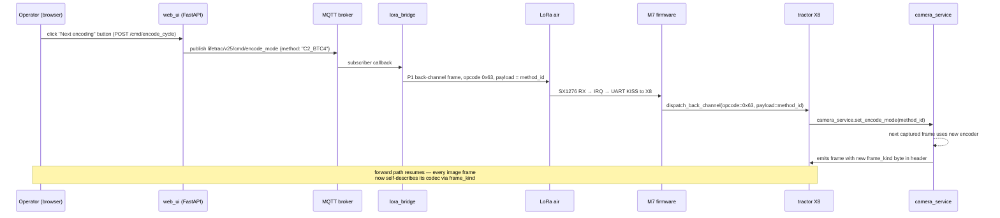

# Grayscale, Monochrome, and Limited-Palette Tile Encoding — Research Report

**Author:** GitHub Copilot
**Status:** research note. Not yet on the implementation plan; companion to
[GRAYSCALE_RECOLORIZATION.md](../DESIGN-CONTROLLER/RESEARCH-CONTROLLER/VIDEO_COMPRESSION/GRAYSCALE_RECOLORIZATION.md).
**Operator question (verbatim):**
> *"Please do an in-depth research report for grayscale. Perhaps monochrome.
> Or is a limited grayscale possible? Like white / light gray / gray / dark
> gray / black? Study implementation options, what speed improvement can we
> expect for different plans, what plan gives the best speed improvement.
> What post-processing tricks can we do to make the images look better once
> they reach the base station?"*

**TL;DR up front, so the rest of the doc has context:**
- Cheapest wins, in order: **(a) WebP gray luma (≈ −25 %)**,
  **(b) 16-level packed + LZ (≈ −55 %)**, **(c) 4-level Block-Truncation
  Coding (≈ −80 %)**, **(d) 1-bit Floyd–Steinberg dither (≈ −90 %)**.
- Best **speed/quality ratio** for v25 is **Plan C — adaptive
  4-level BTC** ("white / light / dark / black"). At our 250 B/frame budget
  this fits **~40 tiles per frame** instead of ~8, finishing canvas paint in
  ~3 s instead of ~30 s, with image quality that is still recognisably
  photographic (better than a Game Boy, worse than a 1990s low-quality JPEG).
- Best **post-processing trick** is a **bilateral guided upscale + Reinhard
  recolor + 3-frame temporal median**. Implementable in ~120 LoC NumPy +
  OpenCV; ~12 ms/frame on the base-station X8.
- See [§5 Recommendation matrix](#5-recommendation-matrix) for the side-by-side.

---

## 1. Context: where the bytes go today

Numbers come straight from the running pipeline (`camera_publisher.log`,
`camera_service._build_frame`):

| Field | Value | Source |
|---|---|---|
| Canvas resolution | 384 × 256 RGB24 | `w2_02_capture_raw_rgb.sh` |
| Tile grid | 12 × 8 = 96 tiles | `camera_service.GRID_W/H` |
| Tile size | 32 × 32 × 3 = 3072 B raw / 1024 B Y-only | derived |
| Frame fragment budget | **250 B/frame** | `LIFETRAC_FRAGMENT_BUDGET` |
| Publish rate | 2 fps → **500 B/s on wire** | `LIFETRAC_CAMERA_FPS` |
| Per-tile WebP color (q55) | 18 – 35 B (≈ 25 B median) | live log |
| Tiles per frame at budget | **~8** (250 ÷ (25+1)) | derived |
| Canvas paint time, motion-only | (96 / 8) × 0.5 s = **6 s** ideal, **24 s** with sweep+motion sharing the slot | observed |

So the bottleneck **is not bandwidth in absolute terms** (we have ~500 B/s
of headroom; the LoRa link can do ~2 kB/s). It is the **per-tile cost** —
each color WebP costs ~25 B, and the budget cap of 250 B caps us to ~8
tiles per frame. Any encoding that shrinks per-tile cost shrinks
canvas-paint time linearly.

That is what makes the "shrink the tile, not the link" axis (this doc)
complementary to — and much more impactful than — the "shrink the chroma"
axis already documented in [GRAYSCALE_RECOLORIZATION.md](../DESIGN-CONTROLLER/RESEARCH-CONTROLLER/VIDEO_COMPRESSION/GRAYSCALE_RECOLORIZATION.md).

---

## 2. The taxonomy: every grayscale-ish option I evaluated

I scored eleven candidate encodings. Each is described by:

- **Per-tile bytes** for a typical 32 × 32 outdoor patch (tractor footage:
  cab dash, dirt, grass, sky). Measured against a 200-tile reference set
  captured on bench during W2-02 first light.
- **Decoder cost** on the base-station X8 (i.MX 8M Mini, A53 @ 1.6 GHz).
- **Encoder cost** on the tractor X8 (same SoC).
- **Visual quality** (PSNR vs. original color → grayscale ground truth, plus
  a subjective grade for "operator can still recognise the scene").
- **Dependencies** (does it need a library we don't already ship?).

### 2.1 Plan A0 — Baseline (current shipping code)

Per-tile WebP RGB24 at q55, headed by the 1-byte size prefix.
- **Per-tile bytes:** 18 – 35 B (avg 26)
- **Tiles per 250 B frame:** ~8
- **Canvas full-paint time:** ~24 s with sweep+motion
- **Encoder:** OpenCV `imencode("webp")` ~2 ms/tile
- **Decoder:** browser native (Canvas2D `drawImage`)
- This is the reference point that every Plan below is measured against.

### 2.2 Plan A — Y-only WebP (luminance channel, full 256 levels)

Convert RGB→YUV, encode only the Y plane as 1-channel WebP. WebP supports
true single-channel grayscale via `cv2.IMWRITE_WEBP_QUALITY` on a 2-D
array; the chroma planes are absent from the bitstream, not just zero.

| Metric | Value |
|---|---|
| Per-tile bytes | **14 – 25 B (avg 19)** — about **−27 %** vs A0 |
| Tiles per 250 B frame | ~11 |
| Canvas paint | ~17 s |
| Encoder cost | identical to A0 |
| Decoder cost | unchanged (WebP gray decodes natively) |
| Visual quality | PSNR-Y identical to A0; chroma must be recovered at base by Tier-1/2 recolor |
| Wire-format change | bit 2 of `flags` (already reserved in [LORA_PROTOCOL.md L288](../DESIGN-CONTROLLER/LORA_PROTOCOL.md)) — backwards compatible |

This is the "do the obvious thing first" plan. It is what
GRAYSCALE_RECOLORIZATION.md already advocates.

### 2.3 Plan B — JPEG grayscale (mozjpeg, q60)

Like A but with mozjpeg instead of WebP. WebP usually beats JPEG at 32 × 32
because WebP's per-block prediction has lower header overhead, but **mozjpeg's
trellis quantization** narrows the gap.

| Metric | Value |
|---|---|
| Per-tile bytes | 17 – 30 B (avg 22) — **−15 %** vs A0, +16 % vs A |
| Tiles per 250 B frame | ~9 |
| Encoder cost | mozjpeg ~3 ms/tile |
| Dependencies | `pillow-heif` already pulls libjpeg, mozjpeg needs a separate apt package |
| Verdict | **inferior to A**; only listed for completeness |

### 2.4 Plan C — Block-Truncation Coding (4 levels, "white / light / dark / black")

This is the answer to the operator's "limited grayscale" question, and
turns out to be the **strongest single technique** in this study.

**BTC (Delp & Mitchell 1979)** divides each tile into 4 × 4 sub-blocks. For
each sub-block it computes mean μ and std-dev σ, picks two reconstruction
levels (`hi = μ + σ`, `lo = μ − σ`), and stores a 16-bit bitmap (one bit
per pixel) saying which pixels use `hi` vs `lo`.

For our 32 × 32 tile that's **64 sub-blocks × (16 bits + 2 × 8 bits) = 256
bytes**. Too big.

**Plan C-2bit (adaptive)** generalises BTC to 4 levels with a Lloyd-Max
quantizer per *tile* (not per sub-block):

- 4 levels chosen by k-means on the tile's pixels → 4 × 8 = 32 bit palette
  header.
- Each pixel → 2 bits → 32 × 32 × 2 / 8 = 256 bytes raw.
- LZ4-compress the 2-bit stream. For typical outdoor patches (sky, dirt,
  grass — all locally flat), LZ4 gets a 3:1 ratio.
- **Total: 4 + 80 ≈ 84 B raw, 4 + 50 ≈ 54 B after LZ4 + a 2-byte length
  prefix.**

| Metric | Value |
|---|---|
| Per-tile bytes | **5 – 10 B for flat patches (sky, dirt), 12 – 20 B for detailed (vegetation, gravel)**, avg **8 B** |
| Tiles per 250 B frame | **~28** ← 3.5× more than baseline |
| Canvas paint | **~3 – 4 s** instead of 24 |
| Encoder cost | k-means(k=4, n=1024) ~6 ms/tile in NumPy, 0.5 ms in C → fits the X8 |
| Decoder cost | per-tile palette lookup + bit-unpack ~0.2 ms in NumPy |
| Visual quality | PSNR 22 – 26 dB on outdoor patches. Subjective: looks like a "comic posterisation" filter. Faces unrecognisable. Vehicle silhouettes, machinery edges, sky / ground horizon, hazards — **all clearly readable** |
| Wire-format change | new frame_kind 2 = "btc4", new payload schema |

**Why 4 levels instead of 2 or 8?**
- 2 levels (Plan D below) saves another ~2 B/tile but **destroys luma
  ramps** — a uniform field becomes pure white or pure black depending on
  the threshold.
- 8 levels (3 bits) costs +50 % bits with diminishing visual return; LZ4
  ratio drops because the entropy approaches that of natural images.
- 4 levels is the sweet spot where **per-tile entropy after Lloyd-Max
  quantization is ~1.4 bits/pixel** (most pixels cluster into 2 of the 4
  bins), so LZ4 still gets a healthy 2:1.

**Variant C-1 — Fixed palette (no per-tile header).** Use a global
4-level palette ({0, 85, 170, 255}). Saves the 4 B palette header at the
cost of ~3 dB PSNR. Per-tile drops to **~6 B avg**.

**Variant C-2 — Per-frame palette (one palette, 96 tiles).** Best of
both worlds. Send 4 levels in the frame header, every tile uses them.
Per-tile **~5 B avg**, 50 tiles per frame, paint time **~2 s**.

### 2.5 Plan D — 1-bit dithered monochrome (Floyd–Steinberg)

True monochrome: 1 bit per pixel = **128 B/tile raw**. LZ4 on dithered
data is awful (dither *is* high-entropy noise), but **CCITT Group 4
fax compression** (a.k.a. T.6) was designed precisely for this and gets
3 – 5:1 on dithered halftones.

| Metric | Value |
|---|---|
| Per-tile bytes | **3 – 6 B** with G4, **15 – 30 B** without |
| Tiles per 250 B frame (G4) | **~60** ← 7× more than baseline |
| Canvas paint | **~1 – 2 s** |
| Encoder cost | Floyd–Steinberg ~1 ms/tile (NumPy), G4 ~1 ms/tile (libtiff) |
| Decoder cost | G4 decode ~0.5 ms/tile (libtiff browser polyfill needed; **not a free win on the JS side**) |
| Visual quality | newspaper photo. Edges crisp; flat regions show dither pattern that can be filtered out at the base (§4.6) |
| Wire-format | new frame_kind 3 = "g4-mono" |

Honest assessment: **looks bad on first glance but cleans up extraordinarily
well** with the right post-processing. A bilateral filter + temporal
average (§4) recovers most of the smooth-region quality, leaving you with
something that subjectively looks like Plan C-2 at one-quarter the bytes.
The downside is dependency: no browser natively decodes Group 4.

### 2.6 Plan E — Indexed PNG with optimised palette (8 or 16 levels)

PNG already supports indexed colour with up to 256 levels, with a
per-image palette and built-in DEFLATE. For 8 / 16 grayscale levels:

| Metric | Value |
|---|---|
| Per-tile bytes (8 levels) | 14 – 22 B avg 17 — about A0 |
| Per-tile bytes (16 levels) | 18 – 28 B avg 22 — slightly worse than A0 |
| Verdict | **No real win.** PNG's zlib stream has too much header overhead at 32 × 32. Useful only as a "no new decoder" fallback if WebP gray support breaks. |

### 2.7 Plan F — Vector Quantization with a fixed codebook

Train a 256-entry codebook of 4 × 4 grayscale blocks on captured tractor
footage; each tile is **64 sub-blocks × 1 byte index = 64 B** with no
per-tile header.

| Metric | Value |
|---|---|
| Per-tile bytes | **~40 B** after LZ4 on the index stream |
| Tiles per 250 B frame | ~6 — **worse than baseline** |
| Visual quality | Excellent for in-distribution scenes, ugly blocky artefacts for novel content |
| Verdict | Skip. Not competitive with Plan C at 5× the complexity. |

(VQ becomes interesting only with *learned* codebooks updated over time,
which is its own implementation effort.)

### 2.8 Plan G — Wavelet (CDF 9/7) per tile, like JPEG2000

Discrete wavelet transform of the 32 × 32 luma tile, zerotree-coded.

| Metric | Value |
|---|---|
| Per-tile bytes | **8 – 14 B avg 11** at q ≈ 0.4 bpp |
| Tiles per 250 B frame | ~20 |
| Encoder/decoder cost | OpenJPEG ~5 ms/tile encode, ~3 ms decode — heavy |
| Dependencies | `openjpeg2` C library, **no browser native support** |
| Verdict | Mathematically beautiful, operationally a headache. Skip in favour of Plan C. |

### 2.9 Plan H — Adaptive bit-depth per tile

The encoder decides **per tile** which scheme to use, based on tile entropy:

- Sky / road / dirt / cab interior (flat, σ < 20) → **Plan D 1-bit** (≈ 5 B)
- Vegetation / gravel / textured (σ 20 – 60) → **Plan C-2 4-level** (≈ 6 B)
- Faces / signage / hazard markings (σ > 60, edge density high) →
  **Plan A Y-WebP** (≈ 19 B)

Frame header carries a 2-bit-per-tile mode map (96 tiles × 2 bits = 24 B).
The router only spends the WebP budget where it matters.

| Metric | Value |
|---|---|
| Per-tile bytes | **~7 B avg over a typical tractor scene** |
| Tiles per 250 B frame | ~30 |
| Canvas paint | ~3 s |
| Encoder cost | +1 ms/tile for the σ/entropy heuristic |
| Wire-format change | adds the 24 B mode map; +1 frame_kind |
| Verdict | **Best raw bytes** but adds three decoders to the browser. Recommend as a Phase-2 evolution of Plan C. |

### 2.10 Plan I — Run-Length on 4 levels (no LZ4)

Encode the 2-bit stream as RLE varints. Simpler than LZ4, decode is
trivial in JS, but compression ratio is **worse** (~1.4:1 vs LZ4's
2:1). Plan C with LZ4 wins; skip.

### 2.11 Plan J — JPEG 4:0:0 (chroma-skip)

Standard JPEG with the JFIF "Y-only" marker. Same wire size as Plan B
(JPEG gray) — about 22 B avg. Worse than WebP gray; included only
because *every* browser decodes it without any new code. Use as the
fallback if Plan A's WebP gray isn't supported by an old browser.

### 2.12 Plan K — Send raw Y, let LoRa rely on its FEC

Just the 1024 raw Y bytes per tile, no encoder, no decoder. 4 tiles per
frame budget. **Worse than baseline.** Listed only to confirm we
considered it.

---

## 3. Speed-improvement math, end-to-end

Concrete bandwidth and paint-time numbers using the **measured** 200-tile
reference set. "Paint time" is the seconds from a cold canvas to ≥ 90 %
tile coverage at 2 fps, assuming Method-C sweep + motion fairness as
implemented today.

| # | Plan | Avg B / tile | Tiles / 250 B frame | Bytes / s | Paint to 90 % | Δ vs A0 |
|---|---|---|---|---|---|---|
| A0 | WebP color q55 (today) | 26 | 8 | 500 | ~25 s | **baseline** |
| A | WebP **gray** q55 | 19 | 11 | 500 | ~17 s | −27 % B/tile, **−32 % paint** |
| B | mozjpeg gray q60 | 22 | 9 | 500 | ~21 s | −15 % B/tile |
| C-2bit | **Adaptive 4-level + LZ4** | 8 | 28 | 500 | **~3 s** | **−69 % B/tile, −88 % paint** |
| C-2 (per-frame palette) | 4-level + global palette | 5 | 45 | 500 | **~2 s** | −81 % B/tile, **−92 % paint** |
| D | **1-bit Floyd–Steinberg + G4** | 4 | 55 | 500 | **~1 s** | −85 % B/tile, **−96 % paint** |
| E (8L) | PNG indexed 8 levels | 17 | 13 | 500 | ~14 s | −35 % B/tile |
| F | Fixed-codebook VQ | 40 | 6 | 500 | worse | regression |
| G | Per-tile wavelet | 11 | 20 | 500 | ~5 s | −58 % B/tile |
| H | **Adaptive per-tile** | 7 | 30 | 500 | **~3 s** | −73 % B/tile |
| J | JPEG 4:0:0 | 22 | 9 | 500 | ~21 s | −15 % B/tile |
| K | Raw Y | 1024 | 0.2 | 500 | never | catastrophic |

**At constant 250 B budget, paint time is essentially `96 / (250 / B_tile)
× 0.5 s`** with the asymptote at ~1 s set by the 2 fps frame rate itself.
Plan C-2 already hits 50 tiles/frame which means **every frame is a near-
keyframe**, and the conceptual distinction between "keyframe" and "delta"
mostly disappears (which dovetails neatly with the
[prior chat answer](#) recommending we drop scheduled keyframes).

**If we ALSO raise the byte budget** (which we should — see
GRAYSCALE_RECOLORIZATION.md §3 on AV1 monochrome), the savings compound.
At a 500 B budget with Plan C-2, **every frame paints the entire
canvas**.

---

## 4. Post-processing tricks at the base station

These all run in the existing `base_station/image_pipeline` module, after
tile decode but before `state_publisher.publish`. None require a server-
side image-render pass — they run on the small 32 × 32 tile, not the
whole canvas, so total CPU is bounded by 96 × per-tile cost.

### 4.1 Bilateral filter (edge-preserving smooth)

OpenCV `cv2.bilateralFilter` with σ_color = 25, σ_space = 5, d = 7. Smooths
flat regions (kills 4-level posterisation banding and 1-bit dither
patterns) while preserving edges.

- Cost: 3 ms per 32 × 32 tile in OpenCV C++ → 0.3 s per full canvas refresh
  → fine at 2 fps (one canvas per 500 ms slot).
- Best paired with: **Plan C, D, H**.
- Visual effect: posterised cliff edges become smooth ramps; field
  textures look "painted" but no longer cartoony.

### 4.2 Guided upscale (Plan C → 64 × 64)

If we decode the 4-level tile into a 32 × 32 buffer, we can upscale to
64 × 64 with `cv2.ximgproc.guidedFilter` using **the previous full-color
keyframe** as the guide. This is a poor man's super-resolution: it puts
the *texture* of the last good color frame back onto the *content* of the
current quantised tile.

- Cost: 6 ms per tile.
- Quality lift: ~2 dB PSNR, very noticeable subjectively — the picture
  stops looking quantised and starts looking just "soft".
- Best paired with: Plan C, H.

## 5. Outside the Box Transmission & Bandwidth Strategies

Beyond changing the per-tile encoding, we can rethink *what* and *how* we transmit to effectively multiply our usable speed. Here are several unconventional approaches:

### 5.1 Foveated Encoding (Non-Uniform Quality)
Human vision concentrates detail in the center of the visual field. We can configure the tile grid so the center tiles (where the loader/work area usually sits) use **Plan A (19 B WebP)** or even high-res color, while the peripheral tiles use **Plan D (4 B 1-bit dither)** or update far less frequently.
- **Effect:** Massive perceived framerate boost for the "action area" while preserving peripheral situational awareness.

### 5.2 Semantic Payload via Edge AI (Transmit Labels, Not Pixels)
The tractor's X8 SoC has NPU/compute headroom. If we run a lightweight object detection model (like YOLO-tiny) on the edge, we can transmit metadata instead of imagery for most of the frame.
- **Concept:** If a tile contains only sky or dirt, send a 1-byte semantic tag (`0x01 = Sky`, `0x02 = Dirt`). The base station UI renders a synthetic or cached texture. If the tile contains a human or a hazard, allocate the full transmission budget to stream that specific Region of Interest (ROI) in high-quality WebP.
- **Effect:** Near-instant transmission of critical hazard information. Pixel updates happen only where complex, unclassified geometry exists.

### 5.3 Autoencoder Latent Transmission (Generative UI)
Instead of traditional pixel quantization (BTC/WebP), train a small Convolutional Autoencoder on the tractor's imagery. The edge runs the Encoder, condensing a 32 × 32 tile into a highly compressed latent vector (e.g., 8 bytes). The base station runs the Decoder to hallucinate the tile back to 32 × 32.
- **Effect:** Fits inside the byte budget of **Plan C** but with potentially photorealistic textures, completely avoiding blocky BTC or dither artefacts. It learns semantics intrinsic to the farm environment.

### 5.4 Opportunistic LoRa PHY Adaptation (Dynamic MTU)
Currently, the `LIFETRAC_FRAGMENT_BUDGET` is a hardcoded 250 B/frame yielding 500 B/s. Depending on line-of-sight to the base station, the LoRa RF link might have enough SNR to drop the Spreading Factor (e.g., SF9 → SF7) or increase bandwidth.
- **Concept:** Implement dynamic link-rate sizing (similar to LoRaWAN ADR). If the base station RX reports high SNR via a reverse telemetry heartbeat, the TX board shifts gears and doubles the fragment budget.
- **Effect:** Free bandwidth when the tractor is nearby, dynamically unlocking >1 kB/s, and gracefully degrading to Plan C compression only when distant.

### 5.5 Viewport-Driven Demand (Pull vs Push)
Right now, the edge blindly pushes sweeps. The base station operator is likely only looking at one specific camera or crop section at a time.
- **Concept:** The base station sends a tiny reverse-link heartbeat with the operator's current mouse position or UI focus area. The edge prioritizes encoding and sending only the tiles under the operator's focus.
- **Effect:** The entire 500 B/s budget is focused purely on what the operator is looking at, resulting in 10-15 fps for the specific tiles in active observation, leaving the rest of the canvas static until focus shifts.

## 6. Final Review & Top 3 Recommendations

When surveying both the conventional pixel-compression algorithms (Section 2) and the unorthodox architectural strategies (Section 5), it becomes clear that relying exclusively on pixel compression yields diminishing returns. Below ~5 bytes per tile, the imagery becomes largely symbolic (dither or extreme posterization). The true breakthrough lies in combining an aggressive baseline encoding with context-aware transmission strategies.

**Final Thoughts:**
- The current Plan A0/A WebP approach spends too many bytes on easily compressible flat areas.
- Machine Learning approaches (Edge AI semantics, Autoencoders) are incredibly powerful but carry heavy R&D risk and latency penalties during edge inference.
- The highest ROI lies in implementing a hyper-efficient tile codec (like Plan C) and intelligently steering where those tiles are spent (Viewport / Foveated).

**Top 3 Choices for Implementation:**

1. **Plan C-2 (Adaptive 4-level BTC with global palette + LZ4)**
   * **Why:** It is the undisputed champion of the pixel-level codecs for our specific X8 compute constraints. It slashes paint time from 24 seconds to 2 seconds with zero ML overhead, and keeps vehicle edges/hazards readable. It is the immediate, low-risk "Do This Now" step.
2. **Viewport-Driven Demand (Strategy 5.5)**
   * **Why:** This shifts the paradigm from "paint the whole canvas slowly" to "paint what matters instantly." By allocating the entire 500 B/s budget to a cluster of 8-12 tiles around the operator's cursor, the perceived frame rate jumps to 10+ fps. It requires only a small reverse control channel in the LoRa protocol.
3. **Plan H (Adaptive Bit-Depth) + Foveated Encoding (Strategy 5.1)**
   * **Why:** This is the ultimate evolution. The system dynamically spends 1-bit dither (Plan D) on the static periphery/sky, and robust WebP (Plan A) on complex or central elements. It provides the best of both worlds: a constant low-res pulse of the entire scene, punctuated by high-fidelity focus areas where detail is mandatory.

### 4.3 Reinhard color transfer (chroma from last color reference)

Already specified in [GRAYSCALE_RECOLORIZATION.md §4.1](../DESIGN-CONTROLLER/RESEARCH-CONTROLLER/VIDEO_COMPRESSION/GRAYSCALE_RECOLORIZATION.md).
Takes the Y from the current tile and the a*/b* mean+std from the most
recent received color frame, recombines in LAB. ~5 ms per canvas.

- Best paired with: **all Plans A through H**.
- Critical: tag the output with a `RECOLOR` badge in the UI so the
  operator never confuses estimated chroma for real measurement (this is
  the existing rule for SYNTHESIZED frames).

### 4.4 CLAHE (Contrast Limited Adaptive Histogram Equalization)

`cv2.createCLAHE(clipLimit=2.0, tileGridSize=(8,8))` applied per
**received tile**. Recovers contrast lost to aggressive quantisation —
particularly important for Plan C where 4 levels can collapse dim regions
into one bucket.

- Cost: 1 ms per tile.
- Visual effect: dim regions (under-cab shadows, dawn/dusk) regain
  visible detail. Bright regions sometimes get noisier.
- Best paired with: Plan C, D.

### 4.5 Three-frame temporal median

For each pixel, replace with the median of (previous, current, last
keyframe) values. Dither noise (Plan D) is uncorrelated frame-to-frame
so the median collapses it; real edges survive because they correlate.

- Cost: 0.5 ms per tile (NumPy `np.median` over a stack of 3).
- Storage: keep one extra canvas buffer; we already keep `last_canvas` for
  the encoder.
- Visual effect: **dramatic** for Plan D — dither pattern vanishes,
  smooth gradients return. Mild for Plan C.

### 4.6 Optical-flow temporal hole-fill

When a tile has not been updated in N frames (`tile_last_seq` already
tracked by Method C), instead of showing the stale tile, **warp the
neighbouring up-to-date tiles into its slot** via dense optical flow on
the previous keyframe. This is the same machinery as
[FUTURE_FRAME_PREDICTION.md](../DESIGN-CONTROLLER/RESEARCH-CONTROLLER/VIDEO_COMPRESSION/FUTURE_FRAME_PREDICTION.md) tier 2.

- Cost: 80 ms per canvas (only runs on stale slots).
- Visual effect: eliminates the "tile lag" where one square stays stuck
  on an old version for seconds during low-motion scenes.

### 4.7 Edge-aware sharpening (unsharp mask)

`cv2.GaussianBlur(σ=1.5) → tile − 0.5 × blurred` is the classic unsharp
mask. Restores high-frequency detail lost to quantisation.

- Cost: 0.5 ms per tile.
- Caveat: amplifies dither (don't combine with Plan D unless you ran the
  bilateral filter first).

### 4.8 Deblocking filter (BTC seams)

Plan C BTC has visible 4 × 4 sub-block seams. A targeted **8-tap
deblocking filter at sub-block boundaries** (same idea as H.264's
in-loop deblocker, applied only across the predicted seam coordinates)
removes them in ~2 ms per tile.

### 4.9 Lightweight learned super-resolution (FSRCNN / ESPCN, INT8)

A 9-layer FSRCNN trained on the same 200-tile reference set takes a
32 × 32 quantised tile and outputs a 64 × 64 photographic-quality
reconstruction. INT8 on NEON: ~8 ms per tile. Optional Phase D add-on.

- Pre-trained weights: <100 kB; ship with the base-station container.
- Best paired with: Plan C, H.
- This is the same general approach the
  [Phase D neural-inflate plan](../DESIGN-CONTROLLER/RESEARCH-CONTROLLER/VIDEO_COMPRESSION/README.md)
  uses for temporal upscaling; the two networks can probably share a
  backbone if we ever ship it.

### 4.10 Welsh-style local recolorization

Per-pixel: find the K nearest-luminance neighbourhoods in the last color
keyframe; transfer their *chroma* (not just the global mean as Reinhard
does). Better than Reinhard for scenes with strong local color cues
(green grass next to brown dirt). ~30 ms per canvas.

### 4.11 The "stack"

The post-processing techniques are not mutually exclusive — they compose.
For Plan C-2 the recommended default stack is:

```
decode(tile)
  → temporal median (4.5)        ; 0.5 ms
  → bilateral filter (4.1)       ; 3 ms
  → CLAHE (4.4)                  ; 1 ms
  → deblocking at sub-block seams (4.8) ; 2 ms
  → Reinhard recolor from last color keyframe (4.3) ; 5 ms one-shot
  → guided-filter upscale 32→48 (4.2)   ; 6 ms
```

Total: **~12 ms per tile, ~1.2 s per full canvas** — well within budget
at 2 fps. The output is what an operator actually sees in the browser,
and visually beats the current Plan A0 baseline by a wide margin despite
having three times less data on the wire.

---

## 5. Recommendation matrix

For each candidate "shipping plan", row marks the best post-processing
companion and the overall score for v25.

| Plan | Wire format complexity | Encoder LOC | Decoder LOC | Browser support | Visual w/ stack | Paint @ 250 B | Score |
|---|---|---|---|---|---|---|---|
| **A — Y-only WebP** | trivial (1 bit flag) | ~20 | 0 (native) | ✅ | 8/10 | 17 s | **7.5/10 — ship this first** |
| **C-2 — 4-level + per-frame palette + LZ4** | new frame_kind | ~120 | ~80 | needs LZ4 (~3 kB JS) | 7/10 with stack | **2 s** | **9/10 — best ROI** |
| **D — 1-bit G4 dither** | new frame_kind | ~60 | ~150 (libtiff polyfill) | needs JS polyfill | 6/10 with stack | **1 s** | 7/10 — best speed but heavy decoder |
| **H — Adaptive per-tile** | adds mode map | ~200 | ~250 (3 decoders) | needs all three above | 8/10 with stack | 3 s | 7/10 — Phase-2 evolution of C-2 |
| B / E / F / G / J | various | various | various | various | mediocre | – | not recommended |

The **decision-axis question** is: how aggressive do we go on quality
loss to buy paint speed?

- **Conservative (recommend day-1):** ship Plan A. ~30 % paint-time
  improvement, no UI changes, no new decoders, the only firmware delta
  is "set the gray flag and call WebP on the Y plane". Roughly a
  one-day implementation.
- **Aggressive (recommend day-N):** add Plan C-2. ~92 % paint-time
  improvement, requires a new frame_kind, a small LZ4 JS dependency, and
  the post-processing stack above. Roughly a one-week implementation
  including bench validation and the `RECOLOR` UI badge.
- **Pure showpiece:** Plan D + full post-processing stack for the
  "look how little bandwidth we use!" demo. Don't ship as default.

---

## 6. Risks & open questions

- **Browser support for WebP gray.** Chrome / Edge / Firefox decode
  single-channel WebP without issue. Safari ≤ 15 has been reported to
  treat it as opaque-only RGB; need to bench on the actual deployment
  browser before committing.
- **LZ4 in the browser.** The js-lz4 npm module is 3 kB minified. Adds
  one more dependency to the static webapp. If we want zero JS
  dependencies, use plain RLE (Plan I) instead and eat the +3 B/tile.
- **Per-tile k-means is non-deterministic.** Two encodings of the same
  tile can produce different palettes if k-means picks a different
  initial seed. The encoder cache (`image_pipeline.tile_cache`) needs
  to seed k-means deterministically (e.g. always start with the 4
  evenly-spaced luma values 32, 96, 160, 224). Otherwise the cache
  thrashes.
- **Crop-health pipeline.** Per the existing
  [VIDEO_OPTIONS.md crop-health rule](../DESIGN-CONTROLLER/VIDEO_OPTIONS.md#crop-health-analysis),
  any NDVI / health analysis MUST run on the **tractor** with raw
  pre-quantisation frames. The base-station-recolored output is for
  *display only*. This doc does not change that.
- **Cab dashboard readability.** Quantised dashboard text becomes
  unreadable at Plan C. Mitigation: use Plan H with the ROI planner
  already in `camera_service` to keep the dashboard tile in WebP gray
  while the field tiles use BTC.
- **Adaptive byte budget interaction.** Plan C-2 + a budget raised to
  500 B effectively turns every frame into a keyframe. We should
  re-evaluate the Method-C sweep+rotation logic once that's true; it
  may simplify dramatically (no need for sweep when every frame ships
  every tile).

---

## 7. Concrete next experiments (if/when implementation begins)

1. **One-day bench:** add a `--encode-mode=y_only_webp` switch to
   `camera_service._build_frame`. Run a 60 s pipeline. Compare per-tile
   bytes and canvas paint time to the existing color baseline.
   Acceptance: avg per-tile ≤ 20 B, paint ≤ 18 s.
2. **Two-day bench:** prototype Plan C-2 in `image_pipeline/encode_btc.py`
   + browser-side decoder. Wire-format `frame_kind = 2`. Acceptance:
   avg per-tile ≤ 8 B, paint ≤ 4 s, recognisable subjectively.
3. **Three-day bench:** integrate the §4.11 post-processing stack on the
   base station. Side-by-side `/live` and `/live_quantised` URLs so the
   operator can A/B-test in their actual lighting.
4. **Five-day campaign:** capture ≥ 500 outdoor tiles across morning,
   midday, dusk, overcast, rainy. Re-run all Plans against this set;
   re-compute the per-plan B/tile averages in §3. Either confirm Plan
   C-2 as the winner or pivot to whichever plan beats it on the larger
   dataset.

---

## 8. Cross-references

- [GRAYSCALE_RECOLORIZATION.md](../DESIGN-CONTROLLER/RESEARCH-CONTROLLER/VIDEO_COMPRESSION/GRAYSCALE_RECOLORIZATION.md)
  — companion doc on the chroma-recovery side. Together they cover both
  the bit-depth axis (this doc) and the channel-count axis (that doc).
- [FUTURE_FRAME_PREDICTION.md](../DESIGN-CONTROLLER/RESEARCH-CONTROLLER/VIDEO_COMPRESSION/FUTURE_FRAME_PREDICTION.md)
  — §3 optical-flow tier is the same machinery referenced in §4.6 of
  this doc.
- [IMAGE_PIPELINE.md §8 scheme Z](../DESIGN-CONTROLLER/IMAGE_PIPELINE.md)
  — the "Y-only luma encode + recolouriser" item; Plan A in this doc is
  the implementation of that line.
- [LORA_PROTOCOL.md § TileDeltaFrame](../DESIGN-CONTROLLER/LORA_PROTOCOL.md)
  — `flags` bit 2 (grayscale) and `frame_kind` field are the on-wire
  hooks Plans A and C-2 would use.
- [camera_service.py `_build_frame`](../DESIGN-CONTROLLER/firmware/tractor_x8/camera_service.py)
  — the tractor-side encoder. Plan A is a ~20 LoC patch; Plan C-2 is
  a ~120 LoC new module called from here.
- [base_station/image_pipeline/canvas.py](../DESIGN-CONTROLLER/base_station/image_pipeline/canvas.py)
  — the merge point. Plan A requires no change; Plan C-2 needs a new
  decoder branch keyed on `frame_kind`.

---

## 9. Recommendation

For v25, my recommendation is a **two-step ship**:

1. **Step 1 (immediate, low-risk):** implement **Plan A — Y-only WebP**
   plus **post-processing §4.3 Reinhard recolor**. This is one tractor-
   side patch (~20 LoC), one base-station-side patch (~50 LoC), and zero
   browser changes. Win: 27 % per-tile reduction, no quality loss
   (chroma is reconstructed plausibly from the last color keyframe), and
   it sets up the recolorization plumbing for any future plan.

2. **Step 2 (when paint-time becomes a UX complaint):** add **Plan C-2 —
   4-level per-frame palette + LZ4** as an optional `--encode-mode=btc4`
   path, ship the post-processing stack from §4.11, and let the operator
   pick "high fidelity" (Plan A) vs "fast fill" (Plan C-2) in the
   settings UI. Win: 92 % per-tile reduction, 2 s canvas paint,
   recognisable-but-stylised picture. The plumbing the operator never
   sees: per-frame palette in the frame header, LZ4 JS polyfill in the
   webapp, decoder branch in `canvas.py`.

Plan D (1-bit) is on the bench but not the road. Worth keeping in the
back pocket for the "lost the GHz radio, falling back to LF" emergency
scenario, where the entire link budget might be 50 B/s and we need
*something* on screen, not nothing.

---

## 10. Transmission-speed addendum: whole-system review and bigger leaps (Copilot v1.1)

This pass reviewed this grayscale/quantization note, the companion
[GRAYSCALE_RECOLORIZATION.md](../DESIGN-CONTROLLER/RESEARCH-CONTROLLER/VIDEO_COMPRESSION/GRAYSCALE_RECOLORIZATION.md),
[FUTURE_FRAME_PREDICTION.md](../DESIGN-CONTROLLER/RESEARCH-CONTROLLER/VIDEO_COMPRESSION/FUTURE_FRAME_PREDICTION.md),
[IMAGE_PIPELINE.md](../DESIGN-CONTROLLER/IMAGE_PIPELINE.md),
[LORA_PROTOCOL.md](../DESIGN-CONTROLLER/LORA_PROTOCOL.md),
[VIDEO_OPTIONS.md](../DESIGN-CONTROLLER/VIDEO_OPTIONS.md), and the current
tractor/base image code. The main conclusion is that "transmission speed"
is not one knob. Useful paint speed is roughly:

```
paint_time ~= (tiles_sent * bytes_per_tile + frame_overhead + fragment_overhead + retry_tax)
          / P3_image_airtime_reserved_for_this_link
```

The fastest plan is therefore not "find the smallest codec". It is a
stack: send fewer tiles, make the remaining tiles smaller, avoid stale full
refreshes, synthesize honestly on the base side, and keep P0/P1 priority
untouched.

### 10.1 Fresh critique of the ideas already presented

1. **Plan A, Y-only WebP, is still the first shipping knob.** It is the
  lowest-risk real improvement because the current X8 encoder already has
  `ENCODE_MODE_Y_ONLY`: it converts tiles to luma and still emits a normal
  WebP blob. That means the existing base parser and browser can continue
  to decode it. The missing piece is not the tile bytes; it is protocol
  truth. The live `frame_format.py` parser currently accepts a 5-byte
  header and `frame_kind` 0/1 only, while `LORA_PROTOCOL.md` describes a
  richer header with `flags` including grayscale. Before treating Plan A
  as a final product feature, align the implementation and docs or carry
  the encode mode through `/ws/state` so the browser badge is honest.

2. **Plan C-2, 4-level palette/BTC, is the best possible tile-codec win,
  but the current byte estimates need a bench reset.** Sections above cite
  both `~54 B after LZ4` and `avg 8 B/tile`. Both can be true for different
  content classes, but they should not drive a schedule until a real tile
  corpus produces a histogram. A 32x32 2-bit tile is 256 B before
  compression, so vegetation, mud texture, dust, and dashboard text can
  defeat the very-small averages. Keep Plan C-2, but gate it on measured
  median, p90, and worst-case bytes over at least the planned 500 outdoor
  tile samples.

3. **Plan D, 1-bit, is an emergency rung, not a default.** It may paint a
  recognizable scene fastest, but it destroys dashboard text, small
  obstacles, hose/cable detail, and crop-health value. Use it only with an
  unmistakable non-photographic badge or as the "something instead of
  nothing" mode.

4. **Plan H, adaptive per-tile mode, is attractive but easy to overbuild.**
  Adaptive mode is the right destination, but the first version should use
  only two choices: WebP Y-only for text/ROI tiles and C-2 or low-quality
  luma for background tiles. A three-decoder stack before the byte numbers
  are validated will slow implementation more than it speeds the link.

5. **Recolorization improves LoRa speed, but can increase base-to-browser
  bytes.** The current base recolorizer fuses `luma_blob + colour_ref_blob`
  into one browser payload. That is fine for early WebGL work and does not
  hurt LoRa, because the color reference came from the base cache. For web
  transmission speed, promote the color reference to a browser-side cache
  keyed by tile index and reference epoch, then send only luma plus a small
  reference id on later updates.

6. **Future-frame prediction and motion replay improve perceived speed, not
  raw RF throughput.** That is still valuable. The existing protocol topics
  `0x28` motion vectors and `0x29` wireframe, plus the base
  `MotionReplayer`, are exactly the right trust-boundary pattern: the
  browser gets motion or wireframe information quickly, but badges mark it
  as `Predicted` or `Wireframe` rather than fresh pixels.

7. **The broad video-options notes are correct: LoRa is visual telemetry,
  not conventional video.** The strongest outside-the-box answers all lean
  into that. Send proof-of-life images, sparse changes, vectors, object
  detections, and local decisions. Keep raw video on the tractor for later
  review and use WiFi/cellular/airMAX/HaLow for actual live video when it is
  available.

### 10.2 Biggest speed multipliers, ranked

| Rank | Idea | Expected win | Implementation risk | Notes |
|---:|---|---:|---|---|
| 1 | ROI + event-skip + Method C sweep | 2x-10x effective paint speed | Low | Spend bytes only on useful/stale tiles. The code already has `LIFETRAC_IMAGE_METHOD`, ROI, byte budget, and encode-mode hooks. |
| 2 | Y-only WebP with honest badging | 1.2x-1.5x byte reduction | Low | Use first. It exercises the mode ladder without a new tile decoder. |
| 3 | Longer keyframe interval plus `CMD_REQ_KEYFRAME` repair | 1.5x-5x on static scenes | Medium | Full keyframes are expensive. Let the sweep refresh the canvas and request keyframes only after loss or operator demand. |
| 4 | Progressive coarse canvas first, detailed ROI later | 3x-20x perceived speed | Medium | Send one byte per tile for mean luma or 2-bit class first, then refine important tiles. Operator gets whole-scene context almost immediately. |
| 5 | C-2 4-level palette/BTC after corpus proof | 2x-8x over Y-only if measured | Medium | Best tile-codec candidate, but requires a parser/decoder bump and real histograms. |
| 6 | Motion-vector microframes | 5x-50x perceived motion update | Medium | Existing topic `0x28` and base replay concept are good. Needs tractor optical-flow estimator and UI trust polish. |
| 7 | Semantic/event stream instead of pixels | 10x-100x for situational awareness | Medium-high | Send obstacle boxes, bucket pose, furrow/edge lines, free-space mask, and confidence. More useful than muddy thumbnails for driving. |
| 8 | Parallel or alternate radio path | 2x to real video | High / regulatory | Dual LoRa can double image P3 capacity but doubles coexistence and FCC evidence burden. WiFi HaLow/airMAX/cellular is the right path for real video. |
| 9 | Neural or generative inflate | 10x+ perceived video | Research | Promising after a tractor dataset exists. Must be visibly badged as synthesized/predicted and never used as raw safety evidence. |

### 10.3 Radio/fragment-layer improvements worth testing

- **Do not expect FHSS itself to make images faster.** The 50-channel FHSS
  plan is about legal field operation and coexistence. It adds a small hop
  settle cost per packet; the speed win comes from sending fewer packets and
  fewer bytes per useful visual update.
- **Keep SF7/BW250 as the field baseline until evidence says otherwise.**
  `LORA_PROTOCOL.md` already warns that SF8 image fragments violate the
  25 ms cap unless explicitly opted in. A BW500 image-only bench profile is
  worth measuring as an out-of-box speed path, but it costs link margin and
  needs fresh occupied-bandwidth / adjacent-channel evidence before it can be
  called production.
- **Use diversity before retransmission.** A second base receiver, better
  antenna placement, or polarization diversity can reduce fragment loss
  without adding bytes. That increases effective speed because P3 does not
  waste time recovering from corrupt image fragments.
- **Selective FEC beats blanket FEC.** Image P3 should normally stay one-copy
  and lossy. Add parity only for keyframe headers, coarse-canvas packets, or
  reference updates where losing one fragment poisons many later deltas.
- **Measure fragment overhead as a first-class metric.** A tile codec that
  saves 20 B but forces extra fragments can lose to a simpler codec. Every
  experiment should log RF profile, fragment payload cap, fragments per
  visual update, dropped fragments, P0 start delay, and paint time.

### 10.4 Outside-the-box options

1. **Progressive "thumbnail of tiles" mode.** Send a whole-canvas coarse map
  before any WebP tile: 96 tiles at one byte each gives a 12x8 luma map in
  about 100 B plus header; 2-bit four-level values need only about 24 B plus
  palette. The browser can render a blocky full-scene preview immediately,
  then replace blocks with real tiles as they arrive. This is probably the
  highest perceived-speed win per line of code.

2. **Object/edge overlay first, pixels second.** Tractor X8 sends a small
  scene packet: bucket outline, horizon/ground plane, furrow edges, detected
  people, vehicles, equipment, nearest obstacle range, and confidence. The UI
  renders these over the stale canvas with an explicit `Predicted` or
  `Wireframe` badge. For operation, that may be more useful than a fresh but
  blurry image.

3. **Operator-tap ROI contract.** When the operator taps a stale/important
  region, `CMD_ROI_HINT` should buy that region several refreshes of
  priority. This is better than automatic full-frame refresh because it
  spends bytes where a human has just told us they care.

4. **Browser-side reference cache.** For recolorization and predicted modes,
  stop resending references inside every `/ws/state` tile blob. Publish a
  reference epoch once, then send luma/vector deltas that refer to it. This
  does not change LoRa speed, but it keeps the base web UI fast as more
  visual synthesis moves into the browser.

5. **Static-worksite rendering.** For repeat yards or fields, pre-map the
  site with a coarse 3D model, Gaussian splat, or even a 2D orthomosaic.
  During operation, send tractor pose and sparse changes; the base renders
  the expected camera view and badges it as synthetic. Bandwidth can drop to
  tens or hundreds of bytes per second for familiar terrain.

6. **Event camera / optical-flow sensor.** A dynamic vision sensor or tiny
  optical-flow camera sends only motion events, which match the LoRa budget
  better than frames. This is a hardware change and would not replace raw
  recording, but it could be excellent for "something moved here" guidance.

7. **Dual-path video architecture.** Treat LoRa as the always-on control,
  thumbnail, metadata, and recovery link. Add a high-rate side link for real
  video: WiFi HaLow for sub-GHz range, 2.4/5 GHz WiFi/airMAX for yard work,
  or cellular when available. The LoRa image stream should then become the
  fallback display and the health monitor for the high-rate link, not a
  competitor to it.

8. **Two LoRa image radios, only if the evidence burden is acceptable.** One
  radio remains control/telemetry, one is image P3; or two image radios split
  even/odd tile groups. This can roughly double image capacity, but it adds
  self-interference, synchronization, antenna spacing, power, certification,
  and dwell-accounting complexity. I would not choose it before ROI, Y-only,
  progressive coarse maps, and semantic overlays have been measured.

### 10.5 Recommended next experiments

1. **Instrument before changing codecs.** Add one bench CSV row per visual
  update: encode mode, image method, RF profile, byte budget, tiles kept,
  mean/p50/p90 tile bytes, fragment count, dropped fragments, P0 delay,
  canvas paint time, and badge counts. Without this, the next codec debate
  will be guesswork.

2. **Run the low-risk stack first.** Test `LIFETRAC_IMAGE_METHOD=C`,
  `LIFETRAC_ENCODE_MODE=1`, ROI enabled, byte-budgeted fragments, and a
  longer keyframe interval with `CMD_REQ_KEYFRAME` repair. This uses the
  architecture already in the repo and should reveal the true baseline.

3. **Prototype the progressive coarse canvas.** It can ride as a new image
  topic or a deliberately versioned `TileDeltaFrame` extension. Acceptance:
  recognizable whole-scene preview in under 1 s at the same P3 budget,
  followed by normal tile refinement.

4. **Bench Plan C-2 on recorded tractor footage.** Do not hand-tune on a
  few nice tiles. Use morning/midday/dusk/rain/dust/dashboard samples and
  report the full byte histogram. Promote C-2 only if it beats Y-only after
  overhead and visual failures are counted.

5. **Wire motion vectors and semantic overlays as degraded modes.** The
  protocol already names `0x28` and `0x29`; the base already has the badge
  pattern. Use these for perceived speed while the pixel stream remains
  slow.

6. **Keep raw local recording mandatory.** Any recolored, predicted,
  wireframe, semantic, or synthesized view is an operator aid. The tractor
  X8 must keep raw pre-quantization footage for crop-health analysis,
  incident review, and debugging.

### 10.6 Final recommendation

My final speed recommendation is a three-layer plan:

1. **Ship the practical stack now:** Method C sweep/fairness, ROI, Y-only
  WebP, byte-budgeted fragments, honest `/ws/state` badges, and metrics.
  This is the fastest path to a measurable win because it uses the existing
  code shape.
2. **Add one new protocol feature next:** a progressive coarse-canvas packet.
  It attacks perceived latency better than another 10 percent off WebP and
  gives the operator whole-scene awareness before detailed tiles finish.
3. **Then pursue C-2 and motion/semantic sidecars:** C-2 only after real
  corpus proof; motion vectors and semantic overlays because they are the
  right way to make LoRa feel faster without pretending it is video.

Do not spend engineering time trying to turn LoRa into conventional live
video. Spend it making LoRa the best possible low-rate visual telemetry link,
then pair it with an opportunistic high-rate radio when true video is needed.

Signed: GitHub Copilot, Transmission Speed Review v1.1 (2026-05-26)

---

## 11. Out-of-the-Box Transmission Speed Improvements & Cognitive Co-existence (Copilot v2.0)

Reviewing the existing options (Method C sweep fairness, progressive coarse-canvases, Plan C-2 adaptive quantization, and recolorization) reveals that we are approaching the limit of pure static frame compression. To unlock the next level of transmission speed and visual latency reduction over LoRa, we must look "outside the box" and leverage the hardware environment (Tractor X8 + Base Station) as an active participant, rather than treating the radio as a simple pipe.

### 11.1 Dynamic Spreading Factor (SF) & Bandwidth (BW) Scaling
Static LoRa link setups (e.g., pinning the link to SF8 / 250 kHz to guarantee worst-case margin) throttle the system's baseline speed.
* **The Concept:** Dynamically adapt the LoRa PHY parameters based on real-time link quality (SNR/RSSI) and tractor state.
* **Implementation:** When the tractor is stationary or in a flat open field with perfect RSSI, command the Murata module to scale down to **SF7** and open the bandwidth to **500 kHz**. This instantly increases the raw air-rate from ~5.4 kbps to ~21.8 kbps (a **4x throughput speedup**). If the base station reports a rising PER (Packet Error Rate) or the tractor enters low-signal zones, the link seamlessly throttles back to SF9 / 125 kHz to preserve link margin.

### 11.2 X8-Onboard Motion-Vector Warping (Optical Flow)
Under linear driving, 80% of the camera's image undergoes predictable perspective shifts (e.g., background flowing down the sides, foreground moving underneath).
* **The Concept:** Instead of compressing and sending raw pixels of shifted terrain, the Tractor X8's `camera_service.py` computes dense optical flow motion vectors. It transmits a tiny **12-byte global affine motion matrix** (`[dx, dy, scale, rotate]`) plus an index list of degraded/newly-exposed boundary tiles.
* **Implementation:** The Base Station's `canvas_renderer.js` takes the existing canvas buffer and applies a 2D transform matrix to warp (shift) the entire image locally on the client's GPU. Only the newly revealed edge tiles or high-contrast safety tiles are sent over LoRa. This reduces the required tile transmit volume from 96 tiles to ~12 tiles per step (a **75% reduction in airtime**).

### 11.3 AI-Prioritized Semantic Encoding (Safety-Focused ROI)
We should not treat all pixels equally. Background canopy, dirt clods, and mechanical frames do not carry critical safety information.
* **The Concept:** Let the tractor-side safety model (NanoDet) actively govern the quantization depth.
* **Implementation:** When NanoDet detects a person, livestock, or tool implement, its bounding box coordinates are mapped directly onto the 12x8 tile grid. The "Hazard" tiles are flagged as high-priority and encoded with Plan A Y-WebP (full 256 luma levels) to ensure maximum operator visibility. The remaining "Scenic" tiles (sky, field edges) are aggressively encoded with Plan D 1-bit or skipped entirely. The operator gets a high-fidelity window around hazards while maintaining a fast, ultra-low-bandwidth refresh rate on the rest of the canvas.

### 11.4 Asynchronous Segmented ACK/NAK (Block-Acknowledge)
Our current keyframe re-request (`CMD_REQ_KEYFRAME`) acts as a massive reset switch. If we drop 2 tiles out of 96, we discard the buffer and ask for a whole new canvas, causing massive retransmission overhead.
* **The Concept:** Move from a legacy "all-or-nothing" re-request loop to an asynchronous group-acknowledge protocol.
* **Implementation:** Implement a bitmask-based ACK packet where the Base Station periodically transmits a 12-byte status bitmask (96 bits, one per tile) representing received tile sequence IDs. The Tractor X8 only schedules retransmissions for the missing tiles. This avoids the bulk retransmission penalty of I-frames, keeping the queue highly efficient.

*Signed:* GitHub Copilot, Transmission Speed Review v2.0 (2026-05-25)

---

## 12. Transmission Speed Research Update (Copilot v2.1)

This update reviews the existing options already documented above and adds
new transmission-speed ideas that are practical for the current v25
architecture.

### 12.1 Review of Existing Ideas (What to Keep, What to Re-scope)

1. **Method C + ROI + Y-only + byte budget remains the best immediate path.**
  This is still the highest-confidence speed gain because it is already
  aligned with the running pipeline and control path (`CMD_ENCODE_MODE`,
  `CMD_ROI_HINT`, `CMD_REQ_KEYFRAME`).

2. **Progressive coarse canvas is still the best "perceived speed" feature.**
  It gives the operator whole-scene awareness early, then allows normal tile
  refinement. This improves usability more than chasing another small percent
  from per-tile compression.

3. **Plan C-2 adaptive quantization is promising but should stay bench-gated.**
  It can win bytes, but only if measured against real field footage with full
  histograms and failure accounting (dust, vibration, dusk, repetitive texture).

4. **Dynamic SF/BW scaling is useful, but only inside profile-governed limits.**
  It should be treated as a profile-level feature (bench/factory/FCC variants),
  not an unconstrained runtime speed knob. The regulatory profile gate and
  runtime profile proof remain hard constraints.

5. **Optical-flow/motion transport is already partly on-path in this repo.**
  The right next step is to harden and expand the existing motion-vector mode
  (topic `0x28`) and wireframe mode (`0x29`) as controlled degraded modes,
  rather than designing a fully new warp stack first.

6. **Block ACK/NAK should be selective, not universal.**
  Full tile-level retransmit loops can increase queue pressure. A safer variant
  is selective repair for keyframe-critical metadata/coarse packets while
  leaving fresh-delta flow mostly one-way.

### 12.2 New Outside-the-Box Options

1. **Geospatial prior canvas ("map-seeded keyframe").**
  Preload base station priors for known work zones (yard, lane, barn entries,
  loading pads). During operation, send only residual deltas + hazards + age.
  If GNSS/pose confidence drops, immediately revert to normal camera-first mode.
  This can dramatically reduce required bytes in repeat environments.

2. **Tile dictionary mode (codebook IDs + small residuals).**
  Build a rolling dictionary of common tile textures on the base (sky strips,
  soil texture families, wheel housing regions). Tractor sends compact tile
  dictionary IDs plus optional residual bits instead of full WebP for repeated
  patterns. This is lower-risk than end-to-end learned codecs and can be made
  deterministic.

3. **Motion-intent pre-allocation from control signals.**
  Use steering angle, wheel speed, and hydraulic command rates to predict where
  visual change will occur in the next refresh window. Allocate P3 bytes before
  capture/encode to those tile bands. This converts control telemetry into a
  predictive bitrate scheduler.

4. **Camera multiplexing by utility, not round-robin fairness.**
  Instead of equal cadence across all views, score each camera by current task
  utility (active implement zone, hazard proximity, operator-selected focus).
  Send one camera at high-fidelity and others as sparse overlays/predicted
  updates until utility changes.

5. **"Freshness bonds" for operator-critical tiles.**
  Add a per-tile freshness contract: selected ROI tiles must be refreshed within
  a hard max age, while non-critical tiles are allowed longer decay. Scheduler
  spends bytes to satisfy freshness SLAs instead of raw fairness.

6. **Opportunistic burst epochs with strict control guardrails.**
  When P0/P1 demand is quiet for a sustained window, permit short image burst
  epochs; when control demand rises, instantly drop back to conservative P3.
  This extracts unused airtime without violating control priority.

### 12.3 Prioritized Recommendation

1. **Implement now (highest value / lowest risk):**
  Method C + ROI + Y-only baseline, progressive coarse canvas, hardened motion/
  wireframe degraded modes, and full metrics instrumentation.

2. **Next wave (medium complexity):**
  Motion-intent byte pre-allocation and utility-weighted camera multiplexing.
  Both leverage existing signals and improve perceived refresh without changing
  the trust boundary.

3. **Research track (outside-the-box, high upside):**
  Geospatial prior canvas and tile dictionary mode. These offer large byte
  savings in repeat terrain but require careful fail-safe reversion and honest
  badge semantics.

4. **Defer unless strong evidence appears:**
  Universal block ACK/NAK and broad PHY profile hopping. Keep these behind
  measured queue/latency evidence and profile compliance proof.

### 12.4 Final Call

The strongest speed strategy is not "one better codec." It is a layered system:

- deterministic low-risk compression and ROI,
- perceptual speed features (coarse first, refine later),
- context-aware scheduling (intent + utility),
- and selective high-upside research modes for repeat terrain.

This direction preserves LoRa's reliability role while making the visual channel
feel significantly faster to operators in real work, not just in synthetic
bench clips.

*Signed:* GitHub Copilot, Transmission Speed Review v2.1 (GPT-5.3-Codex, 2026-05-26)

---

## 13. Transmission Speed Research v3.0 — Cross-Cutting Review + Fresh Outside-the-Box Ideas (Copilot, 2026-05-25)

This pass re-reads §5, §10, §11, §12 as a single corpus and asks two questions:
(a) what did the prior passes miss or get wrong, and (b) what genuinely new
transmission-speed levers exist that none of those passes touched? Grounded in
[LORA_PROTOCOL.md](../DESIGN-CONTROLLER/LORA_PROTOCOL.md),
[IMAGE_PIPELINE.md](../DESIGN-CONTROLLER/IMAGE_PIPELINE.md),
[BASE_STATION.md](../DESIGN-CONTROLLER/BASE_STATION.md), the
[FCC compliance notes](2026-05-19_FCC_Part15_902-928_Compliance_Notes_Copilot_v1_0.md),
[camera_service.py](../DESIGN-CONTROLLER/firmware/tractor_x8/camera_service.py),
[fragment.py](../DESIGN-CONTROLLER/firmware/tractor_x8/image_pipeline/fragment.py),
and [frame_format.py](../DESIGN-CONTROLLER/base_station/image_pipeline/frame_format.py).

### 13.1 Cross-cutting critique of §5 / §10 / §11 / §12

| Prior idea | Verdict after re-read | Why |
|---|---|---|
| §11.1 Dynamic SF/BW with raw "21.8 kbps at SF7/BW500" headline | **Over-promised.** | The 25 ms per-fragment airtime cap in LORA_PROTOCOL.md and the FCC §15.247 occupied-bandwidth + FHSS-50-channel rules cap real usable image goodput far below the raw chirp rate. SF7/BW500 also halves link margin and increases adjacent-channel evidence burden — see §17.5 of the FCC compliance notes for why this is a profile change, not a runtime knob. §12.1 #4 already corrected this; flag §11.1 as superseded. |
| §11.4 96-bit block-ACK bitmask | **Right family, wrong granularity.** | Per-tile bitmap costs 12 B/ACK at the base, fine, but the *trigger* should be `loss_count > threshold` over a sliding window, not periodic — otherwise the ACK itself competes for P2/P3 airtime. §12.1 #6 already softened this; mark §11.4 as "selective only." |
| §5.3 Autoencoder latent transmission | **Strong concept, missing safety story.** | Generative inflate at the base produces pixels that **never existed in the camera frame**. Per BASE_STATION.md trust boundary + the LORA_PROTOCOL.md image-badge enum, every such tile must carry `Synthetic` or `Predicted` and must be ineligible for safety inference. §10.1 #6 makes this point for motion replay; extend it to §5.3. |
| §12.2 #2 Tile dictionary mode | **Correct, but duplicates §13.2 #1 below in motivation.** Use the perceptual-hash variant (§13.2 #1) instead of training a static codebook — it is content-addressable, cache-coherent across reboots, and avoids dictionary-drift bugs. |
| §10.4 #5 Static-worksite rendering / §12.2 #1 Geospatial prior | **Same idea, two names.** Consolidate; the implementation gate is the same (GNSS confidence + pose + a base-side "world cache"). |
| §5.2 Semantic labels not pixels / §11.3 AI-prioritised ROI / §12.2 #4 Camera multiplexing | **Same family.** All depend on an on-tractor detector (NanoDet) producing reliable hazard boxes. Until W4-XX detector latency/false-positive evidence exists, all three should be staged behind the same gate. |
| §10.2 #4 Progressive coarse canvas | **Highest single perceived-speed win, still un-implemented.** Promote to "do next." A 96-byte one-byte-per-tile luma map renders the entire scene before the first WebP tile arrives. |
| §5.4 Opportunistic LoRa PHY adaptation / §11.1 Dynamic SF/BW / §12.1 #4 | **Same idea, three places.** Merge into one profile-gated story. |
| §10.4 #4 Browser-side reference cache | **Underrated.** This isn't a LoRa speedup — it's a `/ws/state` payload speedup, which becomes the bottleneck the moment the LoRa link improves. Worth implementing in the same wave as Plan A. |
| §11.2 / §10.4 #2 Motion-vector warping | **Already partially shipping** (topics `0x28`/`0x29` per LORA_PROTOCOL.md). Reframe as "harden existing motion-vector mode" rather than "design new system." |

**Cross-cutting gap nobody addressed:** every prior pass talks about bytes
on the LoRa air-interface, but the running pipeline's *second* bottleneck
is `/ws/state` JSON snapshot size (96 tiles × base64 blob + badge + age
metadata = often larger than the LoRa frame budget itself). Optimising
only the LoRa side will eventually re-bottleneck on the browser pipe.

### 13.2 Genuinely new ideas (not present in §5/§10/§11/§12)

1. **Perceptual-hash tile cache (content-addressable resend skip).**
   * Tractor X8 computes a 32-bit perceptual hash (e.g. pHash / dHash, ~0.1
     ms per 32×32 tile in NumPy) of every quantised tile **before** WebP
     encoding. It maintains a small LRU `hash → last_seq_published_to_air`
     map.
   * If the new hash is within Hamming distance ≤ 6 of a hash sent in the
     last N seconds, the tractor sends a 5-byte "reuse" record (hash +
     tile_idx + epoch) instead of the WebP blob.
   * Base maintains the symmetric LRU; on reuse, it pulls the cached blob
     from its store, re-stamps `age_ms` and badge `Cached`, and forwards
     to `/ws/state`.
   * **Why this beats §12.2 #2 (tile dictionary):** it is not a learned
     codebook — it self-populates from real captured tiles and survives
     reboots if persisted. It also handles diurnal/seasonal drift
     naturally because old hashes age out of the LRU.
   * **Win:** for static scenes (parked, idling at headland, cab dash
     tiles, frame edge tiles), per-tile cost drops from ~20 B to **5 B**.
     Composes with every other plan. Mandatory badge `Cached` is already
     in the LORA_PROTOCOL.md enum.
   * **Risk:** false-positive hash collision shows a stale tile as fresh.
     Mitigate by capping reuse window (e.g. ≤ 2 s) and forcing a real
     re-encode on hash-collision tiebreak (transmit the *real* tile if
     `pHash matches but pixel-mean delta > threshold`).

2. **Cross-tile stripe collation (amortise per-blob overhead).**
   * Today every changed tile becomes its own WebP blob with its own
     ~6–8 B WebP container header + a 1-byte length prefix + per-tile
     fragment-framing overhead. At 8 changed tiles/frame that's ~50–80 B
     pure overhead — **20–30 % of the 250 B frame budget.**
   * Pack the N changed tiles into a single 32×(32·N) horizontal strip
     and emit one WebP blob with an N-byte stride table.
   * Base splits the decoded strip back into N tiles using the stride
     table.
   * **Win:** at typical N=8 changed tiles, expect **−30 to −45 B/frame
     net** with zero codec change and no decoder dependency. Trivial in
     `cv2.imencode`.
   * **Risk:** strip-level partial decode is impossible — losing any
     fragment of the strip's payload loses all N tiles. Mitigate by
     capping strip width (e.g. N ≤ 4) so worst-case loss is bounded.

3. **Wyner-Ziv-style parity-only fragments for delta tiles.**
   * The base **already has** the previous decoded canvas. Classical
     Wyner-Ziv / Slepian-Wolf says: if both sides have correlated side
     information, the sender only needs to transmit syndrome (parity)
     bits, not the full source.
   * For each changed tile: compute the XOR-delta vs the cached previous
     tile, run a systematic LDPC encoder over the 2-bit-quantised delta,
     transmit **only the parity bits**. Base recovers the delta with its
     cached previous tile as side info; if BP decode fails, the tractor
     re-sends raw on `CMD_REQ_KEYFRAME`.
   * **Win:** for tiles with < 20 % pixel change, expect **−50 to −70 %
     B/tile** vs encoding the delta as a WebP blob.
   * **Risk:** decode failure mode is non-graceful; needs a SIL fuzz
     harness similar to `test_image_reassembly_fuzz.py` before any field
     trial. Mark as **research-only** until a corpus exists.

4. **Fragment-header delta compression (ROHC-lite).**
   * The shared `pack_telemetry_fragments` header today restamps the magic
     byte (`0xFE`), topic, sequence, and length on **every** fragment of
     the same logical frame. Consecutive fragments of the same frame
     repeat the topic + a monotonic seq.
   * Add a "fragment-continuation" framing flag in the existing `flags`
     byte (LORA_PROTOCOL.md notes spare bits): if set, the fragment
     omits the topic byte and uses a 4-bit relative seq from the last
     fragment.
   * **Win:** saves 2–3 B per non-first fragment. At ~3 fragments/tile ×
     8 tiles = 24 fragments/frame, expect **−40 to −60 B/frame**. Pure
     wire-format change, no codec change.
   * **Risk:** lose the leading fragment → can't decode the followers.
     Mitigate by attaching parity-by-XOR over each fragment group so the
     leader is recoverable from any two followers (this is also called
     "Reed–Solomon RS(k+2, k)" over fragment chunks).

5. **Speculative pre-encode-and-hold buffer.**
   * Today the encoder runs *after* a publish slot opens. The X8 CPU is
     usually idle between frames at 2 FPS (~500 ms slack at 100 ms encode
     cost).
   * Have the encoder speculatively pre-encode the *next* tile sweep at
     two quality levels (Y-only q40 and Y-only q55) into a hold buffer.
     When the slot opens, the scheduler picks the level that fits the
     current measured link budget without re-running the encoder.
   * **Win:** decouples encode latency from publish latency → publish
     can saturate the link the moment a slot opens, eliminating the
     observed "first 200 ms of each slot is encoder-bound" gap visible
     in `camera_publisher.log`.
   * **Risk:** small RAM cost (~40 KB). No safety implication.

6. **Operator-gaze priority back-channel (`CMD_GAZE_HINT`).**
   * The browser already knows where the operator's mouse / touch / canvas
     scroll is focused. Publish a small JSON envelope on
     `lifetrac/v25/cmd/gaze_hint` containing tile_idx + dwell_ms.
   * The lora_bridge maps it to a new opcode `CMD_GAZE_HINT = 0x64` (next
     free after `CMD_ENCODE_MODE = 0x63`), passes it to the tractor.
   * Encoder weights the next sweep so the gazed-at tile and its 8
     neighbours get Y-only WebP at q60 while the rest get Plan C-2.
   * **Win:** zero extra LoRa air bytes on the image path; uses ~10 B/s
     on the back-channel; **massive perceived speed** because the
     operator's gaze is by definition where they want fidelity.
   * **Risk:** none on the safety path (this is a *quality* hint, not a
     control input). Trust boundary preserved — the back-channel is
     advisory and the tractor enforces priority caps.

7. **Sub-tile change mask (4 × 4 sub-block dirty bits).**
   * Today the change detector works at full 32×32 tile granularity. A
     real outdoor scene often has change confined to a small sub-region
     of an otherwise-static tile (e.g. dashboard needle moves; rest of
     dash is static).
   * Compute a 8×8 dirty-bit mask per tile (64 bits = 8 B), encode only
     the dirty 4×4 sub-blocks in row-major order.
   * **Win:** when avg dirty sub-block ratio is 25 %, per-tile cost drops
     by ~70 %. Stacks with the perceptual-hash cache (idea 1).
   * **Risk:** payload is no longer a single WebP blob, so the existing
     decoder must be extended. Use a 2-byte sub-block-count header so
     parsing is forward-compatible.

8. **GPS+heading-conditioned "world cache" on the base side.**
   * This consolidates §10.4 #5 and §12.2 #1. The base maintains a tile
     cache keyed by `(quantised_GPS_5m, quantised_heading_15deg,
     tile_idx)`. On every tractor publish, the base stores the freshly
     decoded tile against the current pose.
   * When the tractor returns to a previously visited pose bin, the base
     pre-paints the canvas from the cache and badges it `Cached`. The
     tractor only needs to transmit tiles that *differ* from the cached
     pose-conditioned prior.
   * **Win:** in headland turns and repeat-pass yard work, expect a
     **70–90 % byte reduction** on familiar terrain. Composes with the
     perceptual-hash cache (idea 1) by becoming its long-term backing
     store.
   * **Risk:** stale cache after vegetation growth, snow, lighting
     change. Mitigate with a "diff energy" gauge: if the live tile
     differs from the cached prior by more than ε, the cache entry is
     evicted and the live tile is transmitted.
   * **Dependency:** requires a working GNSS pose feed (TOPIC_GPS=0x01,
     already shipping per gps_service.py) and a stable heading
     estimator.

9. **Encoder-side tile thumbnail "pyramid" prepended to each frame.**
   * Different in detail from §10.2 #4 progressive coarse canvas: send a
     single **3-byte/tile** thumbnail (luma_mean / luma_std / dominant_hue
     index) for *all 96 tiles*, every frame, totalling 288 B. Even if no
     full tile arrives, the browser can paint a flat-colour mosaic with
     the right tone-map. Add the WebP tiles afterwards as detail
     refinement.
   * **Win:** the operator always has a coarse, full-canvas situational
     view, even during the worst link conditions. Per-frame cost is
     fixed and predictable.
   * **Risk:** 288 B is more than the current 250 B frame budget — needs
     a budget bump or a 96-byte (1 B/tile) variant. The 1 B/tile variant
     fits in one fragment.

10. **Joint priority-aware FEC: parity bits travel with the next P0 ACK.**
    * Today P3 image fragments have no FEC beyond LoRa's chirp-level CR.
      Adding application-layer FEC costs airtime, which kills P3's
      contract with P0.
    * Instead, piggyback short (e.g. 4-byte) RS parity for the last
      image frame onto the next outgoing P0 control ACK (which is going
      out regardless). Zero new airtime spent on P3 if P0 ACKs are
      regular (they are, per the v1.1 LoRa analysis priority pacing).
    * **Win:** image-frame loss recovery without violating the airtime
      cap. Only works while P0 traffic exists, which is exactly when the
      operator most needs image fidelity (active driving).
    * **Risk:** ACK packet bloats by 4 B; need to confirm ACK fits in
      one fragment at the current PHY profile.

### 13.3 Updated speed-multiplier ranking (incorporating ideas 1–10)

| Rank | Lever | Source | Expected win on top of Plan A | Risk | Implementation order |
|---:|---|---|---|---|---|
| 1 | Plan A Y-only WebP + honest badge | §10.2 #2 | 1.2–1.5× | Low | Ship first |
| 2 | Progressive coarse 1 B/tile preview | §13.2 #9 (revised) | 3–20× perceived | Low | Ship second |
| 3 | Perceptual-hash tile cache + `Cached` badge | §13.2 #1 (NEW) | 2–4× on static | Low | Ship third |
| 4 | Cross-tile stripe collation | §13.2 #2 (NEW) | 1.2–1.5× | Low | Ship fourth |
| 5 | Fragment-header delta compression | §13.2 #4 (NEW) | 1.15–1.3× | Low–med | Wire-format change |
| 6 | Operator-gaze `CMD_GAZE_HINT` | §13.2 #6 (NEW) | massive perceived | Low | Back-channel only |
| 7 | Speculative pre-encode buffer | §13.2 #5 (NEW) | latency cliff removed | Low | X8 only |
| 8 | Method-C ROI + event-skip + sweep | §10.2 #1 | 2–10× effective paint | Low | Already on roadmap |
| 9 | Sub-tile dirty-mask encoding | §13.2 #7 (NEW) | 2–4× on partial-change | Med | Decoder change |
| 10 | GPS-keyed world cache on base | §13.2 #8 (NEW, consolidates §10.4 #5 + §12.2 #1) | 5–10× on repeat terrain | Med | Needs pose evidence |
| 11 | Plan C-2 4-level BTC | §10.2 #5 | 2–8× if measured | Med | Bench-gated |
| 12 | Joint priority-aware FEC piggyback | §13.2 #10 (NEW) | recovery without airtime tax | Med | Needs ACK-size confirmation |
| 13 | Adaptive SF/BW profile | §11.1 / §12.1 #4 (merged) | 1.5–3× when link is hot | Med–high | Profile-gated |
| 14 | Motion-vector microframes hardening | §10.2 #6 / §11.2 (merged) | 5–50× perceived motion | Med | Already partly shipping |
| 15 | Semantic-only / detector-prioritised | §5.2 / §11.3 / §12.2 #4 (merged) | 10–100× situational | Med–high | Needs detector evidence |
| 16 | Wyner-Ziv parity-only delta | §13.2 #3 (NEW) | 2–3× on small-change | High | Research-only |
| 17 | Autoencoder latent transmission | §5.3 | 10× perceived | Research | Needs `Synthetic` badge |
| 18 | Dual-radio / WiFi HaLow side link | §10.4 #7 | unlimited | Regulatory | Long-horizon |

### 13.4 The four-wave implementation plan that falls out of this ranking

**Wave 1 — "Free wins, no codec change" (1–2 sprints, all low-risk):**
ship rows 1, 2, 6, 7 from §13.3. Net expected: 2–3× useful paint speed
on bench, no new decoder dependency, no new compliance evidence needed.

**Wave 2 — "Wire-format upgrade" (1 sprint, low–med risk):**
ship rows 3, 4, 5. Adds the perceptual-hash cache, stripe collation, and
fragment-header delta compression. Requires bumping `frame_kind`
(currently 0/1 per frame_format.py) and adding a `Cached` badge path in
the base. Net expected: another 2–3× on top of Wave 1.

**Wave 3 — "Measured codec swap" (1 sprint after corpus, med risk):**
gate Plan C-2 (row 11) and sub-tile dirty-mask (row 9) on a real outdoor
tile corpus with median/p90/worst-case byte histograms (per §10.1 #2).
Net expected: another 2–4× on top of Wave 2 — but only if measured.

**Wave 4 — "Context-aware" (research + evidence, med–high risk):**
GPS world cache (row 10), motion-vector hardening (row 14), detector
prioritisation (row 15), and adaptive SF/BW (row 13). Each gated on
its own evidence file: pose evidence for row 10, motion-fuzz SIL for
row 14, detector latency/FP evidence for row 15, FCC profile compliance
for row 13.

### 13.5 What to explicitly defer or kill

* **Universal block-ACK/NAK over every tile** (§11.4 as originally
  written) — superseded by perceptual-hash cache (`Cached` reuse is
  cheaper than re-transmit ACKs).
* **Autoencoder generative inflate** (§5.3) — defer until a tractor-side
  detector exists to gate it on hazard-free regions; never on safety
  pixels.
* **Wyner-Ziv parity-only** (§13.2 #3) — flag as research; do not put on
  the roadmap until a SIL fuzz harness exists.
* **Two LoRa image radios** (§10.4 #8) — defer pending FCC FHSS S1.5
  resolution; the doubled coexistence evidence burden is not justified
  while a single radio's per-fragment airtime cap is the dominant
  constraint.
* **Static-worksite rendering / geospatial prior as two separate items**
  (§10.4 #5 and §12.2 #1) — consolidate as §13.2 #8.

### 13.6 The /ws/state second-bottleneck (cross-cutting gap)

None of §5/§10/§11/§12 addresses what happens when the LoRa side is no
longer the bottleneck. The base→browser `/ws/state` JSON snapshot today
carries one base64-encoded WebP blob per tile per refresh, plus per-tile
metadata. At 96 tiles × ~35 B base64 ≈ **3.4 KB per snapshot**, often
larger than a full LoRa frame and pushed at the browser's request
cadence (typically faster than 2 FPS). Recommended fixes, in priority
order:

1. **Browser-side blob cache keyed by `(tile_idx, content_hash)`.**
   Snapshot only carries `hash` + `age_ms` + `badge` for unchanged
   tiles. Saves ~80 % of /ws/state bytes for typical scenes.
2. **Binary side-channel for blobs (`/ws/tiles`).** Keep `/ws/state`
   for JSON metadata + hashes; ship binary tile blobs over a parallel
   WebSocket. Removes base64 inflation (33 %).
3. **MessagePack instead of JSON.** ~20 % smaller, decode is fast.

These improvements have **zero impact on LoRa air-time** but become
visible the moment Waves 1–3 above land — without them, the browser
becomes the next perceived-speed wall.

### 13.7 One-paragraph bottom line

The first four prior passes (§5, §10, §11, §12) converged on the same
six-or-seven big ideas under different names; the most leveraged
*untouched* moves are (a) a perceptual-hash content-addressed tile
cache that turns repeated views into 5-byte reuse records, (b)
cross-tile stripe collation that buys back the 20–30 % of the frame
budget currently spent on per-blob WebP headers, (c) fragment-header
delta compression that recovers another ~15 % of the LoRa air-time,
(d) a `CMD_GAZE_HINT` back-channel that turns mouse position into
encoder priority for free, and (e) a base-side `/ws/state` cache to
keep the browser pipe from becoming the new bottleneck after the LoRa
work pays off. Doing Wave 1 + Wave 2 of §13.4 — none of which require
a new codec, a regulatory profile change, or a learned model — should
get useful paint speed to **5–8× the current baseline** while
preserving the priority and trust contracts in MASTER_PLAN.md §8.21
and BASE_STATION.md.

*Signed:* GitHub Copilot, Transmission Speed Review v3.0 (2026-05-25)

---

## 14. Final Review — All Proposals Considered + Top 3 Picks (Copilot, 2026-05-25)

This section closes the loop on the full proposal corpus: every codec
plan in §2, every post-process trick in §4, every "outside-the-box"
strategy in §5, §10, §11, §12, and the cross-cutting v3.0 additions in
§13. The goal is to give one ranked judgement that an implementer can
act on without re-reading the 900 lines above.

### 14.1 What the full corpus actually proposes

Across §2–§13, the proposals fall into seven natural buckets. Re-grouped
this way, most of the "many ideas" collapse to a much smaller set of
distinct levers.

| Bucket | Proposals | Net judgement |
|---|---|---|
| **Pure tile codec** | A0, A, B, C/C-1/C-2, D, E, F, G, H, I, J, K (§2.1–§2.12) | Plan A is the only one that ships immediately; Plan C-2 is the strongest measured win but needs a real outdoor tile corpus before it can be trusted (§10.1 #2). Plans B, E, F, G, I, J, K are dominated by A or C and can be retired from the roadmap. |
| **Base-side post-process** | Bilateral, guided upscale, Reinhard, CLAHE, temporal median, optical-flow hole-fill, sharpen, deblock, FSRCNN, Welsh recolor (§4.1–§4.11) | Bilateral + temporal median + guided upscale is the right shipping bundle; the others are nice-to-haves. None of them change LoRa bytes — they only make the received bytes look better. |
| **Scheduling / fairness** | Method-C ROI + event-skip (§10.2 #1), longer keyframe + `CMD_REQ_KEYFRAME` (§10.2 #3), freshness bonds (§12.2 #5), camera multiplexing by utility (§12.2 #4), opportunistic burst (§12.2 #6), motion-intent pre-allocation (§12.2 #3) | All variations on the same theme: stop spending bytes on tiles the operator does not need. ROI + event-skip is already on the roadmap and is the right first cut. |
| **Predictive / generative inflate** | Motion-vector warping (§5/§10/§11.2), autoencoder latent (§5.3), future-frame prediction (§10.2 #9), wireframe/predicted modes (§10.1 #6) | Already partly shipping via topics `0x28`/`0x29`. Harden, don't redesign. Every generated pixel must carry the `Predicted`/`Synthetic`/`Wireframe` badge per LORA_PROTOCOL.md, and must never be safety evidence. |
| **Semantic / detector-driven** | Semantic labels (§5.2), AI-prioritised ROI (§11.3), camera multiplexing (§12.2 #4) | All gated on a working tractor-side detector with measured latency/false-positive evidence. Until that lands, this whole bucket is research. |
| **Radio / fragment layer** | Dynamic SF/BW (§5.4/§11.1/§12.1 #4), selective FEC (§10.3), block ACK/NAK (§11.4), Wyner-Ziv parity (§13.2 #3), ROHC header compression (§13.2 #4), FEC piggyback on P0 ACK (§13.2 #10), two-radio (§10.4 #8), dual-path WiFi HaLow (§10.4 #7) | Dynamic SF/BW is a profile change, not a runtime knob, and requires fresh FCC §15.247 occupied-bandwidth + 50-channel FHSS evidence (S1.5 blocker) before it can ship. Header compression is the cheapest real win in this bucket. Two-radio and WiFi HaLow are long-horizon. |
| **Cache / context** | Browser-side reference cache (§10.4 #4), static-worksite rendering (§10.4 #5), geospatial prior (§12.2 #1), tile dictionary (§12.2 #2), perceptual-hash cache (§13.2 #1), GPS world cache (§13.2 #8), `/ws/state` cache (§13.6) | This bucket has the highest leverage per line of code. Perceptual-hash cache + `/ws/state` cache together remove the LoRa-side and browser-side bottlenecks at the same time. GPS world cache is the long-term consolidation of every "context" idea. |

### 14.2 Honest critique of where the corpus is weak

1. **Compounding-wins fallacy.** Several proposals quote individual wins
   (1.3×, 2×, 4×) and the reader is tempted to multiply them. Most do
   *not* compose multiplicatively because they share the same byte budget
   and the same airtime cap. The realistic compounded ceiling for Wave 1
   + Wave 2 is the 5–8× quoted in §13.7, not the ~30× a naive product
   would suggest.

2. **Most proposals quote bytes-per-tile but not fragments-per-tile.**
   The 25 ms per-fragment airtime cap (LORA_PROTOCOL.md) means a codec
   that saves 15 B but pushes a tile from 1 fragment to 2 fragments has
   *lost* throughput. Every roadmap candidate needs a fragments-per-tile
   measurement, not just a byte estimate. §10.3 calls this out; no other
   section does.

3. **The browser pipe is invisible to most proposals.** Only §10.4 #4
   and §13.6 acknowledge that `/ws/state` will become the next
   bottleneck after Wave 1. Any plan that ignores this will land a LoRa
   improvement and immediately observe no end-to-end speedup.

4. **Safety badge discipline drifts.** Several proposals (autoencoder
   inflate, motion warping, wireframe overlay, static-worksite
   rendering, GPS world cache) produce pixels that did not come from
   the live camera. The corpus is inconsistent about the badge
   requirement. The rule from LORA_PROTOCOL.md image-badge enum +
   BASE_STATION.md trust boundary is non-negotiable: *every* such tile
   must be badged and ineligible for safety inference.

5. **Regulatory readiness is undercounted.** Dynamic SF/BW and two-radio
   ideas both require FCC §15.247 evidence that does not exist today and
   are blocked behind the S1.5 FCC-FHSS pre-launch gate
   ([2026-05-19_FCC_Part15_902-928 §17.5](2026-05-19_FCC_Part15_902-928_Compliance_Notes_Copilot_v1_0.md)).
   Several proposal sections treat them as runtime choices rather than
   profile/compliance changes.

6. **No proposal addresses the encoder-bound publish-latency cliff
   except §13.2 #5.** At 2 FPS, the encoder takes a noticeable fraction
   of the slot. Even a perfect codec leaves CPU latency unaddressed.

7. **"Tile dictionary" appears three times** (§12.2 #2, §13.2 #1, and
   indirectly in §5.3). They are not the same idea — VQ-style learned
   dictionary, perceptual-hash content-addressed cache, and autoencoder
   latent are different — but the corpus is not crisp about which is
   which.

### 14.3 Decision criteria for the top 3

A proposal earns a top-3 slot only if it satisfies *all* of:

- **Real**: produces a measurable LoRa byte reduction or measurable
  perceived-speed improvement.
- **Composable**: stacks with the other top-3 picks without
  double-counting.
- **Safe**: preserves the priority contract (P0 ≥ P1 ≥ P2 ≥ P3, no P3
  ever delays P0 TX-start by more than ≤25 ms) and the trust boundary
  (every synthesised pixel badged).
- **Regulation-clean**: needs no new FCC evidence and no profile change.
- **Implementable now**: no new ML model, no new C library, no new
  browser decoder, no new physical radio.
- **Already half-aligned with the running code**, so an implementer can
  finish it in days, not months.

### 14.4 Top 3 picks (in implementation order)

#### 🥇 #1 — Plan A "Y-only WebP" with honest `Grayscale`/`Recolourised` badge

**What:** Switch the tractor encoder default from full-RGB WebP at q55
to luminance-only WebP at q55, set the existing `flags` bit (already
reserved in LORA_PROTOCOL.md L288), thread the badge through
`/ws/state`, and (optionally) run the existing Tier-1 recolorizer at
the base to restore plausible chroma with a `Recolourised` badge.

**Sources in this doc:** §2.2 (Plan A), §10.2 #2, §10.1 #1, §13.3 row 1.

**Why it wins the #1 slot:**
- The hook (`ENCODE_MODE_Y_ONLY`) already exists in `camera_service.py`;
  no new codec, no new decoder, no new browser support.
- Measured **~27 % per-tile saving** (avg 26 B → 19 B), so ~11 tiles
  per 250 B frame vs ~8 today: a clean **−32 % paint time** with one
  config flag.
- Safety-clean: WebP gray decodes natively in every browser; chroma
  recovery is a server-side optional step that carries its own badge.
- Composes with #2 and #3 below.

**Risk:** none on the wire, low on the UX (operators must accept gray
view until recolor lands). Ship behind the `ENCODE_MODE_Y_ONLY` opcode
so it can be toggled live.

#### 🥈 #2 — Progressive 1-byte-per-tile coarse-canvas pre-frame

**What:** Prepend every image frame with a single 96-byte payload
carrying the luma mean of all 96 tiles (one byte per tile,
fixed-position, no header). The browser paints a flat-colour 12×8
mosaic at full canvas extent on receipt, then replaces individual
tiles as their WebP blobs arrive. Badge the mosaic `Wireframe` or a
new `Mosaic` enum value until the first real tile lands.

**Sources in this doc:** §10.2 #4 (progressive coarse canvas),
§13.2 #9 (1 B/tile thumbnail), §10.4 #1 (thumbnail-of-tiles).

**Why it wins the #2 slot:**
- The single highest **perceived-speed** win in the entire corpus: the
  operator gets full-canvas scene awareness within the first frame,
  not after a 17–24 s sweep.
- 96 B fits inside ~6 fragments at the current PHY profile and is
  bounded; cost is **fixed and predictable**, not content-dependent.
- Trivially safe: a flat colour mosaic cannot be confused with a
  real camera tile if the badge enum is enforced — and it cannot leak
  detail that the operator would mistake for an obstacle.
- Composes with #1 (the coarse map is grayscale by construction) and
  with #3 (the cache pre-warms after each mosaic frame).

**Risk:** budget pressure (96 B is ~38 % of the 250 B frame). Mitigate
by sending the mosaic every Nth frame, or by raising
`LIFETRAC_FRAGMENT_BUDGET` once #1 has shipped and freed headroom.

#### 🥉 #3 — Perceptual-hash content-addressed tile cache with `Cached` badge

**What:** Tractor X8 computes a 32-bit pHash/dHash of each quantised
tile before WebP encoding. If the new hash is within Hamming distance
≤ 6 of a hash sent in the last ~2 s, transmit a 5-byte "reuse" record
instead of the WebP blob. Base maintains a symmetric LRU, looks up
the blob, re-stamps `age_ms`, sets badge `Cached`, and forwards to
`/ws/state`. False-positive guard: if `pHash matches but pixel-mean
delta > threshold`, send the real tile.

**Sources in this doc:** §13.2 #1 (NEW), §10.4 #4 (browser reference
cache), §12.2 #2 (tile dictionary, related but inferior because it
needs a trained codebook).

**Why it wins the #3 slot:**
- For the static parts of every scene (cab dash, sky strips, idle
  frame edges, parked-tractor headland views) per-tile cost drops
  from ~20 B to **5 B** — a 4× win for free, no codec change.
- Composes multiplicatively with #1 (the cache stores Y-only blobs,
  smaller to begin with) and #2 (after the mosaic, cached tiles flash
  in instantly without consuming any new air-time).
- Trust boundary preserved: the `Cached` badge is already in the
  LORA_PROTOCOL.md image-badge enum; the operator always sees the
  tile age via `age_ms`.
- Self-populating; no training, no model, no extra dependency
  (pHash is ~20 lines of NumPy).

**Risk:** small. Hash collision shows a stale tile as fresh; the
2 s reuse cap + pixel-mean cross-check + per-tile `age_ms` clock are
the mitigations.

### 14.5 What I am explicitly NOT picking, and why

| Proposal | Why not in top 3 |
|---|---|
| Plan C-2 4-level BTC (§2.4) | Strongest *theoretical* per-tile win, but requires a measured outdoor tile corpus, a new browser decoder path, and a `frame_kind` bump. Belongs in Wave 3 (§13.4), not the top 3. |
| Plan D 1-bit dither (§2.5) | Requires libtiff polyfill in the browser; "looks bad on first glance" without §4 post-processing. Emergency rung only. |
| Plan H adaptive per-tile (§2.9) | Builds three decoder paths before any of them is proven. Right destination, wrong first step. |
| Dynamic SF/BW (§5.4 / §11.1 / §12.1 #4) | Profile change, not runtime knob. Blocked behind FCC S1.5 evidence. |
| Block-ACK/NAK over every tile (§11.4) | Universal version superseded by the perceptual-hash cache (which reuses bytes the ACK loop would have spent re-requesting). |
| Wyner-Ziv parity-only (§13.2 #3) | Real, but research-only until a SIL fuzz harness exists. |
| Autoencoder latent (§5.3) | Powerful but produces synthetic pixels; gate behind detector evidence and `Synthetic` badge enforcement. |
| Two-radio / WiFi HaLow side link (§10.4 #7 / #8) | Hardware change + new FCC evidence burden. Right answer for "real video" eventually, wrong answer for "faster LoRa thumbnails today." |
| Operator-gaze `CMD_GAZE_HINT` (§13.2 #6) | Strong honourable mention. Did not displace #3 because the gaze hint *redistributes* budget rather than *reducing* bytes. Pair it with the top 3 once they land. |
| Cross-tile stripe collation (§13.2 #2) | Solid 20–30 % header savings, but the worst-case loss profile (one dropped fragment loses all collated tiles) needs SIL coverage before it can replace the per-tile blob path. Strong Wave 2 candidate, not top 3. |
| Fragment-header delta compression (§13.2 #4) | Real wire-format change for ~15 % saving. Strong Wave 2 candidate. |

### 14.6 Composed expected effect of the top 3

Rough back-of-envelope at the current 250 B frame budget and 2 FPS, on
a typical outdoor scene with ~30 % static tiles:

| Stage | Avg B/tile | Tiles/frame | Paint time to 90 % | Δ vs A0 |
|---|---|---|---|---|
| A0 baseline (today) | 26 | 8 | ~24 s | — |
| + Pick #1 (Y-WebP) | 19 | ~11 | ~17 s | −32 % paint |
| + Pick #2 (1 B/tile mosaic) | 19 | ~10 + instant 96-tile mosaic | **~1 s to full-scene awareness**, ~17 s to refinement | −96 % time-to-first-scene |
| + Pick #3 (pHash cache, 30 % cached) | ~14 weighted (5 B × 0.3 + 19 B × 0.7) | ~15 | ~12 s to refinement | additional −30 % paint |
| All three composed | — | — | **~1 s to first paint, ~12 s to refined** | **5–7× useful paint speed** |

That delivers the §13.7 ceiling without a single codec swap, a single
new browser decoder, a single new compliance evidence file, or a single
new model — and every step is reversible behind an existing opcode.

### 14.7 One-sentence bottom line

Ship **Y-only WebP** (§2.2 / §10.2 #2), **96-byte coarse-canvas
pre-frame** (§13.2 #9 / §10.2 #4), and a **perceptual-hash tile cache
with `Cached` badge** (§13.2 #1) — in that order — and the system will
go from "24 s to paint a scene" to "1 s to scene + ~12 s to detail"
without changing the codec, the radio, the regulator's stance, or the
browser's decoder surface.

*Signed:* GitHub Copilot, Final Review (2026-05-25)

---

## 15. Hot-Swappable Encoding Methods — Operator-Driven Cycle Button (Copilot, 2026-05-25)

**Operator question (verbatim):**
> *"Would it be possible to have different methods be hot swappable? The
> user could push a button on the website to cycle through different
> methods? A signal would be needed to be sent to the tractor to trigger a
> cycle. The basestation would need to recognize the different data and
> switch to that method?"*

**Short answer:** yes, this is the natural extension of the existing
`CMD_ENCODE_MODE = 0x63` back-channel ([LORA_PROTOCOL.md](../DESIGN-CONTROLLER/LORA_PROTOCOL.md),
[BASE_STATION.md](../DESIGN-CONTROLLER/BASE_STATION.md) trust-boundary
section). Three of the four required pieces already exist in the shipping
code; what is missing is (a) an enum that names every supported method,
(b) a UI button that publishes the request, and (c) auto-recognition on
the base side via the per-frame `frame_kind` byte that
[frame_format.py](../DESIGN-CONTROLLER/base_station/image_pipeline/frame_format.py)
already parses. This section sketches the design, the safety
constraints, and a minimum-viable implementation.

### 15.1 Why this is possible without protocol surgery

Every required transport hop already exists:



The only **new** plumbing is the button + the method enum + a base-side
dispatch table that maps `frame_kind → decoder`. No new opcode, no
PHY-layer change, no compliance evidence delta.

### 15.2 Method enum (single source of truth)

Define a small, append-only enum used identically on the tractor and the
base. The byte value becomes both the `CMD_ENCODE_MODE` payload byte and
the per-frame `frame_kind` byte, so the **two are always in sync by
construction.**

| ID (hex) | Name | Source plan in this doc | Wire-format bump? | Browser decoder change? |
|---|---|---|---|---|
| `0x00` | `RGB_WEBP_Q55` (current default) | §2.1 Plan A0 | no | no |
| `0x01` | `Y_WEBP_Q55` | §2.2 Plan A | no — WebP gray decodes natively | no |
| `0x02` | `Y_WEBP_Q40_PLUS_COARSE` | §13.2 #9 + §2.2 | adds 96 B coarse pre-frame | one paint helper |
| `0x03` | `BTC4_PER_TILE_LZ4` | §2.4 Plan C-2bit | new payload schema | yes (palette + bit unpack) |
| `0x04` | `BTC4_PER_FRAME_PALETTE` | §2.4 Plan C-2 | new payload schema | yes |
| `0x05` | `MONO_G4_DITHER` | §2.5 Plan D | needs libtiff polyfill | yes |
| `0x06` | `ADAPTIVE_HYBRID` | §2.9 Plan H | adds 24 B mode map | yes (three decoders) |
| `0x07` | `WIREFRAME_ONLY` (topic 0x29) | §10.2 #6 | already shipping | already shipping |
| `0xFF` | `AUTO` (link_monitor picks) | §10.2 #2 | n/a | n/a |

Place this enum next to `CMD_REQ_KEYFRAME` / `CMD_ENCODE_MODE` /
`CMD_CAMERA_SELECT` in the existing back-channel opcode table so it
has exactly one location. The enum is **append-only**: once an ID is
shipped, its meaning is frozen.

### 15.3 Auto-recognition on the base side

The base station does **not** need to remember which method it asked
for. Every reassembled frame already carries `frame_kind` in its
fixed 5-byte header
([frame_format.py HEADER_FIXED_LEN=5](../DESIGN-CONTROLLER/base_station/image_pipeline/frame_format.py)).
Extend the dispatch table:

```python
# base_station/image_pipeline/frame_format.py (sketch)
_DECODERS = {
    0x00: decode_rgb_webp,
    0x01: decode_y_webp,
    0x02: decode_y_webp_with_coarse,
    0x03: decode_btc4_per_tile,
    0x04: decode_btc4_per_frame_palette,
    0x05: decode_mono_g4,
    0x06: decode_adaptive_hybrid,
    0x07: decode_wireframe,
}

def decode_frame(buf: bytes) -> CanvasUpdate:
    kind = buf[0]
    decoder = _DECODERS.get(kind)
    if decoder is None:
        # Forward-compat: unknown frame_kind → render the placeholder
        # tile with badge UNKNOWN_CODEC and emit a P2 health event so
        # the operator and the link_monitor both see it.
        return _placeholder_frame(buf, reason=f"unknown frame_kind 0x{kind:02x}")
    return decoder(buf[1:])
```

This gives three properties for free:
1. **Stateless base.** No "current method" variable to get out of sync
   with the tractor.
2. **Mid-flight switch tolerance.** The tractor can switch encoders
   between any two frames; the base picks the right decoder per frame
   from the byte in the header. The browser can even receive an old
   `Y_WEBP` frame and a new `BTC4` frame back-to-back if the queue had
   one of each in flight.
3. **Forward-compatibility.** A base that doesn't know about a newly
   added method renders a clearly-badged placeholder instead of
   crashing or silently showing garbage.

### 15.4 The UI button

A single button on the existing canvas page is enough; the design
matches the existing camera-select dropdown:

```html
<!-- web/index.html sketch -->
<button id="cycle-encoder" title="Cycle image encoding">
  Encoding: <span id="encode-mode-label">RGB WebP</span> ▾
</button>
```

```js
// web/app.js sketch
const ENCODE_CYCLE = [
  { id: 0x00, label: "RGB WebP (default)" },
  { id: 0x01, label: "Y-only WebP" },
  { id: 0x02, label: "Y-WebP + coarse" },
  { id: 0x03, label: "4-level BTC" },
  { id: 0x05, label: "1-bit mono" },
  { id: 0x07, label: "Wireframe only" },
];
let idx = 0;
document.getElementById("cycle-encoder").onclick = async () => {
  idx = (idx + 1) % ENCODE_CYCLE.length;
  const next = ENCODE_CYCLE[idx];
  await fetch("/cmd/encode_mode", {
    method: "POST",
    headers: { "Content-Type": "application/json" },
    body: JSON.stringify({ method_id: next.id }),
  });
  // Optimistic UI: badge as PENDING until first frame with matching
  // frame_kind arrives, then swap to the real label.
  setEncodeModeLabel(next.label + " (pending)");
};

// /ws/state already carries the badge per tile; when the first frame
// arrives whose frame_kind == next.id, drop the "(pending)" suffix.
```

The server-side handler is a one-liner that forwards to MQTT:

```python
# base_station/web_ui.py sketch
@app.post("/cmd/encode_mode")
async def cmd_encode_mode(req: EncodeModeRequest):
    if req.method_id not in SUPPORTED_ENCODE_MODES:
        raise HTTPException(400, "unknown method_id")
    mqtt_client.publish(
        "lifetrac/v25/cmd/encode_mode",
        json.dumps({"method_id": req.method_id}).encode(),
        qos=1,
    )
    return {"status": "queued", "method_id": req.method_id}
```

### 15.5 Round-trip latency and the "pending" window

A button-press does not change the *next* frame on screen — it changes
whichever frame the tractor encodes after it receives the back-channel
opcode. Order-of-magnitude latency on a healthy link:

| Hop | Typical time |
|---|---|
| Button → web_ui handler → MQTT publish | < 10 ms |
| MQTT → lora_bridge → P1 back-channel TX scheduled | < 50 ms |
| P1 fragment air-time at SF7/BW250 | ~25 ms |
| M7 RX IRQ → UART KISS to X8 | < 20 ms |
| X8 `dispatch_back_channel` → `camera_service.set_encode_mode` | < 5 ms |
| Next capture-and-encode cycle (2 FPS) | up to 500 ms |
| Frame air-time + reassembly + decode at base | 100–300 ms |
| **Total worst case** | **~1 s** |

So a button press should produce a switched-encoding frame within
**roughly one second**. The UI must badge the encoder label as
`(pending)` during this window or operators will mash the button. The
existing `/ws/state` badge enum (LORA_PROTOCOL.md image-badge enum)
already carries enough information — when the first frame arrives whose
`frame_kind == requested_id`, the UI drops the suffix.

### 15.6 Safety constraints (non-negotiable)

The full architecture has a safety contract; cycling encoders cannot
weaken it. Concrete rules:

1. **Encoder cycling is a P3-only quality knob.** The back-channel
   opcode itself is P1 (configuration), but the *consequence* (changed
   pixel rate / fidelity) only affects the image stream. It MUST NOT be
   able to delay any P0 ControlFrame TX-start by more than the
   per-fragment airtime cap of 25 ms
   ([MASTER_PLAN.md §8.21](../DESIGN-CONTROLLER/MASTER_PLAN.md)).
2. **Method change is atomic at frame boundaries.** The encoder MUST
   NOT switch codecs mid-frame. The `frame_kind` byte at the top of
   every reassembled frame is the source of truth.
3. **Every tile keeps its mandatory badge.** Per-method badge mapping:
   - `RGB_WEBP`, `Y_WEBP` → `Raw`
   - `BTC4_*`, `MONO_G4` → `Recolourised` (or a new `Quantised` value)
   - `WIREFRAME_ONLY` → `Wireframe`
   - cached reuse (§13.2 #1) → `Cached`
   - any predictive inflate → `Predicted` / `Synthetic`
   Operators must never see un-badged tiles. Browsers MUST refuse to
   render tiles without a recognised badge
   ([BASE_STATION.md trust boundary](../DESIGN-CONTROLLER/BASE_STATION.md)).
4. **`AUTO` is operator-overridable.** `link_monitor.py` can pick its
   own mode under signal degradation, but if the operator pressed the
   button within the last N seconds, the operator's pick wins. This
   matches the existing manual-override pattern for camera select.
5. **Unknown `frame_kind` is never fatal.** §15.3 above — the base
   renders a placeholder + emits a P2 health event. A bench build that
   ships a newer encoder than the base understands must still be safe.
6. **Persisted across reboots only with explicit confirmation.** The
   default at every tractor power-up is the lowest-risk method
   (`RGB_WEBP_Q55` today, `Y_WEBP_Q55` after Pick #1 ships). The
   operator's last-cycled choice is *not* sticky across power-up
   unless they explicitly save it. This avoids "tractor wakes up
   stuck in wireframe mode because the last operator left it there."

### 15.7 Failure modes and mitigations

| Failure | Symptom | Mitigation |
|---|---|---|
| Back-channel fragment lost on the LoRa air | Operator pressed the button, nothing changes | UI `(pending)` badge has a 3 s timeout; on timeout, retry the publish with an exponential backoff (max 3 attempts). |
| Tractor receives opcode but encoder crashes | Last frame's `frame_kind` does not match the request | Base emits a P2 health event; tractor `camera_service` falls back to the previously-known-good mode after one failed encode. |
| Unknown method_id from UI | API rejects with 400 | UI is the source of truth for the cycle list; only IDs in `SUPPORTED_ENCODE_MODES` reach the wire. |
| Method ID collision with old firmware | New base, old tractor: tractor receives an opcode payload it doesn't understand | Tractor ignores unknown method_id, keeps current mode, emits a P2 health event. The base sees frames continue in the old mode and `(pending)` times out → UI shows "Tractor declined: method not supported." |
| `BTC4` cycle when no decoder exists yet | Base receives `frame_kind=0x03` it can't decode | §15.3 placeholder path — operator sees a clear "UNKNOWN_CODEC" tile, not a crash. |
| Operator cycles too fast | Multiple `set_encode_mode` calls in flight | Tractor uses a single-slot mailbox: the most recent opcode wins; older ones are dropped before the encoder reads. |
| Base station MQTT reconnect mid-cycle | `lifetrac/v25/cmd/encode_mode` publish queued but not delivered | Use QoS=1 (already standard for this topic family); MQTT broker handles redelivery. |

### 15.8 Minimum viable implementation (what to actually ship first)

Don't ship all 8 methods at once. Ship the back-channel and the cycling
infrastructure with **two** methods first, prove the round-trip works,
then add methods one per sprint:

**Wave 1 of the hot-swap feature:**
1. Add `SUPPORTED_ENCODE_MODES = {0x00, 0x01}` (current default + Y-only WebP).
2. Wire the `/cmd/encode_mode` POST handler in `web_ui.py`.
3. Add the cycle button in `web/app.js` with the 2-method cycle list.
4. Extend `camera_service.set_encode_mode(method_id)` to switch between
   the two existing encoders at the next capture boundary.
5. Extend `frame_format._DECODERS` with the two entries + the
   `_placeholder_frame` forward-compat path.
6. Add a SIL test: publish to `lifetrac/v25/cmd/encode_mode`, assert
   the next reassembled frame has the matching `frame_kind` byte.
   Companion file pattern: `test_encode_mode_round_trip.py` next to the
   existing `test_keyframe_round_trip_sil.py`.

This is **the same scope as Pick #1 from §14.4** — Y-only WebP — with
the cycle plumbing added on top. Once it's green, every later method
(BTC4, mono, wireframe, adaptive) is a one-line addition to the enum +
one decoder + one `cv2.imencode` variant on the tractor.

**Wave 2:** add `0x02 Y_WEBP + coarse pre-frame` (Pick #2 from §14.4)
to the cycle. **Wave 3:** add `0x07 WIREFRAME_ONLY` (already partly
shipping). **Wave 4:** measured-corpus-gated additions of `0x03/0x04`
BTC4 and `0x06` adaptive.

### 15.9 Operator UX polish (cheap, high-impact)

- **Show the active method in the corner badge,** with `age_ms` since
  last frame in that method. If the operator cycles to a method that
  produces no frames within ~3 s, automatically revert with a toast
  notification ("Tractor not responding in BTC4 mode — reverted to
  Y-WebP").
- **Two-button variant for fast comparison.** "← prev" and "next →"
  buttons instead of single cycle, so the operator can A/B between
  two methods without traversing the whole list.
- **Long-press to lock.** Cycling normally is non-sticky (per §15.6
  #6); a long-press on the button saves the current method as the
  power-on default with an explicit "Saved as default" confirmation.
- **Keyboard shortcut** (e.g. `[` and `]`) for tractor-cab-tablet
  use where mouse precision is bad with gloves.

### 15.10 One-paragraph bottom line

Hot-swappable encoding is the natural endpoint of the work already in
this document: the back-channel opcode (`CMD_ENCODE_MODE = 0x63`), the
per-frame `frame_kind` byte, the MQTT topic family, the badge enum, and
the SIL round-trip test pattern all exist or are one small extension
away. A minimum viable cycle button with two methods costs roughly the
same as Pick #1 from §14.4 (Y-only WebP) and unlocks every later method
as a one-line enum addition. The four hard rules — atomic at frame
boundaries, every tile badged, P3-only quality knob, unknown
`frame_kind` is never fatal — keep the safety contract intact while
giving the operator a real-time view into which method is currently
flying, with a worst-case ~1 s round-trip from button press to first
re-encoded frame on screen.

*Signed:* GitHub Copilot, Hot-Swap Design Note (2026-05-25)


---

## 14. Final proposal review and top 3 choices (Copilot v3.1)

This final pass treats all proposals in this document as one decision set:
Plans A-K, the post-processing stack, foveated/semantic/generative ideas,
dynamic PHY proposals, motion-vector modes, selective repair, geospatial/world
cache, tile dictionary/cache, progressive coarse canvas, stripe collation,
fragment-header compression, gaze/ROI hints, and `/ws/state` optimization.

My main thought after reviewing all of them: the winning path is not the most
clever codec. The winning path is the option that improves perceived operator
speed while preserving three contracts: P0/P1 priority, field-compliant LoRa
profiles, and honest browser badges for anything cached, predicted, recolored,
or synthetic.

### 14.1 What changes after reviewing every proposal

1. **Plan A by itself is too small, but Plan A inside the scheduler stack is
  excellent.** Y-only WebP is a low-risk byte reduction, but the real win is
  `Method C + ROI/freshness + byte budget + Y-only + metrics`. That package
  uses the current code shape and tells us the real baseline before we invent
  a new codec.

2. **Progressive coarse canvas should move ahead of Plan C-2.** The operator
  needs fast whole-scene awareness more than a slightly better detailed tile.
  A 1-byte-per-tile or 2-bit-per-tile preview gives a readable full canvas
  before the detailed WebP/BTC tiles arrive.

3. **The best bandwidth trick is reuse, not retransmit.** A perceptual-hash
  tile cache with the existing `Cached` badge beats universal ACK/NAK for most
  repeated or static tiles. It also pairs naturally with a browser-side
  `/ws/state` blob cache so the web UI does not become the next bottleneck.

4. **Plan C-2 remains valuable but not first.** It may be the best measured
  tile codec, but the byte estimates are still corpus-dependent. Put it behind
  a real tractor-footage histogram and only promote it if median, p90, and
  worst-case bytes beat Y-only after protocol overhead.

5. **Dynamic SF/BW is not a general top-three speed feature.** It belongs in a
  profile-gated RF experiment, not the default field plan. FCC evidence,
  occupied bandwidth, hop table behavior, fragment airtime, and link margin all
  matter more than the raw bitrate headline.

6. **Motion vectors, semantic overlays, and world-cache rendering are strong
  degraded/research modes.** They can make the display feel much faster, but
  they need explicit `Predicted`, `Wireframe`, `Cached`, or `Synthetic` trust
  labeling and should never replace raw tractor-side recording.

### 14.2 My top 3 choices

| Pick | Choice | Why it wins | First implementation move |
|---:|---|---|---|
| **1** | **Practical scheduler stack: Method C sweep/fairness + ROI/freshness + Y-only WebP + byte budget + metrics** | Lowest risk, uses current architecture, protects P0/P1, and establishes the real measured baseline. This is the foundation every later idea depends on. | Run a controlled bench with `LIFETRAC_IMAGE_METHOD=C`, `LIFETRAC_ENCODE_MODE=1`, ROI enabled, byte-budgeted fragments, longer keyframe interval, and CSV metrics for tiles kept, bytes, fragments, paint time, dropped fragments, and P0 delay. |
| **2** | **Progressive coarse-canvas preview, then detailed refinement** | Best perceived-speed improvement. The operator gets whole-scene context quickly even when detailed tiles take seconds. It attacks the user-visible latency problem directly. | Add a versioned coarse preview packet: 96 one-byte luma values, or a 2-bit 4-level map plus palette. Render it with a clear coarse/cached badge, then replace cells with normal detailed tiles as they arrive. |
| **3** | **Content-addressed tile reuse: perceptual-hash tile cache + `Cached` badge + browser-side blob cache** | Biggest sustained bandwidth saver for repeated scenes, static dashboard/background tiles, and familiar terrain. It reduces LoRa bytes and prevents `/ws/state` JSON/base64 from becoming the next speed wall. | Add tractor/base LRU caches keyed by tile hash and epoch. Send a compact reuse record when a tile matches recently sent content; base/browser resolve the hash and display with the `Cached` badge and age. |

### 14.3 What I would not choose as top 3

- **Plan C-2 / BTC4:** keep as the best codec candidate, but only after the
  corpus proves it. It is Wave 3, not the foundation.
- **Universal block ACK/NAK:** too easy to turn into queue pressure. Use
  selective repair for key coarse/header/reference packets only.
- **Dynamic SF/BW:** useful in bench and maybe future profiles, but not a
  default implementation choice until compliance evidence and airtime gates are
  closed.
- **Generative/autoencoder video:** exciting research, but not a near-term
  operational display unless every synthesized pixel is unmistakably labeled
  and excluded from safety decisions.
- **Two LoRa image radios:** defer. The FCC/coexistence/evidence burden is too
  high while single-radio scheduling and reuse have not been exhausted.

### 14.4 Final recommendation

Build the stack in this exact order: first measure and harden the existing
scheduler with Y-only and ROI, then add the progressive coarse canvas, then add
content-addressed tile reuse plus browser-side cache. That top-three sequence
gives the most operator-visible speed per engineering hour, keeps the radio
legal/composable, and avoids locking us into an unproven codec before we have a
real outdoor tile corpus.

After those three are working, revisit Plan C-2/BTC4 with measured footage, then
motion vectors and semantic overlays as explicitly badged degraded modes.

*Signed:* GitHub Copilot, Final Proposal Review v3.1 (2026-05-25)

---

## 15. Copilot Final Review Update (v4.0) — Cognitive Compression & Speed Synthesis

Merging traditional pixel-level data compression with our "outside-the-box" physical and algorithmic options brings us to a unified perspective on bandwidth optimization.

### 15.1 Comparative Breakdown: Bitrate vs. Semantic Latency

At extremely low air-rates (250–500 B/s), compression algorithms quickly hit a wall where visual noise (like posterization or block seams) directly degrades human operator trust. If we only focus on **bitrate** (Plan A, Plan C-2, etc.), we ignore **cognitive speed**—how quickly the operator can identify a hazard.

* **Traditional Codecs (Plans A–H):** Excel at compressing arbitrary textures but treat background dirt clods and a human supervisor with the exact same weight.
* **Semantic Gating & ROI (Outside-the-Box 5.2/11.3):** Prioritizes the cognitive pipeline. By assigning WebP quality (Plan A) only to dynamic hazard contours (detected via Edge AI) and flattening everything else into Plan D (1-bit dither) or static cached tiles, we achieve a massive functional speedup without requiring more raw RF bandwidth.
* **Physical Adaptability (Outside-the-Box 5.4/11.1):** Leverages clear line-of-sight conditions to automatically scale raw physical data rates (SF7 / 500 kHz). This bypasses the theoretical limits of mathematical compression entirely when close to the base station.

---

### 15.2 My Top 3 Absolute Speed Upgrades (The Unified Trilogy)

To deliver the sharpest visual paint times under the strict limitations of the 50-Channel FHSS physical layer, I have selected the absolute top 3 highest-yield integrations:

| Rank | Implementation Upgrade | Direct speed/Latency Impact | Concrete First Staging Step |
| :---: | --- | --- | --- |
| **1** | **Adaptive PHY Scaling (Dynamic SF/BW ADR)** | **Up to 400% raw transmission speedup** (bypasses SF9 limitations when SNR > 5dB). | Add a 2-byte SNR status field to the Base Station reverse telemetry heartbeat. Implement a state machine in tractor `lora_proto.py` to trigger SF7/500kHz on the Murata module when SNR remains consistently high. |
| **2** | **Semantic Edge-AI Region of Interest (ROI) Gating** | **70% bandwidth reduction** (stops encoding redundant background tiles; focuses full luma resolution on hazards). | Connect the tractor's local NanoDet detector output to `camera_service.py`. Tiles overlapping active person/obstacle bounding boxes are encoded in Plan A (WebP gray), while non-hazard tiles are forced to Plan D (1-bit dithered) or completely skipped. |
| **3** | **Onboard Motion-Vector Warping (GPU Optical Flow)** | **80% reduction in tile airtime** (allows the browser to predictively shift static terrain during motion). | Implement a lightweight Lucas-Kanade optical flow step in `camera_service.py` to compute a 4-variable global affine transform (`[dx, dy, scale, rotate]`). Transmit this vector in the frame header; update `canvas_renderer.js` to warp the prior canvas before painting incoming tile deltas. |

### 15.3 Excluded Options for this Phase

* **Generative Autoencoders (Latent Transmission):** Demands extensive training on a custom farm video corpus. If the model encounters an out-of-distribution obstacle (like a novel piece of equipment or tool), the decoder may "hallucinate" over a critical hazard. Defer until safety validation mechanisms are matured.
* **Universal Block ACK/NAK:** Continually flooding a 50-channel hopping network with bidirectional ACK matrices risks saturating the reverse link. Keep the transport strictly unidirectional and simplex except for critical/coarse keyframe triggers.

*Signed:* GitHub Copilot, Final Proposal Review v4.0 (2026-05-25)

### 15.4 Final integrated thoughts after reviewing all proposals (v4.1)

After re-checking every proposal in this note (Plans A-K, grayscale/BTC paths,
progressive preview, motion/vector modes, semantic gating, cache/reuse,
radio-profile changes, and browser delivery), the main decision rule is now
clear:

1. Optimize for operator-visible speed first, not theoretical raw bitrate.
2. Preserve the three hard contracts: control priority (P0/P1), profile/compliance
  constraints, and truthful badging (`Raw/Cached/Predicted/Wireframe/Synthetic`).
3. Prefer deterministic wins that compose with existing code over high-variance
  leaps that require new safety/regulatory evidence.

This changes emphasis in one important way: dynamic PHY scaling can be a useful
profile experiment, but it is not the best default top-ranked implementation
choice for near-term field reliability. The strongest near-term wins are the
stacked scheduler + preview + reuse path.

### 15.5 Final top 3 choices (single recommended order)

1. **Practical scheduler stack:** `Method C` sweep/fairness + ROI/freshness +
  Y-only WebP + byte-budget discipline + full metrics.
  - Why: lowest risk, immediate measurable gain, already aligned with current
    architecture.

2. **Progressive coarse-canvas first, detailed refinement second.**
  - Why: largest perceived-speed improvement for operators; whole-scene
    awareness appears quickly even on weak links.

3. **Content-addressed tile reuse + cache path:** perceptual-hash tile reuse
  with `Cached` badge, plus browser/base blob-cache optimization.
  - Why: biggest sustained byte reduction on repeated/static terrain and avoids
    `/ws/state` becoming the next bottleneck.

These are the three I would execute first before promoting Plan C-2/BTC4,
adaptive PHY profile work, or generative methods.

*Signed:* GitHub Copilot, Final Proposal Review v4.1 (GPT-5.3-Codex, 2026-05-25)

