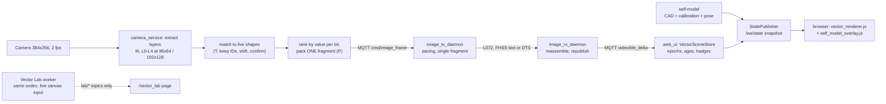

# LifeTrac v25: Vector Scene mode (VS1) design

> **Status (2026-09-23): design proposal, not implemented.** Rebased on `origin/main` at `d3751286` (2026-09-15), the tree that carries the Murata L072 radio, the strict image path and the FHSS bench campaign. The decisions D-VS1 to D-VS9 (D-VS3 and D-VS3a withdrawn) are proposed and need OSE sign-off; they are listed in [DECISIONS.md](DECISIONS.md#vector-scene-mode--proposed-pending-ose-sign-off). The Vector Lab page ([§8](#8-vector-lab-base-website-live-canvas-input)) needs no radio and can be built first.
>
> **Document roles.** This document is the source of truth for *what to build*. The research and review record, which covers *why*, is [../AI NOTES/2026-09-22_Vector_Scene_Research_ClaudeOpus5_5_v1_0.md](../AI%20NOTES/2026-09-22_Vector_Scene_Research_ClaudeOpus5_5_v1_0.md). It holds the prior-art survey with sources, the current-stack code findings, the FHSS campaign summary, the three competing proposals and how they were scored, and the adversarial-review record.
>
> **Relationship to the shipped pipeline.** VS1 is a new per-frame **codec** inside the existing `TileDeltaFrame` (`codec = 6`) and a new **encode mode** (`EncodeMode.VECTOR = 9`), selected exactly like `mono_g4` is today. It rides the strict image path unchanged: `camera_service.py` → MQTT `cmd/image_frame` → `image_tx_daemon.py` → L072 → air → base L072 → `image_rx_daemon.py` → MQTT `video/tile_delta` → `web_ui.py` → `/ws/state`. Nothing in the L072 firmware changes for the codec itself (Phases 1–3); the optional rung switch of D-VS8 (§4.6) is the one part of this proposal that needs L072 work, and the H7 changes only for the optional S1/S3 pose sources (§5.3). The April plan in [IMAGE_PIPELINE.md](IMAGE_PIPELINE.md) (topic `0x29`, wireframe bitmap, 25 ms fragment cap) is superseded by the shipped path; see [§1](#1-summary-and-design-principles).

---

## 0. Overview

### 0.1 The problem

The image link's bottom rung today is `mono_g4`: a 1-bit Floyd–Steinberg dither per 32×32 tile, zlib-packed (`firmware/tractor_x8/camera_service.py:617-641`). It is honest and cheap, but it is still a **tile** codec:

- A tile costs at least 14 B, and 130 B when dither noise defeats zlib (`camera_service.py:617-641`, `base_station/image_pipeline/codec_decode.py:56-84`). A 243 B frame therefore carries at most 16 of the 96 tiles (225 B after header and bitmap), and a single tile when dither noise defeats zlib, so the operator sees the picture arrive as a rotation of patches over several frames.
- Every frame is a train of tile blobs; a whole-canvas refresh is a keyframe train, and the self-heal keyframe requests chasing lost tiles are what broke the FHSS follower on the bench (222 base `REQ_KEYFRAME` sends, 62.8 % loss, `bench-evidence/RS_12_12_fhss_validation_2026-09-12/RESULTS.md:109-135`).

VS1 sends the **whole frame as geometry** in **one fragment**: horizon, sky and ground gradients, large regions as polygons in their measured colours, trees as ellipses, and edge lines. Shapes keep persistent IDs, so a static scene costs almost nothing and a pan costs one group-shift record. There are no keyframe trains, no keyframe requests and no tiles to lose. It is the mode the system drops to when the signal is degraded and the tile modes are failing, so it carries its own degradation ladder (§4.5): shorter frames, more repeats and less detail as loss rises, with no acknowledgement traffic.

### 0.2 What the operator sees

When VECTOR is the active encode mode, the console camera panel shows a stylised live picture instead of photographic tiles:

- **Sky and ground** as two smooth gradients in the measured colours, split by the real horizon, with a tree-line profile along it.
- **Large regions** as polygons filled with their measured mean colour and a simple gradient: the near field, the track, a shed wall.
- **Isolated trees and shrubs** as coloured ellipses.
- **Edge lines** for ruts, fences, structures and overhead wires.
- **Hatched "unknown" areas** (HOLE records): holes the tractor has reported inside a region but not yet described.
- **Dashed "UNCLASSIFIED" boxes** for anything unusual in the tractor's path, drawn above all scene layers and the self-model.
- **The tractor's own hood**, drawn in outline at the base (from the OpenSCAD model once the camera is calibrated; as the hand-drawn mask outline before that). The hood is normally masked and not transmitted. The loader arm is drawn too if an arm sensor is fitted.
- **Honesty cues:** a banner that raw mode cannot hide ("VECTOR — NOT CAMERA PIXELS · age · loss"), per-shape age styling, and a "SAFETY DETECTOR: NO PIXELS" chip.

The whole worked example scene of §3.6 (23 records, 129 B) fits in **one frame** at either radio profile. Later frames add polygon vertices, holes and fine detail while the scene is static, and a 21-bit group shift moves every shape when the tractor pans.

| Radio profile | VS body per frame | Records per frame (est.) | Worked scene |
|---|---|---|---|
| p1 FHSS (BW250) | 197 B | 1,563 bits ≈ 25–35 records | 1 frame, 546 bits spare |
| p2 DTS (BW500) | 237 B | 1,883 bits ≈ 30–40 records | 1 frame, 866 bits spare |

### 0.3 How it flows



Paint order, from bottom to top:

```
 11  banner "VECTOR — NOT CAMERA PIXELS"          (inside the vector canvas; raw mode cannot hide it)
 10  staleness styling + badges
  9  detections
  8  corridor anomalies (dashed, "UNCLASSIFIED")  (always above the self-model)
  7  self-model (hood outline; sensed arm)        (never opaque over transmitted pixels)
  6  L3 edges (ruts, fences, structures, overhead lines)
  5  L4 detail
  4  L2 trees / shrubs (ellipses)
  3  HOLE hatches
  2  L1 masses (polygons + gradient)
  1  L0 sky / ground gradients + skyline      <- first to arrive
```

### 0.4 How the original ideas map to the design

| Idea | Where it lives in this design |
|---|---|
| Convert everything in the frame to polygons | L1 masses. POLY records with 3–10 vertices; detail is added by INSERT records (§2.5, §3.3). |
| A simple colour gradient matching the average colour | FILL uses the measured mean colour (RGB444, or a palette slot only when within ΔE ≤ 4) plus an optional least-squares linear gradient (§3.3). Colours are never invented (principle 4). |
| Sky and ground as the first layer | L0 HZN record: 42–58 bits, the first record of every new epoch. Later frames send a 15-bit residual (§2.4). |
| More detail as bandwidth allows | Records are ranked by error reduction per bit (CELF), so a frame cut short still holds the best picture for its bytes (§2.9). While the scene is static, spare bits add vertices and detail (§4.3). |
| Trees and shrubs as basic shapes with varying detail | L2 TREE/SHRUB ellipses of 34–51 bits. A merged tree line becomes SKYLINE. Trunks are drawn only when the lens is zoomed in enough to resolve them (§2.6). |
| A 3D model of the tractor's own parts at the base | §5. The OpenSCAD model is exported to a visualisation-only model, then calibrated. The hood is masked on the tractor and costs 0 bits. The arm is posed from a sensor (S1). Vision and valve estimates are Lab-only and clearly labelled. The bucket is never masked. |
| Don't re-send the same vectors | Persistent shape IDs with UPD, UCOL, DEL and CONFIRM records. GSHIFT and GZOOM move whole groups. IMU horizon prediction happens at the base (§4). |
| Other optimizations | §9. |
| Testable on the base station website | Vector Lab (§8): the live canvas at both profile budgets side by side, with per-layer bit bars, loss simulation, a hex frame scrubber and golden-fixture export. |

### 0.5 Reading guide

| If you are… | Read |
|---|---|
| Deciding whether to adopt this | §0, §1 (budget), §4.5 (degraded-signal operation), §6 (mode and policy), §10 (blockers), §11 (decisions and roadmap) |
| Building the Vector Lab (Phase 1) | §2, §3, §7.2, §7.5, §8 |
| Integrating on the strict path (Phase 2) | §3.1, §6, §7 |
| Working on the self-model (Phase 3) | §5, and CALIBRATION.md §6 once it is written |
| Implementing the modem-rung switch on the L072 and the daemons (D-VS8) | §4.5.6, §4.6, §7.4 |

---

## Conventions

**Path key.** `DC/` = `LifeTrac-v25/DESIGN-CONTROLLER/`, `bs/` = `DC/base_station/`, `x8/` = `DC/firmware/tractor_x8/`, `DS/` = `LifeTrac-v25/DESIGN-STRUCTURAL/`, `BE/` = `DC/bench-evidence/`.

- **Estimates.** Anything marked *(est.)* has not been measured.
- **Computed figures.** Airtimes come from read-only runs of `bs/lora_proto.py` (`lora_time_on_air_ms`, `max_image_fragment_body`) at `PHY_IMAGE_BW250` (p1 FHSS) and `PHY_IMAGE_BW500` (p2 DTS), SF7/CR4-5/preamble 8 (`bs/lora_proto.py:150-151`), including the 8 B hop header and the 4 B fragment header. Bit packing and footprint figures come from stdlib Python.
- **Review status.** The first draft (2026-09-22) was written against a checkout from 2026-05-01 and reviewed adversarially against that stack (3 blockers, 34 major, 23 minor issues, all resolved). It was then rebased on the 2026-09-15 tree, which replaced the budget, transport, mode and integration sections. The layer model, record set, temporal rules, self-model and Lab carried over. The per-issue dispositions are in the appendix of the [research note](../AI%20NOTES/2026-09-22_Vector_Scene_Research_ClaudeOpus5_5_v1_0.md#appendix-b-adversarial-review-dispositions).

---

## 1. Summary and design principles

### What changes

A new per-frame codec and encode mode on the shipped strict image path:

| Layer | Content |
|---|---|
| L0 | Horizon, with sky and ground as vertical gradients in the measured mean colours, plus a skyline/treeline profile |
| L1 | Large regions as polygons, each with its measured mean colour and an optional linear gradient. Holes are declared, never silently painted over. |
| L2 | Isolated trees and shrubs as ellipses |
| L3 | Edge polylines, including overhead lines. The "edges only" view is L3 with fills toggled off. |
| L4 | Residual detail |

- Every shape has a persistent ID, and **every frame is one fragment that decodes on its own**.
- The tractor never spends bits on its hood, and optionally on its arm members. The base draws them from a CAD self-model at a pose whose source is always labelled.
- The bucket and cutting edge are **never masked** (§5).
- The `0x29 video/wireframe` topic, the 12,293 B edge bitmap in `x8/x8_image_pipeline/encode_wireframe.py` and `bs/image_pipeline/wireframe_render.py` are dead code on the strict path (no importers outside `bs/tests/test_image_pipeline.py`); VS1 replaces the idea, not the code path.

### Budget (computed)

The strict path sends image fragments in plaintext: an 8 B hop-sync header, a 4 B fragment header (`0xFE | frag_seq | frag_idx | total−1`, `bs/lora_proto.py:819-876`), and up to 243 B of payload (the 247 B `TX_FRAME_BODY_MAX` includes the fragment header, `bs/lora_proto.py:835-836`; the 170 ms cap trims it to 203 B at BW250). There is no KISS and no AES-GCM on this path (`x8/image_tx_daemon.py:36-42`, `bs/image_rx_daemon.py:12-14`). The per-fragment airtime cap is 170 ms (`LIFETRAC_FRAG_AIR_CAP_MS`, `bs/lora_proto.py:837`); the April 25 ms cap was dropped for image traffic (TODO.md RS-9.7).

| Profile | Fragment body | On air | Airtime | VS body (body − 6 B `TileDeltaFrame` header) | Record bits (body × 8 − 13) |
|---|---|---|---|---|---|
| p1 `FCC_15_247_FHSS_50CH_BW250` | 203 B | 215 B | 169.1 ms, one per 200 ms slot | **197 B** | **1,563** |
| p2 `FCC_15_247_DTS_BW500` | 243 B | 255 B | 99.9 ms | **237 B** | **1,883** |

Sources: `x8/image_tx_daemon.py:308` (`_FRAG_BODY_BY_PROFILE`), `SETTINGS_REFERENCE.md` §2.1, `CONTROL_PLANE_DESIGN.md:101`.

- The `TileDeltaFrame` byte budget covers the whole wire payload including its header (`x8/camera_service.py:1066-1075`), and the live budget arrives on the retained `tractor/link_budget` topic as one fragment (`x8/image_tx_daemon.py:435, 1054-1088` → `x8/camera_service.py:824-841`). VS1 sizes every frame to that budget.
- Airtime is paced by time-on-air (`x8/image_tx_daemon.py:355-411`, 0.92 headroom), so a short frame really is cheaper: a 12 B VS body costs 18.0 ms at DTS (36.0 ms at FHSS), a full frame 99.9 ms (169.1 ms). Airtime moves in 3.5 B / 1.28 ms steps at BW500 (2.56 ms at BW250), so bodies of 12–15 B all cost the same (18.0 ms at DTS, 36.0 ms at FHSS).
- At the default 2 fps (`x8/camera_service.py:109`) a full VS frame uses 20 % of DTS airtime and 34 % of FHSS airtime (2 of every 5 slots). A static scene converges to CONFIRM/DIGEST-only frames of a few bytes.

**What this replaces.** The first draft of this document (written against the 2026-05-01 checkout) budgeted 10 B per LoRa frame under a 25 ms cap with 28 B of GCM and KISS framing per frame. None of that exists on the strict path. The measured link gives 699–812 B/s on FHSS and 1.75–2.0 KB/s on DTS (`TODO.md:202-210`; `BE/FW_BATCH1_acceptance_2026-07-30/RESULTS.md:86`; `TODO.md:458-461`, tractor-side), so a VS frame is a single fragment with room to spare, and the design's value moves from "fit in 10 bytes" to **"one fragment per frame, no keyframe trains, honest at the floor"**.

### Principles

1. **Frame-atomic and idempotent.**
   - One fragment per frame; no multi-fragment trains, so no penultimate-fragment loss and nothing to reassemble.
   - Defines are absolute. UPD, GSHIFT, GZOOM and GAIN are *cumulative since epoch start* rather than chained deltas. INSERT is addressed against the immutable define, not the current vertex list.
   - The base applies each **field** (geometry, offset, colour) last-writer-wins by capture time.
   - Loss removes or ages content and never corrupts geometry. Design target: at least 12 % frame loss (the FHSS legs measured 2.1 % with a quiet command plane, `BE/RS_12_12_fhss_validation_2026-09-12/RESULTS.md:90-100`, and 10.5–20.9 % under the keyframe-storm camera load, `BE/RS_12_15_clock_authority_2026-09-14/RESULTS.md:300-352`).
2. **Every record describes the current capture.** The tractor re-measures before it re-sends anything: repeat-once and the carousel re-verify each shape against the newest capture (§4). A frame's age nibble is therefore true for every record in it, as C6 requires (`DC/IMAGE_PIPELINE.md:33`).
3. **Embedded order.**
   - Records are ranked by weighted ΔD per bit (CELF lazy greedy, §2) against a mirror of the base display.
   - Weights: 0 on the self-mask; ×3 in the path corridor and for overhead-line candidates; ×0.5 in the rest of the sky.
   - A frame cut short by the budget still leaves the best picture for its bytes.
4. **Measure, don't invent, and disclose omissions.**
   - Every colour is a measured mean. A palette slot is used only when it is within ΔE76 ≤ 4 of that mean.
   - Every shape comes from real pixels. Extrapolated content is PREDICTED (4); CAD content is MODEL (8).
   - The scene is a lossy *summary*. Objects can be missing, so the UI publishes the minimum-object-size table (§2.3), the "N detected / M shown" count, and hatched HOLE and NOT-TRANSMITTED regions.
5. **The base decides and the browser draws** (C5, `DC/IMAGE_PIPELINE.md:32`).
   - One pure-stdlib codec is shared by the tractor, the base store and the Lab (`bs/image_pipeline/vector_scene/`, deployed to the tractor next to `lora_proto` by the harness push list).
   - The browser receives only JSON.
6. **Supervisory tier; no safety claim.**
   - VECTOR is a "look, then move" view. **v25 has no working person detector.** Both `x8/x8_image_pipeline/detect_nanodet.py` backends return `[]`, and no tractor code emits `CMD_PERSON_APPEARED`. The base R6 detector gets no fresh pixels in VECTOR.
   - The console therefore shows "SAFETY DETECTOR: NO PIXELS". The speed cap (§6) applies once the hydraulic drive plane is on air; today no ControlFrame has flown and the E-stop is the 200 ms deadman ("stop by absence").
7. **No keyframe trains.** An epoch start is one frame (an absolute HZN — ABS, or NO_HORIZON — plus LAYER_CLEAR). Repair is level-triggered inside the next scheduled frame, never by a request that grows the load it responds to. This is the same conclusion the bench reached for tiles: the self-heal keyframe request was net harmful and was replaced by the `0x6C` stale-tile report (`TODO.md:136-140`).
8. **Same radio profile as everything else.** Image frames and base commands share whichever profile is active; there is no per-frame PHY split. On FHSS a VS frame occupies one 200 ms slot and base commands steal slots; on DTS commands ride the ~17 ms pacing gaps (`CONTROL_PLANE_DESIGN.md:96-120`, `TODO.md:141-159`).
9. **Degrade by shrinking, repeating and simplifying, never by asking.** Under measured loss the encoder sends shorter frames, repeats the important records more often and drops detail (§4.5). It never adds acknowledgement or retry traffic, because the bench showed that such traffic amplifies loss on this half-duplex link.

---

## 2. Layer model and tractor pipeline

### 2.1 Pre-stage (once per camera frame; 2 fps by default, `x8/camera_service.py:109`)

1. **Frame.** Take the newest 384×256 RGB frame. In VECTOR mode, lock auto-exposure and auto-white-balance where the V4L2 driver allows (B9).
2. **Resize and colour spaces.** `cv2.resize(INTER_AREA)` to 192×128 and 96×64. Convert to Lab for k-means and YCoCg for gradients.
3. **Global gain.** Estimate a per-channel log-gain against the epoch reference, from trimmed means of stable L1 masses. Normalise the frame by it before k-means, and send it as a GAIN record if it changes by more than 2 %. A cloud or auto-exposure step then costs one 25-bit record instead of a UCOL for every shape.
4. **Ego-motion.**
   - **Far and all groups:** `register.py` phase correlation at 96×64 (`x8/x8_image_pipeline/register.py:43-74`), after the B7 fixes.
   - **Ground group:** sparse Lucas–Kanade (`cv2.calcOpticalFlowPyrLK` on 30–50 Shi–Tomasi corners below the horizon at 192×128, 2–4 ms est.), fitted to the one-parameter ground-plane model of §4.4 to give the GZOOM parameter u. When LK has fewer than 12 inliers, use GPS speed.
   - **"moving"** means shift ≥ 1 px in 384-px units, or |u| above threshold, or any valve active.
5. **Weight map W.**
   - Self-mask = 0.
   - Path corridor ×3: a fixed trapezoid before calibration, a projected machine-width strip after.
   - Sky ×0.5, except ×3 for L3 overhead-line candidates, and ×1 inside the loader's swept volume while the sensed arm is above horizontal.
6. **Undistortion.** Once calibration exists, undistort only the sampled points (horizon samples, contour vertices, feature points) with `cv2.undistortPoints`, never the whole frame.

### 2.2 Layers

The target is an A53 at 1.8 GHz, numpy + OpenCV, single core. All times are est.

**Gate:** end-to-end M→P, including T, P and L4, p95 ≤ 100 ms on the **tractor** X8 using host Python, measured by `DC/tools/vector_bench.py` with the detector and register workloads running concurrently and a 30-minute thermal soak (§8.6).

| Layer | Content | Tractor extraction | Res. | ms (est.) | IDs |
|---|---|---|---|---|---|
| **M** self-mask | Static hood/frame. Dynamic **arm members only**, under the §5.3 conditions. **Never the bucket or cutting-edge zone.** | Hand-drawn bounded polygon (MVP) or projected CAD hull, `cv2.fillPoly`. Static mask eroded 1 cell, dynamic 2 cells. Structural anomaly test (§5.2). | 96×64 | 1–2 | — |
| **L0** frame | Horizon (straight, or quadratic before calibration), sky and ground gradients, skyline profile | §2.4 | 96×64 | 2–5 | singleton |
| **L1** masses | Fields, track, buildings, water, holes, corridor anomalies | §2.5 | 96×64 (corridor at 192×128) | 12–30 | 1–31 masses; 80–87 anomalies |
| **L2** plants | Isolated trees and shrubs | §2.6 | 96×64 | 2–4 | 32–55 |
| **L3** edges | Ruts, fences, structures, overhead lines, contact edges | §2.7, computed on the **unmasked** image; edges inside masks are dropped at pack time but kept for S2 | 192×128 | 5–12 | 56–79 |
| **L4** detail | MVP: the tail of the L1/L2 candidates. Phase 4: closed-form fits (§2.8). | shared | 96×64 | 0–3 | 88–127 |
| **T** temporal | Predict each live shape with GSHIFT and GZOOM, then match: regions by IoU on label maps, edges by chamfer distance. Choose UPD / UCOL / redefine / DEL / CONFIRM, whichever is cheapest. Maintain the mirror. | §4 | 96×64 | 5–12 | — |
| **P** pack | CELF lazy greedy, ΔD per bit on a 48×32 flat-fill mirror, ≤ 64 candidates, packed into one F-byte frame | §2.9 | 48×32 | 5–15 | — |

**Total M→P ≈ 32–83 ms per frame (est., sum of the rows above)**, which at the 2 fps camera default is 6–17 % of one core. The §2.1 pre-stage (resize, colour conversion, LK 2–4 ms) comes on top.

- WebP tile encoding (`x8/camera_service.py:644-700`) is skipped in VECTOR mode, so net tractor CPU falls from the roughly 140 % of one core in `DC/IMAGE_PIPELINE.md:60`.

**Paint order, bottom to top:**

1. L0 sky, ground and skyline
2. L1 masses (area-descending, VTracer-style stacking)
3. HOLE hatches
4. L2
5. L4
6. L3
7. self-model
8. **corridor anomalies** (IDs 80–87; dashed, high-contrast, "UNCLASSIFIED")
9. `0x26` detections
10. staleness styling and badges
11. banner

Corridor anomalies sit above the self-model, so the model can never hide one.

**Reprojection groups cost 0 bits.** The base assigns them geometrically:

- **far:** L0, the skyline, and shapes wholly above the horizon;
- **ground:** everything else.

### 2.3 Minimum detectable object (published in the doc and shown in the UI)

Pinhole model, fx = 192/tan(hfov/2): 89.5 px at 130°, 542 px at 39° (computed).

Outside the corridor, components under 6 cells at 96×64 are dropped. Inside the corridor the floor is 2 cells at 192×128.

| Zoom | Distance | Person (0.5 × 1.7 m), px / 4-px cells | Smallest square object, outside corridor | Smallest square object, inside corridor |
|---|---|---|---|---|
| 130° | 5 m | 9.0 × 30.4 px / 17 cells | 0.55 m | 0.16 m |
| 130° | 10 m | 4.5 × 15.2 px / 4.3 cells (**below 6: dropped outside the corridor**) | 1.09 m | 0.32 m |
| 130° | 20 m | 2.2 × 7.6 px / 1.1 cells | 2.19 m | 0.63 m |
| 39° | 10 m | 27 × 92 px / 156 cells | 0.18 m | 0.05 m |
| 39° | 20 m | 14 × 46 px / 39 cells | 0.36 m | 0.10 m |

The console shows this row for the current zoom, for example "objects < 1.1 m at 10 m may not appear outside the corridor". This assumes contrast with the surroundings; brown on soil can vanish at any size.

### 2.4 L0 algorithm (revised)

1. **Per-column score (24 columns), ordered on chroma and texture, not luma.**
   - Sky evidence: high (B−R), or bright neutral for overcast; low local variance; low Sobel gradient density.
   - Ground evidence: texture and vegetation index.
   - Luma is not used for ordering. Blue sky at Y ≈ 114 is darker than straw (189) or snow (241) (computed).
2. **Exclude loader columns.** Skip columns inside the loader's pose-independent swept envelope: the CAD envelope over the joint limits once calibrated, or a hand-drawn "loader zone" before that. A raised bucket's straight top edge cannot become the horizon.
3. **Fit.**
   - Take the strongest sky→ground transition per remaining column.
   - With calibration: undistort those points (`cv2.undistortPoints`) and fit a line.
   - Before calibration: fit y = a + bx + cx². At 2.8 mm / 130° a straight horizon 10–25° off-axis sags 11.5–27 px between centre and ±60° (computed), so a line fails. The curvature is sent as `curv4` (4 px steps, −32..+28 px at the frame edge, which covers the 27 px case).
   - Two-pass trimmed least squares.
4. **Accept** only if all of these hold:
   - ≥ 40 % of the non-excluded columns lie within 2 cells;
   - sky is above ground on chroma/texture;
   - temporal consistency: |Δ| from the previous horizon plus the IMU delta ≤ 3°, or the jump is seen in 2 consecutive captures.
5. **Otherwise mode = NO_HORIZON.** This is the *expected* state during loader work with the camera tilted down, not a failure. NO_HORIZON sends a top/bottom vertical gradient.
6. **IMU prior (Phase 3).** Roll gives the slope, and pitch × fy gives the offset. The search band is in *angle*, ±3°, which is ±fy·tan 3° = ±4.7 px at 130° and ±28 px at 39° (computed).
7. **Colours and skyline.**
   - Colours are trimmed means of the top band and near-horizon band (sky), and the near-horizon band and bottom band (ground).
   - The skyline is the per-column sky/non-sky transition above the horizon. A merged treeline or hedgerow becomes SKYLINE, not TREE records.

### 2.5 L1 algorithm (revised)

1. **Colour stability.** Assign each pixel to the previous refresh's centres in numpy, then call `cv2.kmeans(K=8, 3 iterations, KMEANS_USE_INITIAL_LABELS)`. `cv2.kmeans` cannot take initial centres directly. Match the new clusters to the old by centre distance, so indices stay stable.
2. **Vegetation feature.** Add ExG−ExR, heavily weighted, computed *after* grey-world or sky-referenced white-balance normalisation. Threshold with Otsu, not a fixed 0. Without normalisation a leaf scores +0.308, and under warm low sun +0.028 or −0.094 (computed).
3. **Components.** 3×3 mode filter, then `connectedComponentsWithStats`. Drop components under 6 cells outside the corridor. Inside the corridor, run at 192×128 with a 2-cell floor.
4. **Contours and holes.** `findContours(RETR_CCOMP)` and `approxPolyDP` at ε = 1 cell.
   - Holes of 2 cells or more are candidates for **HOLE** records, weighted by W.
   - A hole the tractor has not sent yet is painted in the parent colour. This is a disclosed omission (§2.3), not a claim.
   - Inside the corridor, every non-ground component goes through the ANOM path instead (step 7).
5. **Progressive vertices.** Order vertices by Visvalingam–Whyatt area. The define carries the top 3–4 (3–10 allowed). INSERT records add the rest (§3.3). This is the "basic shape first, detail as bandwidth allows" progression.
6. **Gradient.** A least-squares plane Y = a + bx + cy from `np.bincount` moments, on gain-normalised pixels.
7. **Corridor anomaly.**
   - Fit a trimmed 2-component GMM on **shadow-invariant chromaticity** (normalised rg) over the bottom band. Exclude the self-mask and the loader swept envelope.
   - Components inside the corridor with Mahalanobis distance > 3 become ANOM records (IDs 80–87).
   - Regions that stay fixed relative to the tractor while GSHIFT or GZOOM is non-zero (the tractor's own shadow) are suppressed.
   - This is a colour-anomaly *aid*, not a detector (principle 6).

### 2.6 L2 plants (revised)

A **tree candidate** is a vegetation cluster that meets all of these:

- darker, and higher in local variance, than the fitted ground-vegetation model;
- touches or rises above the horizon or skyline;
- solidity ≥ 0.8 and ellipse IoU ≥ 0.8 against `cv2.fitEllipse`.

Other points:

- A merged, non-convex treeline becomes SKYLINE.
- A **shrub** is the same test below the horizon, with area < 60 cells.
- In pasture or growing crop, the whole-ground vegetation component is L1, never L2.
- **Trunks are disabled unless fx > 300 px** (zoomed in). At 130° a 0.4 m trunk at 50 m is 0.72 px (computed).

### 2.7 L3 edges (revised; replaces the wireframe)

1. **Edge map.** Sobel magnitude at 192×128, masked by nothing. Canny thresholds come from the 90th and 97th percentiles of Sobel magnitude, not from median luma. A median-luma rule scales with brightness: bright scenes give 119/239 and lose everything, dark ones give 26/53 and flood with texture. EDPF (ximgproc, parameter-free) is optimisation #14.
2. **Prune early.** `connectedComponentsWithStats` on the edge map. Keep only the top K = 30 components by length × contrast × W *before* any per-contour Python.
3. **Polylines.** `findContours` and `approxPolyDP` at ε = 1.5 px, split into polylines of ≤ 4 segments.
4. **Class** (`cls3`):

   | Value | Class | Rule |
   |---|---|---|
   | 0 | rut | — |
   | 1 | structure | — |
   | 2 | fence | — |
   | 3 | contact | Edge within the bucket zone |
   | 4 | **overhead** | Long, thin, near-straight edge above the horizon; W ×3 |
   | 5–7 | reserved | Reject |

5. **Matching.** Distance-transform the previous refresh's edge raster after ego-motion prediction, and score each new polyline by mean chamfer distance. Keep the ID if the chamfer is ≤ 1 cell; with hysteresis, redefine only above 1.5 cells.

### 2.8 L4 detail (revised)

- **MVP:** the tail of the L1/L2 candidate list.
- **Phase 4:** closed-form fits. Take the highest-residual connected component and fit an ellipse from `cv2.moments`, with the mean colour and plane gradient, in O(pixels). Alternatively, place Marwood-style Delaunay vertices at residual peaks (#18).
- **No Python hill-climbing search.** primitive-gpu needed 21.5 s for 200 triangles on 8 desktop cores. A compiled `geometrize-lib` extension is considered only after an X8 benchmark.

### 2.9 Pack (revised)

- **Candidates:** new defines, UPD / UCOL / redefine, INSERT, HOLE, BLOB, capped at 64 per frame (top by a cheap prior).
- **Initial score:** ΔD is computed once per candidate over its bounding box on a **48×32 flat-fill mirror**.
- **CELF lazy greedy:** pop the heap top. Re-evaluate it only if its box overlaps a shape committed since its last evaluation, then commit it or re-push it.
- **Packing:** into one F-byte frame, in the §4.2 priority order.
- **Cost:** about 64 initial evaluations + ≤ 40 re-evaluations × ~50 µs, about 5–15 ms (est.).

---

## 3. Wire format: `TileDeltaFrame` codec `VECTOR` (VS1)

**Container.** A VS1 frame is a `TileDeltaFrame` whose `codec` byte is `CODEC_VECTOR = 6` (ids 0–5 are assigned and 6–14 are free, `bs/image_pipeline/frame_format.py:79-88`; 5 is `CODEC_WEBP_RAWSTREAM`). The 6 B header is unchanged:

```
u8  frame_kind   ; 1 = epoch start (VS "key"), 0 = update — reuses the tile I/P meaning
u8  seq          ; TileDeltaFrame sequence (image_tx_daemon / image_rx_daemon use it as today)
u8  grid_w, grid_h, tile_px   ; canvas geometry, so the base knows the coordinate frame
u8  codec = 6    ; VECTOR
```

After the header comes the **VS body** instead of the changed-tile bitmap and tile blobs. The parser branch is the only format change on the base (§7.1): `parse_tile_delta_frame` currently rejects trailing bytes and knows no codec 6 (`frame_format.py:136-200`).

Why a codec id rather than a new top-level magic:

- `image_tx_daemon` treats a first byte of `0x01` as a keyframe: never batched, and duplicated when its own TX-failure ratio exceeds 0.5 % (`x8/image_tx_daemon.py:763, 1103-1118`). VS epoch starts inherit that handling; the encoder adds its own repeat-once (§3.1).
- `image_rx_daemon` reassembles, re-encodes and republishes `TileDeltaFrame`s (`bs/image_rx_daemon.py:543-557`) and the web UI already routes `video/tile_delta` (`bs/web_ui.py:1109-1113, 1417`); a codec branch reuses all of it.
- The first byte can never collide with the fragment magics `0xFB`–`0xFE` or the batch magic `0xB5` (`frame_format.py:37`).

### 3.1 Frame on air

`hop header 8 B | fragment header 4 B | TileDeltaFrame header 6 B | VS body (F bytes)`, with **F ≤ 197 (FHSS) or 237 (DTS)**, so that the fragment body stays within the profile's 203 / 243 B (`x8/image_tx_daemon.py:308`).

| VS body | On air | p1 FHSS BW250 | p2 DTS BW500 |
|---|---|---|---|
| 12 B (CONFIRM + DIGEST, static scene) | 30 B | 36.0 ms | 18.0 ms |
| 40 B | 58 B | 56.4 ms | 28.2 ms |
| 129 B (worked scene, §3.6) | 147 B | 120.4 ms | 60.2 ms |
| 197 B (full FHSS frame) | 215 B | 169.1 ms | 84.5 ms |
| 237 B (full DTS frame) | 255 B | — (over the 170 ms cap) | 99.9 ms |

- **Always one fragment.** The encoder sizes to the live `tractor/link_budget` (§1) and never emits a body over F. There are no trains, so the short-final-fragment "ride" loss found in RS-12 (`BE/RS_12_bulk_floor_2026-08-16/RESULTS.md:182-199`) cannot occur.
- **Epoch start = `frame_kind` 1.** `image_tx_daemon` adds a second copy only when its cumulative local TX-failure ratio exceeds 0.5 % (`x8/image_tx_daemon.py:1103-1118`); air loss is invisible to it, so VS1 does its own repeat-once: the next frame carries HZN ABS + LAYER_CLEAR again (69 bits, §3.5). When the daemon's copy does fire it uses the 5 B `0xFD` header, whose chunk is 1 B smaller than v1's (`pack_image_fragments_v2`, `bs/lora_proto.py:884`; until #132, merged 2026-09-24, the packer re-wrapped v1-sized chunks, so a full-F copy was 248 B at DTS and refused by the L072, or 171.6 ms at FHSS). VS1 therefore caps epoch-start frames at F − 1 (196 / 236 B) so that a copied epoch start stays one fragment instead of spilling a 1-byte runt into a second pair. The same arithmetic applies to today's full-budget tile keyframes.
- **No crypto.** P3 image traffic is plaintext today; the planned D14 split-trust envelope (4 B seq + 2 B CRC32, `LORA_PROTOCOL.md` priority-class table) would cost 6 B of body when it is switched on. VS1 reserves nothing for it; F simply shrinks by 6.

### 3.2 VS header: 13 bits, explicit in every frame

```
byte0: bit7   0      marker (kept for a future top-level-magic transport; harmless here)
       bit6   V      version (0 = VS1; 1 = reserved -> reject whole frame, count vs_bad_version)
       bit5   K      key: 1 = this is the epoch-start frame (mirrors frame_kind)
       bit4-1 AAAA   capture age, 200 ms units; 15 = saturated (>= 3.0 s, rendered stale)
       bit0   E3  ┐
byte1: bit7-5 E2-0┘  EEEE epoch mod 16
byte1: bit4-3 LL     degradation level the encoder is running: 0 = V0 … 3 = V3 (§4.5.4)
byte1 bit2 ..       records, MSB-first bitstream; records never cross frames
```

- **Age.** `camera_service` writes its encode latency into AAAA at pack time, and `image_tx_daemon` adds the frame's queue residence at dequeue (codec 6 only: payload byte 6, bits 4–1, in the plaintext VS header, patched just before `_pack_for`, `x8/image_tx_daemon.py:1108-1118`; the daemon already knows the enqueue time, `:559-574`), rounding up and saturating at 15. AAAA is therefore encode + queue wait, and the base computes capture time = rx_ms − airtime(profile, length) − 200·AAAA, which is within one 200 ms unit of the truth either way (the ceiling rounds ages older; the unreported slot wait, ≤ 200 ms, rounds them younger). Without the daemon's patch, `rx_ms − 200·AAAA` would be too young by the whole queue wait (up to the 1.5 s below) plus airtime. VECTOR mode sets `LIFETRAC_FRAME_MAX_AGE_MS=1500`, and for codec-6 frames the daemon drops an over-age frame **unconditionally** at dequeue, not only when a fresher one is queued (`x8/image_tx_daemon.py:1136-1145` drops conditionally today; default 10 s): a lone late frame is worth less than nothing, because it would win LWW with an understated age. AAAA therefore never reaches 15 on a working link (1.5 s plus encode is about 9 units); if it does, the store treats it as a bound — the frame's records fill absent state but never supersede state with a known capture time.
- **K and `frame_kind` must agree**; the parser rejects a mismatch.
- **LL** is the level the *encoder* is at, whether the base commanded it or the tractor self-selected it (§4.5.4). Frame size cannot carry this: a quiet V0 frame is smaller than a V2 frame.

**Record bits per frame = F × 8 − 13**

| Profile | F | Record bits |
|---|---|---|
| p1 FHSS | 197 | **1,563** |
| p2 DTS | 237 | **1,883** |

### 3.3 Records: canonical prefix code (Kraft sum exactly 1)

| Prefix | Record | Fields (bits) | Size |
|---|---|---|---|
| `00` | **UPD** | id7 (≠ 0), dx4, dy4: 4 px units, signed −8..+7, so **−32..+28 px**, cumulative offset from the define anchor | 17 |
| `010` | **POLY** define | id7, grid1, n3 (3..10 vertices), v0, (n−1) × EG2 zigzag (dx, dy) in grid cells, FILL | Gradient triangle 69; flat RGB triangle 63; palette triangle 55; flat quad about 75 (est.) |
| `011` | **TREE / SHRUB** | id7, centre 11 (8 px grid, x6 y5), rx3, ry3 ((v+1)·4 px), FILL, trunk1 [+ h3 × 8 px; only if fx > 300] | 34–48 by FILL (42 with a flat RGB fill); +3 with a trunk |
| `100` | **EDGE** | id7, cls3, v0 13 (4 px grid), k2 (1..4 segments), k × EG2 (dx, dy) | 1 segment 40; 3 segments 64 (est.) |
| `1010` | **HZN** | mode2; see the HZN modes below | 15–57 |
| `1011` | **DEL** | id7 | 11 |
| `1100` | **UCOL** | id7, FILL | 17–31 |
| `1101` | **GSHIFT** | grp2 (far / ground / all / L4), dx8, dy7: 2 px, **cumulative since epoch start**, ±256 / ±128 px | 21 |
| `11100` | **STATUS** | arm_src2, arm7 (1°, −30..+97°), bkt_src2, bkt7 (1.5° relative), conf2, corr_n3 (corridor anomalies detected, 7 = ≥ 7, *even if not yet sent*), mask_anom1, moving1 | 30 |
| `11101` | **ANOM** | slot3 (id 80+slot), x6 y5 (8 px), w3 h3 ((v+1)·8 px), RGB444 12. A box define that a later POLY with the same id may refine. | 37 |
| `11110` | **BLOB** (L4) | id7, centre 13, rx3, ry3, rot3 (22.5°), FILL | 40–54 |
| `111110` | **SKYLINE** | n2 (8 / 12 / 16 / 24 samples), sc2 (height unit ×4 / ×8 / ×16 / ×32 px), n × 3-bit heights above the horizon, FILL | 8 samples 48; 12 samples 60; 16 samples 72; 24 samples 96 |
| `111111` | **EXT** + sub4 | See the EXT subtypes below | 12–69 |

**HZN modes**

| Mode | Fields | Size |
|---|---|---|
| 00 ABS | y8 (2 px, y = 2v − 128 at x = 192, so −128..+382 px, which covers a horizon above or below the frame), ang6 (0.5°, ±16°), curv4 (signed sag at the frame edge, 4 px steps, −32..+28 px; 0 after calibration), SKY vfill, GND vfill | 42–58 |
| 01 RESID | dy5 (2 px), dang4 (0.5°). **Relative to the current epoch's ABS** (Phase 3: to the IMU prediction for that capture), never to a previous RESID; not sent while the epoch's anchor is NO_HORIZON | 15 |
| 10 COLOURS | 2 × vfill | 24–40 |
| 11 NO_HORIZON | top and bottom vfill. An absolute anchor like ABS: it starts an epoch and completes a hand-over (§4.3) | 24–40 |

**EXT subtypes**

| Sub | Record | Fields | Size |
|---|---|---|---|
| 0 | INSERT | id7, edge4 (define edge 0..n−1), k2 (order within that edge), EG2 (dx, dy) from **the define-edge midpoint** in the define's grid | 29–35, typically 31 (est.) |
| 1 | CONFIRM | base_id7, cnt4 (= count − 1, so 1..16), mask[cnt], then tag2 for each set bit | 21 + cnt + 2·set; 69 for 16 of 16 |
| 2 | DIGEST | n_live7, crc8 over sorted (id, define-hash, n_inserts, state-tag) | 25 |
| 3 | LAYER_CLEAR | range2: 0 = L1–L4, 1 = L2–L4, 2 = L3–L4, 3 = L4 only (M and L0 are never cleared). Mid-epoch it empties those layers of the current epoch at once. In an epoch-start frame it names the layers the new epoch rebuilds from scratch: at hand-over (§4.3) the previous epoch's cached shapes in those layers are dropped and shapes in the other layers are carried into the new epoch with their IDs and ages until redefined or TTL'd — a camera change, ID exhaustion or entering VECTOR sends 0; the 60 s safety refresh of a static scene sends 2 or 3 and re-anchors without re-sending the masses | 12 |
| 4 | CAL_REV | cal16, mask16 (low 16 bits of the SHA-256 hashes) | 42 |
| 5 | PAL | slot3 (adaptive slots 8–15), RGB444 12 | 25 |
| 6 | GZOOM | u8, log-quantised cumulative ground forward-motion parameter (§4.4); 0 = none | 18 |
| 7 | GAIN | 3 × 5-bit per-channel log-gain (2 % steps, about ±30 %), cumulative since epoch start | 25 |
| 8 | HOLE | parent id7, centre 13 (4 px), r3 ((v+1)·4 px) | 33 |
| 9–15 | reserved | Reject frame | — |

**FILL** = `m1 | (pal4 if m = 0, else RGB444 12) | g1 | [dir3 (22.5° steps over 180°) | dl3 (signed luma, ±64/255)]`

| Fill | Bits |
|---|---|
| Palette, flat | 6 |
| Palette, gradient | 12 |
| RGB, flat | 14 |
| RGB, gradient | 20 |

**vfill** (HZN only) = `m1 | pal4 or rgb12 | dl4 (vertical)`, 9 or 17 bits.

- **Palette.**
  - Slots 0–7 are a static farm palette in the codec: sky, overcast, dark foliage, light foliage, straw, soil, shadow, white.
  - Slots 8–15 are set adaptively by PAL.
  - Use `m = 0` only if the slot is within ΔE76 ≤ 4 of the measured mean.
- **Gradient.** The renderer sets c0/c1 = mean ∓ dl/2 in luma, along `dir` through the centroid, spanning the shape's projected extent. Colours are multiplied by the epoch GAIN.

**Vertex coding: EG2 zigzag per axis**

| Zigzag value | Bits |
|---|---|
| 0..3 | 3 |
| 4..11 | 5 |
| 12..27 | 7 |
| 28..59 | 9 |
| 60..123 | 11 |

**Coordinate ranges.**

- **v0:**
  - 8 px grid: x6 (0..47), y5 (0..31), 11 bits.
  - 4 px grid: x7 (−16..111, with horizontal margin), y6 (0..63), 13 bits.
  - v0's y is always in the frame; later vertices may lie outside via their deltas, and the renderer clips.
- **Epoch-stabilised coordinates:** q = p − S_group(epoch). The base draws at q + S_latest, so a lost GSHIFT or GZOOM only lags the offset.
- **Grid to pixels:** px = gx·384/W, py = gy·256/H.

**Order-independent INSERT (resolves review issues b3 and s6).**

- INSERT names a *define* edge e (the fixed vertices of the define) and an order k within that edge, and positions itself relative to that define edge's midpoint. Its meaning therefore never depends on which other INSERTs arrived.
- The base builds the ring as: define vertices in order, then, within each edge e, the received INSERTs sorted by k.
- **Any subset** of INSERTs gives a sub-ring of the canonical full ring, which is a valid VW simplification.
- The encoder allows at most 4 INSERTs per define edge; beyond that it redefines.
- A re-sent define with the same define-hash keeps the INSERTs. A new define-hash clears them.

### 3.4 Parser rules (base; fuzz-tested)

1. If byte0 bit7 ≠ 0 or V ≠ 0, drop the frame and count it.
2. **Before each record, if every remaining bit is 0, stop successfully (padding).** No valid record is all zeros, because id 0 is illegal on every record that carries an id. Otherwise decode the record.
3. **Drop the whole frame** on any of:
   - a truncated record whose remaining bits are not all zero;
   - a reserved EXT subtype, EDGE cls, or version;
   - an id outside its range (masses 1–31, plants 32–55, edges 56–79, corridor 80–87, L4 88–127; POLY is also legal on 80–87);
   - id 0;

   The fragment has already passed the L072's payload CRC and the reassembler, so a parse error means version skew or a bug. Rejecting the whole frame keeps the store deterministic.
4. UPD, UCOL, INSERT, DEL, CONFIRM or HOLE naming an unknown id is an *orphan*: ignore it and count it.
5. **Per-field last writer wins by capture time.** Each shape has three fields, each with its own capture time:

   | Field | Set by |
   |---|---|
   | geometry | define + INSERTs |
   | local offset | UPD (per shape) |
   | group shift | GSHIFT (per group) |
   | group zoom | GZOOM (per group) |
   | base colour | define fill, UCOL (per shape) |
   | gain | GAIN (per frame, all shapes) |

   Each row is its own last-writer-wins state with its own clock, so a GSHIFT never discards a shape's UPD and a GAIN never replaces a UCOL. On screen: vertices → local offset → group shift → group zoom (about the ground anchor) → screen, and colour = gain × base colour. Group transforms are absolute values, not accumulated deltas; every define stores the group transform current at its capture time and the renderer applies (group now − group at define), so a redefine at the current position never double-shifts. A define with an unchanged define-hash refreshes only the geometry age and never resets the other four. A new define-hash is a redefine at the current position, so the local offset is set to 0 at that define's capture time.

### 3.5 Epochs (revised acceptance)

A frame is applied, or switches the base to its epoch, when any of these holds:

1. its epoch equals the current epoch;
2. K = 1 and its capture time is later than the last applied capture time (this covers a tractor reboot and a normal epoch start);
3. its epoch is 1..7 ahead (mod 16);
4. no frame has been applied for more than 3 s, which covers any wrap during an outage;
5. it is the third consecutive "behind" frame with a strictly increasing capture time (self-heal).

Otherwise the frame is dropped and `vs_epoch_behind` is counted.

- **Hand-over.** The old epoch stays visible as **CACHED (1)** (desaturated, outline-weighted) until the new epoch's absolute HZN (ABS, or NO_HORIZON when the camera points down) has arrived and ≥ 50 % of its DIGEST `n_live` shapes are present. Only the DIGEST half of that condition times out (after 2 frames the store shows what it has); the absolute-HZN half never does, because without an anchor there is nothing to hand over to — if both epoch-start copies are lost, the cached picture stays until the tractor's next epoch start (the repeat-once copy, or the ≤ 60 s safety refresh). There is no black flash. At hand-over, old-epoch shapes in the layers named by the epoch start's LAYER_CLEAR are dropped and the rest are carried into the new epoch with their IDs and ages (§3.3).
- **Key frames.** The first frame of an epoch is an absolute HZN — ABS, or NO_HORIZON when the camera points down (§2.4) — plus LAYER_CLEAR when it fits (58 + 12 = 70; 40 + 12 = 52 for NO_HORIZON). `image_tx_daemon` sends it twice when its own cumulative TX-failure ratio exceeds 0.5 % (§3.1) — a local counter that cannot see air loss, which is why VS1 repeats the epoch start itself (§4.3).

### 3.6 Worked byte counts: typical field-edge scene, cold start, static

**Scene content: 23 records, 1,018 record bits (a 129 B VS body with the 13-bit header; computed from the §3.3 sizes, INSERT taken as 31 bits est.)**

| Records | Bits each | Total |
|---|---|---|
| HZN ABS (RGB vfills) | 58 | 58 |
| STATUS | 30 | 30 |
| Near and far fields (gradient triangles) | 69 | 138 |
| 12-sample treeline SKYLINE | 60 | 60 |
| Track, shed wall, roof (flat RGB triangles) | 63 | 189 |
| 2 isolated trees (no trunks at 130°) | 42 | 84 |
| 1 shrub | 42 | 42 |
| Fence EDGE (3 segments) | 64 | 64 |
| 2 rut EDGEs | 40 | 80 |
| DIGEST | 25 | 25 |
| 8 INSERTs (triangles → quads and pentagons) | 31 | 248 |

The hood is masked (0 bits). The bucket is always encoded as ordinary scene shapes (§5).

**Packing (computed).** The whole scene, key frame included, fits in **one frame** at either profile: 1,018 of 1,563 bits at FHSS (545 spare ≈ 17 more INSERTs) and 1,018 of 1,883 bits at DTS (865 spare). On air that first frame is 147 B (129 B VS body): 120.4 ms at FHSS, 60.2 ms at DTS. With the epoch-start duplicate that `image_tx_daemon` adds when its local TX-failure ratio exceeds 0.5 %, the cold start costs two frames.

**Time to first picture:** one camera period (500 ms at 2 fps) plus the frame's airtime plus the base's reassembly and publish path. Compared with `mono_g4`, which needs several 243 B frames to rotate through 96 tiles, VS1 shows the full scene on the first frame.

**Steady state (est.)**

| Case | Records | Bits | Share of a DTS frame |
|---|---|---|---|
| Pan | 2 GSHIFT + 3 UPD + RESID = 42 + 51 + 15 | 108 | 6 % |
| Forward drive | GSHIFT far + GSHIFT ground + GZOOM + RESID + 3 UPD + 1 near-field redefine | ≈ 195 | 10 % |
| Static | CONFIRM + DIGEST keep ages honest; the rest goes to INSERT, HOLE and L4 until the residual floor, then frames shrink to ≈ 12 B | — | — |

A moving scene therefore leaves most of every frame for repeat-once, the carousel and new detail; §4.2 gives the budget order.

### 3.7 Budget per profile and what changes it

| Profile | Fragment body | VS body F | Notes |
|---|---|---|---|
| p0 `BENCH_ONLY_FIXED_915` | 203 B | 197 B | Bench only; same modem tuple as p1 without hopping (`SETTINGS_REFERENCE.md` §2.1) |
| p1 `FCC_15_247_FHSS_50CH_BW250` | 203 B | 197 B | One fragment per 200 ms slot; commands steal slots |
| p2 `FCC_15_247_DTS_BW500` | 243 B | 237 B | 99.9 ms per full frame; commands ride the pacing gaps |
| any, with D14 split-trust switched on | −6 B | −6 B | 4 B seq + 2 B CRC32 per fragment (`LORA_PROTOCOL.md` priority-class table) |

The encoder takes F from the live `tractor/link_budget` value minus the 6 B `TileDeltaFrame` header — the topic carries the whole payload budget (203/243 B), and `camera_service` already charges its fixed header against it (`x8/camera_service.py:1066-1075`) — so a profile switch (two-phase `0x65/0x66/0x67`, `bs/image_rx_daemon.py:200-205`, opcodes `bs/lora_proto.py:958-960`) changes the frame size on the next capture with no format change. Airtime is quantised in 3.5 B steps (1.28 ms at BW500, 2.56 ms at BW250), so the packer rounds a frame down to the last whole step rather than padding.

---

## 4. Temporal and refresh behaviour

### 4.1 Refresh loop

- The encoder runs once per camera capture (2 fps by default, `x8/camera_service.py:109`; the interval is a setting) on the **newest** frame and emits **one** `TileDeltaFrame` of codec 6 on MQTT `cmd/image_frame`, exactly where `_build_frame` publishes tile frames today (`x8/camera_service.py:1576-1617`).
- `image_tx_daemon` paces by time-on-air with 0.92 headroom (`x8/image_tx_daemon.py:355-411`) and drops the oldest queued frame when its 4-deep queue is full (`:559-574`). VS1 therefore never queues more than one frame: if the previous frame is still waiting (queue depth from the daemon's `tractor/link_rx` status topic, §7.1), the encoder skips this capture and folds its changes into the next one.
- On FHSS each frame takes one 200 ms slot, so at 2 fps VS1 uses two of every five slots and base commands steal from the rest. On DTS a full frame is 99.9 ms, so two frames per second are 20 % of airtime.
- Frames are sized to the retained `tractor/link_budget` (203 or 243 B). A quiet scene shrinks its frames to a few bytes rather than padding (§3.7).

### 4.2 Budget order within a frame

1. Epoch-start records when an epoch starts (§3.5): the absolute HZN (ABS or NO_HORIZON) + LAYER_CLEAR.
2. ANOM, if corr_n > 0.
3. HZN (RESID, or ABS when an epoch starts or a stop changes by ΔE > 6), GSHIFT, GZOOM, GAIN.
4. STATUS (every frame while the arm moves or `mask_anom = 1`; otherwise every 4th frame or on change).
5. Changes (new, UPD, UCOL, DEL, HOLE), by ΔD/bit.
6. Repeat-once of the previous frame's defines, **re-verified**.
7. Carousel (κ = 25 % of the remaining budget), **re-verified**.
8. CONFIRM and DIGEST.
9. INSERT and L4, until the budget or the residual floor.

With 1,563–1,883 record bits per frame, items 1–5 rarely exceed a third of the frame even while driving; the rest is repeat-once, carousel and detail. There are no frame templates: the packer is the CELF greedy of §2.9 with this priority order as a pre-sort.

**Static accumulation.** With `moving = 0`, change bits fall to about 0. Detail accumulates at roughly 40–50 INSERT/HOLE/L4 records per frame (est.) until the residual threshold. After it, most frames are the 12 B floor — anchor + CONFIRM, 83 record bits: room for the RESID anchor, one CONFIRM or DIGEST and at most one small record, so no carousel — and every fourth frame at V0 (κ = 25 %) is a ≈ 40 B carousel frame carrying about four defines. At 2 fps that is 3 × 18.0 + 28.2 ms per 2 s (4.1 % of DTS airtime; 3 × 36.0 + 56.4 ms, 8.2 %, on FHSS), which is what the carousel age bound of §4.1 costs; the channel is otherwise free for commands.

### 4.3 Loss tolerance and honest ages

- **New epoch** on any of: a camera change; GSHIFT or GZOOM beyond its field; more than 40 % of the weighted area relabelled; ID exhaustion; entering VECTOR; 60 s (safety refresh).
- **Repeat-once and carousel re-verify.**
  - Before re-sending a shape, the tractor re-matches it on the current capture: IoU ≥ 0.7 after motion prediction, and ΔE ≤ 6.
  - If it passes, the re-sent define (same define-hash) plus its current UPD/UCOL is a *real* confirmation at this capture time.
  - If it fails, the tractor redefines or deletes it.
  - Repeat-once: at 12 % independent loss, lost defines fall to 1.44 % (computed).
  - Carousel period ≈ Σ define bits / (κ × spare bits per frame): about 2 frames for the worked scene (est.).
- **CONFIRM tag.**
  - tag2 = the low 2 bits of crc8(define-hash, offset, colour, n_inserts), computed from the tractor's mirror.
  - The base resets a shape's age only when the tag matches its stored state **and** DIGEST is not in mismatch. Otherwise it counts an orphan.
  - A 2-bit tag passes a stale state 25 % of the time per CONFIRM. The DIGEST crc8 (1/256) bounds this: while it mismatches, CONFIRMs reset no ages.
- **Orphans.** More than 20 % orphan records in 10 s, or 3 consecutive DIGEST mismatches, puts the store into a *resync* state: it shows a "RESYNC" chip, stops resetting ages, and waits for the tractor's next epoch start. VS1 sends no request. The tractor starts a new epoch at least every 60 s (the safety refresh above), so a desynchronised base recovers within one safety period with no uplink at all, and the picture shows its true age in the meantime.
- **Shape TTL:** 20 frames without a verified define, CONFIRM or UPD.
- **Age styling** (shape age = now − last *verified* capture time):

  | Age | Style |
  |---|---|
  | > 1.5 s | Tint |
  | > 5 s | Desaturate and show the age |
  | > 10 s | Outline only |

- **Static accumulation.** With `moving = 0`, change bits fall to about 0 and the budget goes to INSERT, HOLE and L4 (§4.2). Below a residual threshold the tractor sends only the anchor, CONFIRM and the carousel, so frames shrink to about 12 B and the airtime goes back to the command plane.

### 4.4 Ego-motion

**Tractor-side groups**

- **GSHIFT** per group: one 21-bit record moves every shape in the group. For a 30-shape pan, 510 → 42 bits.
- The ±256 / ±128 px range survives turning. At 39°, 10°/s of yaw is 95 px/s (computed), so the field lasts about 2.7 s before an epoch; at 130° it lasts about 16 s.

**Ground expansion (GZOOM)**

- Forward motion expands the ground row by row, which no translation can model. At 39° and 1 m/s, rows 10 / 30 / 60 / 100 px below the horizon move 0.2 / 1.5 / 6.1 / 18.2 px per 1.5 s (three frames at 2 fps). At 130° they move 1.0 / 11.6 / 76 / 1,351 px (computed, h = 1.8 m).
- **Model.** A ground point at row offset r below the horizon moves to r′ = r / (1 − u·r), with x scaled by r′/r about the vanishing point, where u = d / (h·fy).
- u **adds** across frames (r′′ = r / (1 − (u1 + u2)·r)), so the cumulative u8 is idempotent under loss.
- Shapes with r′/r > 2 or projected off-frame are dropped by the base (styled PREDICTED until confirmed or deleted).
- The tractor applies the same prediction before IoU and chamfer matching.

**Base-side reprojection**

- **Far group (Phase 3, needs calibration):** rotation homography K·ΔR·K⁻¹ from the tractor IMU quaternion (5 Hz) once IMU telemetry rides the strict path; today `x8/imu_service.py` still targets the retired M7 UART. Horizon bias b = HZN − pred(q_capture); display pred(q_now) + b.
- **Ground group (Phase 4):** H = K(R − t·nᵀ/h)K⁻¹, with t from GPS plus IMU yaw. This is the ground/far split of US10425622B2; its claims need review before this ships.
- **Honesty rules:**
  - A layer warped by more than 8 px, or extrapolated more than 2 s past verification, becomes **PREDICTED (4)** with a dashed outline.
  - Warping stops at 3 s.
  - Revealed, never-observed area is hatched "NO DATA".
  - Before calibration there is no base-side warp; shapes only age.

### 4.5 Degraded-signal operation

VECTOR is the mode the system drops to when the signal is degraded and the tile modes are failing, so its behaviour under loss matters more than its behaviour on a clean bench. This section sets the rules. Airtimes are computed with `bs/lora_proto.py`; bench facts are cited.

#### 4.5.1 Two kinds of poor signal

| Class | Symptoms | Evidence | What helps |
|---|---|---|---|
| **Scheduling loss** (what the bench measured) | Bursty, correlated with our own traffic: the base deafens itself ~18 ms per transmission, keyframe-request storms, FHSS lock loss, external emitters on fixed channels, the pacer notch | `BE/RS_12_11_command_timing_2026-09-12/RESULTS.md:214-222`; `TODO.md:130-159, 2226-2272` | Fewer, smaller transmissions; no request traffic; repeats in different slots |
| **SNR loss** (the field; not yet characterised) | Random, proportional to airtime, worse with distance, foliage and low antennas; the whole campaign ran at short range | `TODO.md:1774-1775` (exposure scales with airtime) | Shorter frames, more redundancy, slower modulation, power, antenna height |

VS1 must handle both without any change to the radio, and it must be the image payload that still works if slower modulation is ever exposed (§4.5.6).

#### 4.5.2 No retries: forward redundancy, scaled by measured loss

The campaign measured the cost of acknowledgement traffic on this half-duplex link: suppressing the tractor's echo took in-stream command delivery from 56 % to 91 %, smooth pacing took it to 99.8 %, and the self-heal keyframe request *raised* fragment loss by 1.9 points because each request steals a slot and deafens its sender (`TODO.md:130-159, 136-140`). Retries that need feedback amplify the condition they respond to. VS1 therefore:

- **Sends no acknowledgements** and never asks for anything. There is no feedback path: resynchronisation is in-band through the tractor's periodic epoch start (§4.3).
- **Repeats forward, on a dial.** The carousel share κ and the epoch-start repeat count rise with measured loss (§4.5.4). On FHSS each slot is a different channel, so a repeat in the next slot is also frequency diversity against the fixed-channel emitters the surveys found (`TODO.md:2874-2914`).
- **Keeps every frame independently useful** (principle 1), so a lost repeat costs nothing but age.
- **Measures loss from its own sequence numbers.** Every VS frame is one fragment and carries the `TileDeltaFrame` `seq`, so the base store counts frame loss from `seq` gaps directly. The auto radio policy's loss input is blind to single-fragment frames (RS-12.20); VS1 has the missing input from day one.

#### 4.5.3 Shorter frames under loss

Per-frame loss rises with airtime (`TODO.md:1774-1775`). VS1 records are typically 30–75 bits (the worked scene of §3.6 averages 44 bits over 23 records); the largest are a 24-sample SKYLINE at 102 bits and a 10-vertex POLY with 11-bit EG2 steps at about 240, which the packer defers to a fuller frame. A small frame therefore still carries several typical records:

| VS body | On air | p1 FHSS | p2 DTS | Records (est.) |
|---|---|---|---|---|
| 12 B (anchor + CONFIRM) | 30 B | 36.0 ms | 18.0 ms | 1–2 |
| 40 B | 58 B | 56.4 ms | 28.2 ms | 4–7 |
| 100 B | 118 B | 100.0 ms | 50.0 ms | 10–18 |
| 197 / 237 B (full) | 215 / 255 B | 169.1 ms | 99.9 ms | 21–43 |

Under loss the encoder trades one full frame for several short ones: the same bits in the same time, spread over more slots and channels, each exposed for a fraction of the time. At level V2 (below) a 2 fps stream of 58 B frames uses 11 % of FHSS airtime and 6 % of DTS airtime, leaving the channel to commands.

#### 4.5.4 The degradation ladder

The base scores link health over a 10 s window from three inputs: VS frame loss from `seq` gaps, the median SNR margin of received frames (the L072 reports `snr_db` and `rssi_dbm` on every `RX_FRAME_URC`, `DC/firmware/murata_l072/include/host_rx_wire.h:15-16`; `image_rx_daemon` already keeps `_last_snr_db`, `bs/image_rx_daemon.py:338-339`), and dead air. The SNR margin is measured SNR minus the profile's demodulation floor (SX1276 datasheet: −7.5 dB at SF7, −10 dB at SF8, −12.5 dB at SF9). Two consecutive windows move the level down; 60 s of health moves it up one step, the same hysteresis `AutoRadioPolicy` uses (`bs/web_ui.py:419-452`).

| Level | Enter when | Frame body F | Carousel κ | Epoch-start repeat | Detail | Base display |
|---|---|---|---|---|---|---|
| **V0 normal** | loss < 10 % and margin ≥ 6 dB | full (197 / 237 B) | 25 % | ×1 (next frame) | INSERT + L4 on | normal |
| **V1 degraded** | loss 10–25 % or margin 3–6 dB | 100 B | 50 % | ×2 | INSERT + L4 halved | "LINK DEGRADED" chip |
| **V2 poor** | loss > 25 % or margin < 3 dB | 40 B | 75 % | ×3, consecutive emitted frames (500 ms apart at 2 fps: the encoder repeats, the daemon does not) | INSERT + L4 off; STATUS and ANOM in every frame | "LINK POOR" chip, ages emphasised |
| **V3 dead air** | no VS frame for 10 s | 20 B beacon: the epoch's anchor form (HZN RESID, or NO_HORIZON while that is the anchor) + STATUS (+ ANOM) | — | — | nothing else | "NO VECTOR DATA" |

- **How the level reaches the tractor: one mapping for the quality byte.** The existing `0x63` command carries mode 9 and a quality byte 1–100 with a single meaning: the byte is the **detail ceiling**. Its band selects the level — 60–100 → V0, 40–59 → V1, 20–39 → V2, 1–19 → V3 — and the value inside the band scales the INSERT/L4 budget and the residual threshold linearly, so the operator's slider (§6) chooses detail within V0 and the ladder chooses the band. Automatic degradation sends `min(operator value, band ceiling)` — 59 for V1, 39 for V2, 19 for V3 — the base remembers the operator's value and restores it as the ladder climbs, and the ack matching of §6 compares the byte actually sent. The tractor's self-selected level (D-VS6b) can only lower the effective band; the LL field reports the effective level either way. The tractor's `_apply_encode_mode` clamps the quality byte to 20–100 today (`x8/camera_service.py:1240-1253`); for mode 9 the clamp becomes 1–100 so the V3 band exists on the wire. The settings slider keeps its 20 floor (`settings.html:216`): V3 is reached only by the ladder or the tractor's self-select, never pinned by hand. In V3 the base repeats the command at the RS-12.14 rate limits.
- **Tractor self-selection (D-VS6b).** Base → tractor commands are the weak direction on FHSS (1/17 and 49/281 delivered in legs H/I, `TODO.md:2661-2676`). The tractor therefore also scores its own downlink from the SNR margin of the base frames it *does* hear (the same `RX_FRAME_URC` field, relayed by `image_tx_daemon` on `tractor/link_rx`, §7.1) and from base silence, and steps its own level down when either says so. It steps up only on a received base frame. The base reads the tractor's level from the LL field of every VS header (§3.2); frame size cannot carry it, because a quiet V0 frame is smaller than a V2 frame.
- **Base heartbeat (the silence clock needs it).** On the shipped path base → tractor traffic is event-driven — `image_rx_daemon` only drains queued commands, and its periodic probe is bench-only (`LIFETRAC_REACTIVE_FIRE=0` in production, `bs/image_rx_daemon.py:354-359`) — so a healthy idle base is silent indefinitely, and silence alone would walk a healthy tractor down the ladder. VECTOR mode therefore adds `LINK_HB` (`0x71`, §4.6.3): whenever no command has left the gate for `T_hb` = 5 s, `image_rx_daemon` sends a 12 B heartbeat carrying the rung and the number of VS frames it decoded since the last one, two copies 1.0 s apart on FHSS (every base copy rides the shared command gate, §4.6.3). Cost: 2 × 20.6 ms per 5 s at F0 (0.8 % of airtime), 2 × 72.2 ms at F2 (2.9 %). The tractor's silence clock counts commands and heartbeats alike: **one level down per 20 s of silence** (four heartbeats missed), never without the heartbeat in service, and the `frames_rx` field tells the tractor whether its own frames are getting through, which keeps it off the rendezvous path (§4.6.4) while the forward link is alive.
- **Budget interaction.** F is the smaller of the level's body and the live `tractor/link_budget` minus the 6 B `TileDeltaFrame` header (§4.1), so a profile switch and a level change compose.
- **What the operator sees.** Each level changes the chip, never the picture's honesty: ages, HOLE hatches, the "N detected / M shown" count and the minimum-object table all stay, and the minimum-object table is recomputed for the smaller frame.

#### 4.5.5 Detail versus redundancy

At V1 and V2 the packer's priority order (§4.2) is re-weighted so that the budget goes to repeats of L0, L1 and ANOM before any new INSERT or L4 record. This is unequal error protection: the records that let the operator stop safely are sent several times, the records that make the picture prettier are sent once or not at all. HOLE records keep their place, because a disclosed hole is safety information.

**Optional cross-frame parity (Phase 4).** An XOR of the last k VS bodies, sent as its own frame, would let the base rebuild one lost frame in k. The tile path's per-train parity recovered about 24 % of losses for about 24 % extra airtime (`TODO.md:1036-1042`); a cross-frame variant for VS1 needs new code and a bench leg before it earns a default.

#### 4.5.6 Radio-level levers, and what VS1 needs from them

| Technique | Gain | State in the L072 firmware | Bearing on VS1 |
|---|---|---|---|
| Adaptive spreading factor (ADR) | about +2.5 dB per SF step, 2× airtime each | **Not exposed:** SF is 7 in all three profiles, no CFG key (`SETTINGS_REFERENCE.md:50, 1247`) | If a key is added (D-VS8, protocol in §4.6), the 170 ms cap allows 96 B bodies at SF8/BW250 and 35 B at SF9/BW250 (computed). VS1 still carries a whole-scene update at 35 B (about 4 records per frame); a tile frame is down to a single, unusually compressible tile (a minimum one-tile `mono_g4` frame is about 31 B: 6 B header, 12 B bitmap, one blank tile) |
| Bandwidth reduction | +3 dB per halving | 500 → 250 kHz is the DTS → FHSS switch; BW125 has no profile | Automatic today via `AutoRadioPolicy` |
| Coding rate 4/5 → 4/8 | ~1–2 dB in noise; +57 % airtime | Fixed 4/5; the bench saw zero payload CRC errors at the daemon layer (`TODO.md:141-143, 990-1000`) | Retest at the range edge; body at FHSS would fall to 113 B |
| Transmit power | +3 dB from 14 to 17 dBm | `CFG_KEY_TX_POWER_DBM` default 14, module ceiling 17, ERP clamp applied (`SETTINGS_REFERENCE.md:48, 394`) | Free; a field decision |
| Antenna gain and height | often 6–10 dB | Mast antenna planned; the bench swap was a null | The largest range lever |
| Repetition with time/frequency diversity | strong against bursts and fixed emitters | `0xFD` copies exist for tile keyframes | VS1's dial (§4.5.4) at record level |
| Adaptive frequency hopping (blacklist) | large against fixed interferers | Refused: the +30 dBm tier needs all 50 channels (`SETTINGS_REFERENCE.md:206`) | A policy decision: fewer channels at lower power |
| Longer preamble | helps a re-arming receiver | Tried (F4) and dropped after measurement (`TODO.md:141-145`) | — |
| Listen-before-talk | avoids collisions | CAD, 4 symbols (`SETTINGS_REFERENCE.md:83`) | — |
| ARQ / confirmed messages | — | Measured harmful on this link (§4.5.2) | Not used |

**Slower modulation and the control plane.** The same table cuts the other way for commands: a 38 B control frame is 20.5 ms at SF7/BW500 and 133.6 ms at SF9/BW250; a 12 B ditto frame is 10.3 ms and 72.2 ms (computed). Any SF key must therefore be routed through the airtime invariant and the control cadence, not just the image budget; see §7.4.

### 4.6 Coordinated modem-rung change (the D-VS8 protocol)

This is the protocol behind decision D-VS8: how both radios move to a slower, more sensitive spreading factor on the fly without losing each other, and how they find each other again if they do. It is written for whoever implements it on the L072 and in the two daemons. Nothing here changes the regulatory profiles; a *rung* is a modem tuple inside a profile.

#### 4.6.1 Rungs

| Rung | Tuple | Profile | VS body / frame (170 ms cap) | 12 B ditto | 38 B control | Sensitivity vs SF7/BW500 |
|---|---|---|---|---|---|---|
| R0 | SF7 / BW500 | p2 DTS | 237 B | 10.3 ms | 20.5 ms | 0 dB |
| R1 | SF8 / BW500 | p2 DTS | 228 B | 20.6 ms | 36.0 ms | +2.5 dB |
| R2 | SF9 / BW500 | p2 DTS (rendezvous) | 111 B | 36.1 ms | 66.8 ms | +5 dB |
| F0 | SF7 / BW250 | p1 FHSS | 197 B | 20.6 ms | 41.1 ms | +3 dB |
| F1 | SF8 / BW250 | p1 FHSS | 96 B | 41.2 ms | 71.9 ms | +5.5 dB |
| F2 | SF9 / BW250 | p1 FHSS (rendezvous) | 35 B | 72.2 ms | 133.6 ms | +8 dB |

Airtimes are computed with `bs/lora_proto.py`; sensitivity steps are the SX1276 datasheet's ~2.5 dB per SF and 3 dB per bandwidth halving. Coding rate stays 4/5. BW125 is excluded: the p1 validator demands exactly 250 kHz and p2 exactly 500 kHz (`SETTINGS_REFERENCE.md` §2.1), so a BW125 rung would be a new regulatory profile, not a rung. SF10 is excluded because a 12 B frame already costs 144 ms at BW250.

**Header assumption.** Every budget in this document uses the shipped schema-1 hop header (8 B). Schema 2 adds the rung byte of §4.6.2 item 3 and a trailing MIC of N bytes (`DC/firmware/murata_l072/include/lora_pkt_hdr.h:35-43`, N fixed by Track C1), and each extra byte comes straight out of the body: with N = 4 the VS bodies become R0 232, R1 223, R2 106, F0 192, F1 91 and F2 30 B (computed; R0 is bound by the L072's 255 B ceiling, the others by the 170 ms cap). F2 then carries 3–4 records per frame instead of 4, and the 197 / 237 B figures used from §3 onward shrink to 192 / 232 B. Recompute §3.7 and this table when N is fixed; record costs do not change.

The **rendezvous rung** is the slowest rung of the active profile (R2 or F2). Every node can always be found there.

Legal dwell is unaffected: on FHSS every rung still sends at most one packet of ≤ 170 ms per 200 ms slot, under the 400 ms-per-10 s per-channel accountant and the 380 ms per-packet cap (`SETTINGS_REFERENCE.md` §2.2). At F2 the 12 ms head-start and 15 ms guard are 6 and 7 symbols, which is enough.

#### 4.6.2 What the L072 needs

1. **`CFG_KEY_MODEM_RUNG`** (new host CFG key): `u8 rung` within the active profile, applied through `sx1276_set_sf_bw_cr_checked()` (`DC/firmware/murata_l072/radio/sx1276.c:393`) so the airtime invariant and the legal-dwell accountant validate the tuple. Rejected tuples leave the radio untouched and answer with a status byte.
2. **Scheduled apply.** The same key with an *apply-at* argument: on FHSS `{epoch, hop_idx}`; on DTS `delay_ms` from receipt. The firmware retunes at that instant, not at receipt, so both ends switch on the same slot boundary.
3. **Rung in the hop header, as a schema-2 field.** The 8 B header carries `profile_id` as a full byte with values 0–2 (`DC/firmware/murata_l072/include/lora_pkt_hdr.h`). Do not overload its spare bits: schema-1 parsers treat the whole byte as the profile and would reject a value such as `0x11` as an unknown profile. Schema 2 is already planned for a MIC, so the rung rides that bump as an additive field. A receiver cannot decode a frame on the wrong rung (it would not demodulate), so until schema 2 lands the host infers the rung of a decoded frame from the SF it is tuned to; the field is for logging and for verifying a switch from the first frame.
4. **Rendezvous beacon and sweep.** While healthy, the tractor sends one firmware-timed 12 B `RUNG_HELLO` per 10 s on the rendezvous rung: on DTS on the profile's single channel, on FHSS on a fixed **rendezvous channel** (one member of the hop set, chosen per profile) rather than on the hop sequence, so a listener parked on that channel is guaranteed to hear it within one period. The transmitter retunes for that one frame and returns. Cost at F2: 72 ms per 10 s, 0.7 % of airtime and well inside the per-channel dwell accountant; the peer that wants to hear it retunes its receiver for that slot, 200 ms per 10 s of deafness on the working rung, 2 %. A tractor that is itself deaf (§4.6.5) switches to a **sweep**: `RUNG_HELLO` on every channel of the hop set in turn, one per 200 ms slot, a full sweep every 10 s (on DTS, one beacon every 2 s), so a base parked on any single channel of the rendezvous rung hears it within 10 s.
5. **Rung-aware scan.** Cold-start acquisition today walks the hop set at `SX1276_RX_SCAN_DWELL_MS` = 500 ms per channel with a 30 s abort (`include/sx1276_rx_scan_policy.h`), which finds a continuously transmitting peer but not a sparse beacon: one 12 B frame per 10 s on one channel gives a walking scanner a few percent chance per pass. On the rendezvous rung the scanner therefore **parks** instead of walking — 10.5 s on the rendezvous channel (one healthy beacon period plus a slot) — before trying the working rung the host last knew, then back. A parked receiver also catches a sweeping peer within 10 s on any channel.
6. **Bench vectors.** `bench/host_proto` gains vectors for the key, the schema-2 header field, the scheduled apply and the legal-dwell check at F2, in the style of `cfg_profile_wire.c` and `legal_dwell.c`.

#### 4.6.3 Message flow (host, `0xFB` command frames)

New opcodes in the shipped `0xFB` namespace (`bs/lora_proto.py:956-995`), continuing the profile-switch pattern of `0x65`–`0x67`:

| Opcode | Name | Direction | Args | Sent on |
|---|---|---|---|---|
| `0x6D` | `RUNG_REQ` | base → tractor | `u8 rung, u8 req_seq` | old rung, 3 copies 1.0 s apart: every base copy rides the shared command gate (`CMD_STREAM_MIN_GAP_S`, `bs/image_rx_daemon.py:273, 827-865`; 120 ms only when no stream is active), never a burst — the RS-12.14 lesson |
| `0x6E` | `RUNG_ACK` | tractor → base | `u8 rung, u8 req_seq, u8 current_rung, u8 status` (0 = accepted; 1 = moving; 2 = rung refused by the firmware; 3 = cooling down after a revert) | old rung; `status ≠ 0` is a NACK |
| `0x6F` | `RUNG_CONF` | base → tractor | `u8 rung, u8 req_seq, u32le apply_epoch, u8 apply_hop` (FHSS) or `u16le apply_delay_ms` (DTS; each copy carries its *own* remaining delay, the apply instant minus that copy's transmit time) | old rung, 3 copies 1.0 s apart; carries the apply instant, computed when it is sent; the tractor latches the instant from the first copy it accepts and ignores later copies with the same `req_seq` |
| `0x70` | `RUNG_HELLO` | both | `u8 rung, u8 req_seq, u32le epoch` | new rung, in alternating slots (base: even hop slots, through the gate; tractor: odd slots; on DTS the base at the apply instant + k × 1.0 s and the tractor offset by 500 ms) until the first peer frame is decoded (rule 4); also the beacon and sweep body on the rendezvous rung |
| `0x71` | `LINK_HB` | base → tractor | `u8 rung, u8 frames_rx` (VS frames decoded since the last heartbeat) | working rung, after every `T_hb` = 5 s of command silence, 2 copies 1.0 s apart on FHSS (§4.5.4) |

```
base                                   tractor
 |  RUNG_REQ(rung)  ─────►               |   old rung
 |  ◄─────  RUNG_ACK(rung)               |   old rung
 |  RUNG_CONF(rung, apply_at)  ─────►    |   old rung   (both arm the scheduled apply)
 |            … apply instant …          |
 |  ◄─────  RUNG_HELLO(rung)             |   new rung   (tractor's first slot)
 |  RUNG_HELLO(rung)  ─────►             |   new rung
 |  first decoded frame on the new rung proves the switch on each side
```

Rules:

1. The base sends `RUNG_REQ` only on the idle drain or the completion-aligned pump, behind the shared 1.0 s command gate like every other command (`bs/image_rx_daemon.py:265-273`), and only while the tractor reports `moving = 0` in STATUS (before the drive plane: always allowed).
2. `apply_at` travels in `RUNG_CONF`, not in the request, so it is computed after the ACK and the command gate; it is at least 1.0 s (one gate interval, five FHSS slots) after the last `RUNG_CONF` copy, so all three copies can land first.
3. The tractor arms the switch only on a `RUNG_CONF` whose `req_seq` matches its ACK. A `RUNG_REQ` without a matching `RUNG_CONF` within `T_conf` = 10 s is discarded, and the tractor stays put. `T_conf` covers the whole sequence at the gate's pace: three `REQ` copies over 2 s, the ACK, the base's 1.0 s command gate, three `CONF` copies over 2 s, and one retry of the CONF.
4. After the apply instant each side sends `RUNG_HELLO` in its own slots — base even hop slots (through the gate), tractor odd slots, so the two half-duplex radios never key up together — until it decodes any peer frame on the new rung (a HELLO, a VS frame, a heartbeat or any command). There is no commit message: the new rung is held under a **lease**. The first peer frame must arrive within `T_revert`; after it, every decoded peer frame renews the lease for `T_lease` = 15 s (three heartbeat periods in the base → tractor direction, more than one V3 beacon period in the other). A side whose lease lapses reverts to the old rung and holds *that* under the same lease before the deaf rule of §4.6.5 applies. This is convergent after any loss pattern, including "first peer frame heard, then every reply lost": the silent side reverts at `T_revert`, the other side's lease lapses `T_lease` later, and both are on the old rung within `T_revert` + `T_lease` = 20 s with no acknowledgement of the acknowledgement.
5. `image_tx_daemon` and `image_rx_daemon` re-read the rung after the apply and update `tractor/link_budget` (§3.7), so the vector encoder sizes the next frame to the new body.

#### 4.6.4 Timers

| Timer | Value | Purpose |
|---|---|---|
| `T_conf` | 10 s | Tractor discards a request not confirmed in time; the sequence takes about 6 s without retries at the gate's pace (three REQ copies over 2 s, the ACK, the 1.0 s gate, three CONF copies over 2 s) |
| `T_revert` (image only) | 5 s | Either side reverts to the previous rung unless it has decoded a peer frame on the new one; after that the lease below takes over |
| `T_lease` | 15 s (image); 3 control periods on the drive plane | Renewed by every decoded peer frame; a side whose lease lapses reverts to the old rung, so a one-sided switch converges within `T_revert` + `T_lease` |
| `T_revert` (drive plane on air) | 600 ms (3 slots) | Same, at the control link's timescale; the April `CMD_LINK_TUNE` design used 500 ms |
| `T_cool` | 60 s | No new `RUNG_REQ` after a revert |
| `T_deaf` (base) | 10 s without a VS frame (= level V3, §4.5.4) | Base goes to the rendezvous rung |
| `T_hb` | 5 s | Base heartbeat `LINK_HB` after 5 s of command silence (§4.5.4), two copies on FHSS; every silence-based decision counts against it |
| `T_deaf` (tractor) | 60 s without a decoded base frame (12 heartbeats, 24 copies, missed) | Tractor goes to the rendezvous rung. Longer than the base's `T_deaf` on purpose: the tractor cannot tell a dead base from a bad reverse link, and leaving a working rung while its own frames still arrive (the `frames_rx` field of the last heartbeat said so) would break a live image link. Until D-VS9 fixes FHSS reverse delivery (1/17 and 49/281 in legs H/I) this fallback stays bench-only |
| Beacon period | 10 s | Healthy tractor's rendezvous beacon on the rendezvous channel (§4.6.2 item 4) |
| Beacon while deaf | sweep: one channel per 200 ms slot on FHSS (the hop set in 10 s); every 2 s on DTS | Guarantees a parked listener hears it within 10 s |
| Hysteresis (policy) | 2 windows down, 6 windows up (10 s windows) | Same shape as R-8 and `AutoRadioPolicy` |

Both sides count `T_revert` from the apply instant, not from receipt, and hold the new rung only under the lease, so a one-sided switch ends with both on the old rung within `T_revert` + `T_lease`.

#### 4.6.5 Rendezvous rule

1. A side that is deaf for `T_deaf` tunes to the rendezvous rung of the active profile. The base **parks** its receiver on the rendezvous channel; the tractor **sweeps** `RUNG_HELLO` across the hop set (one channel per slot; every 2 s on DTS) and listens between beacons (§4.6.2 item 4). The roles are fixed so the two never talk past each other.
2. A healthy tractor still beacons once per 10 s on the rendezvous channel (§4.6.2 item 4), so a base that lost the working rung and parks there finds it within 10 s without a scan.
3. On hearing the peer's beacon, both stay on the rendezvous rung and negotiate upward with the normal flow, one rung at a time, subject to the policy hysteresis.
4. Cold start is the same rule from the other end: the scan parks on the rendezvous channel first (§4.6.2 item 5).
5. On DTS there is no slot grid, so the rendezvous beacon is timed from the transmitter's own clock and the listener keeps its receiver on the rendezvous rung until it hears one; the F1 DTS slot clock (`CONTROL_PLANE_DESIGN.md` §10) would make this deterministic.

#### 4.6.6 Decision policy (base)

Inputs, over 10 s windows: median SNR margin of decoded frames (`RX_FRAME_URC` `snr_db`, `DC/firmware/murata_l072/include/host_rx_wire.h:15`, minus the rung's demodulation floor: −7.5 dB at SF7, −10 dB at SF8, −12.5 dB at SF9), VS frame loss from `seq` gaps, and dead air.

- **Down one rung** when the margin is below 3 dB for 2 consecutive windows *and* the VS1 ladder is already at V2 (shrink and repeat come first, §4.5), *and* the tractor is stopped. One change per `T_cool`.
- **Up one rung** when the margin is at or above 9 dB for 6 consecutive windows and no revert happened in the last `T_cool`.
- **Never below the rendezvous rung, never above the profile's fastest rung.** A profile switch (`0x65`–`0x67`) resets the rung to that profile's fastest, so the two ladders compose: profile first (DTS ↔ FHSS), rung second.
- **Tractor self-select (D-VS6b) uses the same inputs** from the base frames it hears, heartbeats included; when it is deaf for its own `T_deaf` (60 s, §4.6.4) it goes straight to the rendezvous rung rather than stepping.

#### 4.6.7 Interaction with control

- A rung change is a "look, then move" event: it happens while stopped, and the deadman stays armed throughout, so a failed switch is a stop.
- Control frames slow with the rung (§4.6.1): at F2 a full control frame is 134 ms, so the cadence floor is about 5 Hz and the 12 B ditto (72 ms) becomes the normal control message. The reserved control slot of D-VS9 must be sized per rung.
- Image traffic yields first: the VS1 ladder (§4.5.4) has already cut frames to 20–58 B on air before any rung change is considered, so the slower rung is spent on control, not on pictures.

#### 4.6.8 Failure analysis

| Failure | Effect | Recovery |
|---|---|---|
| `RUNG_REQ` lost | Nothing changes | Base retries after the command gate |
| `RUNG_ACK` lost | Base never confirms; tractor discards after `T_conf` | Base retries |
| `RUNG_CONF` lost | Base switches, tractor stays; base hears nothing on the new rung | Base reverts after `T_revert`; `T_cool`; tractor never moved |
| Apply-time skew (DTS) | One side keys up a slot early or late | `RUNG_HELLO` repeats in its own slots until the first peer frame, within `T_revert` |
| Base HELLO heard, every tractor frame on the new rung lost | Tractor holds a lease; base hears nothing | Base reverts at `T_revert`; the base is then silent on the new rung, so the tractor's lease lapses `T_lease` later and it reverts too: both on the old rung within 20 s, then `T_cool` |
| New rung too poor for both | Neither side decodes anything | Both revert after `T_revert` (counted from the apply instant on both sides), then `T_cool` |
| Repeated failures | Link stays marginal on the old rung | After `T_deaf`, both go to the rendezvous rung and climb back one rung at a time |
| Beacon collides with image traffic | One 12 B frame lost | Next epoch |
| Base commanded a rung the tractor's firmware rejects, or the tractor is moving or cooling down | `RUNG_ACK` carries `status ≠ 0` | Base treats it as a NACK; no switch; a `status = 1` (moving) request may be retried once STATUS shows `moving = 0` |

#### 4.6.9 Work list and tests

- **L072:** items 1–6 of §4.6.2; `host_proto` vectors; `check-stats-layout`-style wire pin for the schema-2 header field.
- **Base:** opcodes `0x6D`–`0x71` in `bs/lora_proto.py`; the flow, the lease, the timers, the `LINK_HB` heartbeat and the parked rendezvous rule in `image_rx_daemon.py`; the policy in `AutoRadioPolicy` (`bs/web_ui.py:378-538`) with a "rung" chip beside the profile selector; audit events for every request, switch, revert and rendezvous.
- **Tractor:** ACK (with `status`) and HELLO (own slots, lease) handling, the per-copy DTS delay latch and the scheduled apply in `image_tx_daemon.py`; the beacon sweep when deaf; `tractor/link_budget` republished per rung and `tractor/link_rx` (last base frame heard, SNR, rung, `frames_rx`, queue depth) published for `camera_service`; D-VS6b's 60 s rendezvous fallback in `camera_service.py`, bench-only until D-VS9.
- **SIL:** `test_rung_switch_sil.py` modelled on `test_link_tune_sil.py` (764 lines, the April ladder): every row of §4.6.8 including "first peer frame heard, then every reply lost" (must converge within `T_revert` + `T_lease`), the lease renewals, timer arithmetic from the apply instant and the 1.0 s gate, the heartbeat silence clock (an idle but healthy base never causes a level step or a rendezvous), hysteresis, no request while moving, budget update after a switch, schema-2 header field round trip.
- **Bench:** (1) a switch leg on the two-board bench at each rung pair, scored on proven-switch time and frames lost during the switch; (2) a rendezvous leg where one board is parked mid-session and must be re-found within `T_deaf` + 10.5 s (parked listener, one sweep); (3) the range-edge attenuator walk-down of §8.6, now with rung changes allowed, which is also the campaign's first range data.

---

## 5. Self-model overlay

### 5.1 Geometry pipeline (visualisation only; STL was removed on purpose, `DS/REQUIREMENTS.md:166`)

1. **`DS/openscad/export_viz_bodies.scad`.**
   - Uses `use <lifetrac_v25.scad>` and exports `-D part=chassis|arm|bucket` at the reference pose, with low `$fn` and no COG sphere, welds or tread.
   - Kinematics:
     - arm rotation at `lifetrac_v25.scad:3973-3974`;
     - the bucket transform at `:4153-4159` (it re-applies the arm transform rather than being a child module);
     - pivot [0, 200, 1100] mm (`lifetrac_v25_params.scad:106-108`).
   - A CI job cloned from `generate-assembly-png.yml` produces the bodies as build artefacts, not committed files.
2. **`DC/tools/build_self_model.py`** (numpy; trimesh optional) writes `bs/web/models/self_model_v25.json` containing:
   - pivots and limits via `openscad --export-format echo`;
   - per-body convex parts (≤ 2k vertices);
   - dihedral > 35° feature edges (≤ 400 segments per body);
   - the **pose-independent swept envelope** of arm and bucket over their joint limits (used by §2.4 and §2.5);
   - the label "visualisation self-model — not for fabrication".

   An optional `.viz.glb` for a later vendored three.js view is Phase 4.
3. **Projection is on the base** (C5). `bs/image_pipeline/self_model.py` does forward kinematics and `cv2.projectPoints`, and sends 2D polygons and edges to the browser.
4. **The tractor** uses the same JSON plus calibration, through the shared `self_model_geom.py`, to rasterise masks (< 1 ms).

### 5.2 Calibration (new `DC/CALIBRATION.md` §6, following `CALIBRATION.md:47-61`)

1. Add a camera bracket to the CAD. Lock the varifocal zoom (2.8–12 mm, 130–39°). Fix the crop and scale to 384×256.
2. **Intrinsics:** about 20 ChArUco images in the 384×256 mode, `cv2.calibrateCamera` (fisheye model at 2.8 mm). Target RMS ≤ 0.5 px.
3. **Extrinsics:**
   - Park at the reference pose: flat ground, `ARM_MIN_ANGLE`, bucket flat.
   - In the Lab Calibrate tab, click 6–10 CAD landmarks.
   - Run server-side `solvePnP`. Accept at RMS ≤ 2 px.
4. **Storage and revision check.**
   - Store in `config/calibration.toml [camera.front]` with a SHA-256.
   - The tractor reports the low 16 bits of both the cal and mask hashes in EXT CAL_REV (key frames and every 60 s). A 16-bit field false-matches 1 in 65,536.
   - The full hash is verified at install over the params path (step 6).
   - On mismatch the model is drawn dashed with "CAL MISMATCH", and the tractor stops dynamic masking.
5. **Self-mask anomaly test (structural, not intensity):**
   - Per capture, compute NCC of the Sobel magnitude inside the mask after per-channel gain normalisation. The reference is a rolling one, updated only when the test has been stable for 10 captures. With calibration, also compute the chamfer distance between observed edges and the projected CAD feature edges.
   - A test must fail in 2 of 3 captures to raise an anomaly, and pass in 3 of 3 to clear it.
   - On anomaly: that region is **not masked**, `mask_anom = 1`, STATUS is forced, and the model is drawn dashed with "SELF-MASK ANOMALY".
   - The same test runs **inside every dynamic mask**.
6. **MVP hand-drawn mask** (`POST /api/vector_lab/self_mask`, §8). It is bounded:
   - area ≤ 20 % of the frame;
   - it must touch the bottom edge;
   - it must not intersect the corridor trapezoid or the loader swept envelope.

   Saving it requires an explicit two-step confirm and writes an audit event. It is installed on the tractor through `params_service` (`x8/params_service.py:1-27`; key `camera.front.self_mask` plus its SHA-256) over the maintenance IP link, **never over LoRa**. The console always draws the active mask outline.
7. **Acceptance:**
   - ≤ 2 px at the reference pose.
   - Sensed arm ≤ 1° (about 28 mm, about 3.5 px at the tip, est.).
   - This does **not** claim the AI NOTES re-open criterion. See D-VS7.

### 5.3 Pose sources (works with and without sensors)

| Rank | Source | Needs | Accuracy (est.) | Console style | Tractor may mask | Bits |
|---|---|---|---|---|---|---|
| S0 | **Static** hood/frame | Hand mask (MVP) or CAD + calibration | ≤ 2 px | **MODEL (8)** "MODEL". Thin outline, 25 % neutral fill. Arm and bucket not drawn ("BUCKET: SEE SCENE"). | Hood only, eroded 1 cell, subject to the anomaly test | 0 |
| S1 | **Sensed arm**: hall sensor on the arm pivot → Opta spare AI6, already in `0x04` bytes 10–11 (`DC/firmware/tractor_h7/tractor_h7.ino`) | Sensor + 2-point end-stop scaling. **The M7 polls AI6 alone at ≥ 20 Hz** (the full Opta block is emitted at 1 Hz), timestamps each sample, and forwards it to the X8. | ±0.5–1° | MODEL (8) "SENSED 0.1 s". Solid 2 px arm outline, 20 % fill. Dashed "SENSED (stale)" if > 0.2 s old while the arm is active. | **Arm members only**, only when the sample is ≤ 50 ms from capture, the arm is stationary (\|ω\| < 2°/s for 0.5 s), the anomaly test passes, and the mask is eroded 2 cells | STATUS |
| S2 | **Vision**: chamfer match of projected CAD feature-edge points (≈ 100 per hypothesis) against one distance transform of the **unmasked** L3 edge map (10–20 µs per hypothesis, est.), seeded from the previous pose ± commanded direction | Calibration | ±2–3° (unvalidated) | MODEL (8) "VISION EST (margin m)". Dashed, no fill. **Lab only by default (D-VS7).** | **Never**, until field-validated against S1 (30 min, < 5°) | STATUS when Δ ≥ 1° |
| S3 | **Valve dead-reckoning** on the M7 | Coil bits forwarded to the X8 | Unbounded; not validated | **PREDICTED (4)** "EST FROM VALVES". Dotted amber **swept band** between the joint limits reachable since the last sync, never a single pose, never filled. **Lab only by default (D-VS7).** | **Never** | STATUS |
| S4 | None | — | — | Not drawn | No | 0 |

**Hard rules**

1. **The bucket and the cutting-edge zone are never masked.** That zone is the CAD bucket hull plus a 150 mm margin, or the whole loader swept envelope before calibration. The real bucket and anything in or behind it are always transmitted as scene shapes.
2. **The bucket model is drawn only when both** hold: the operator has declared the attachment "bucket" (audit-logged, default "unknown"), and a bucket pose is sensed (future sensor, D-VS5). With "unknown" there is no bucket model and no bucket mask, so a swapped attachment (forks, grapple) is never misdrawn.
3. **S3 limits.** The M7 drives a single flow set-point, the maximum across all axes, written to both FLOW_SP registers (`DC/firmware/tractor_h7/tractor_h7.ino`). Bucket coils come from buttons (`:1013-1014`).
   - S3 therefore integrates only while the arm coil is the *only* active actuator. Otherwise it freezes the estimate and widens the band quickly.
   - It re-syncs only when the commanded direction has been held longer than the full-stroke time *and* a relief spike appears on AI2.
   - The earlier "5–15°/min" figure has no source and is withdrawn. S1 is the real answer.
4. **Transport.** Pose rides in the VS STATUS record of every frame; there is no separate telemetry stream on the strict image path today.
5. **Rendering.**
   - The model never opaquely covers transmitted pixels.
   - Masked regions are hatched "NOT TRANSMITTED" in raw mode.
   - A mismatch between the drawn arm and the scene shapes is expected when the arm is unmasked, and is shown as is.

---

## 6. Mode and policy integration

**Naming: D-VS1 / D-VS2**

| Item | Value | Where |
|---|---|---|
| Encode mode | `EncodeMode.VECTOR = 9` | `bs/lora_proto.py:80-91`, `x8/camera_service.py:489-516`. Prerequisite met: `RAWSTREAM = 8` landed in `bs/lora_proto.py` with #131 (2026-09-24), and `bs/tests/test_encode_mode_parity_sil.py` now pins every tractor-implemented mode against the base enum, so `VECTOR = 9` is checked the same way once the tractor implements it. |
| Frame codec | `CODEC_VECTOR = 6` | `bs/image_pipeline/frame_format.py:79-88` (0–5 assigned, 6–14 free), mirrored in `x8/camera_service.py:560-565` and `_ENCODE_MODE_CODEC` (`:571-581`) |
| Badges | `Badge.VECTOR = 7` (scene geometry from measured pixels, not photographic), `Badge.MODEL = 8` (CAD self-model) | `bs/lora_proto.py:71-77`, `bs/web/img/badge_renderer.js:20-30` (`VALID` becomes {0..8}). Badge 6 `Wireframe` stays as is: it is what `mono_g4` tiles carry today (`bs/image_pipeline/canvas.py:35-38`). |
| Wire names | `_CODEC_NAMES[6] = "vector"`, `ENCODE_MODE_NAMES[9] = "vector"` | `bs/image_rx_daemon.py:223`, `x8/camera_service.py:502` |

**How a mode is selected today (operator-only).** There is no automatic encode ladder in production: `EncodeModeController` is instantiated only by the unfinished `lora_bridge.py` (`:234`), which the strict path does not run, and `bs/web_ui.py:91-92` says the UI has no auto-ladder mode. The operator picks from `_ENCODE_MODE_UI_CHOICES` (`bs/web_ui.py:99-104`) or the gamepad cycle (`:2499`); the choice is persisted to `.encode_mode_override` and published retained on `control/encode_mode_override` (`:230-236`). `image_rx_daemon._on_encode_mode_msg` (`bs/image_rx_daemon.py:1175-1219`) sends `0xFB 0x63 [mode, quality]` behind the shared 1.0 s command gate with exponential retry (`:265-273`); `camera_service._apply_encode_mode` clamps and applies it (`x8/camera_service.py:1229-1302`) and acks with `0x68` carrying the codec id (`:1290`); the base clears the pending command on an exact mode + quality match (`bs/image_rx_daemon.py:958-985`), and the codec byte of every later frame is an implicit second ack (`:1993`).

VECTOR plugs into that path with four edits: add `"vector"` to `_ENCODE_MODE_UI_CHOICES` and the cycle order; add mode 9 to `_ENCODE_MODE_IMPLEMENTED` (`x8/camera_service.py:509-516`, otherwise it clamps to `y_only`); map it to codec 6 in `_ENCODE_MODE_CODEC`; and interpret the existing **quality byte (1–100)** with the single mapping of §4.5.4: its band is the level (60–100 V0, 40–59 V1, 20–39 V2, 1–19 V3) and the value inside the band is the detail (residual threshold and INSERT/L4 budget), The slider does **not** carry over unchanged: `_set_encode_mode_override` keeps the current quality on a mode change and the slider defaults to 55 (`bs/web_ui.py:2515-2540`, `settings.html:216`), which would enter VECTOR in the V1 band. web_ui therefore persists a separate `vector_detail` (default 80, band V0) used whenever mode 9 is selected, and leaves the tile-mode quality untouched for restoration when the operator leaves VECTOR. A mode change already forces a keyframe (`x8/camera_service.py:1272-1280`), which for VS1 is an epoch start.

**Automatic policy (D-VS6).** The only automatic policy on the strict path is `AutoRadioPolicy` (`bs/web_ui.py:378-538`): it demotes DTS → FHSS after 10 s of dead air or > 25 % loss and promotes back after 60 s healthy; dead air and promote-back were validated on air on 2026-09-15 (`BE/RS_1_4_auto_policy_2026-09-15/RESULTS.md`), while its loss input is blind to frames that arrive as a single fragment (RS-12.20). The proposal is an **encode floor** in the same policy rather than a separate ladder:

- When the policy is on FHSS and a lock-loss gap is detected, pin `VECTOR` through the normal `0x63` path; restore the operator's pinned mode after 60 s healthy. Same hysteresis constants, same audit event. Its loss and timeout inputs read zero on single-fragment frames until RS-12.20's `frag_seq` gap detector lands; that detector is the prerequisite for a loss-driven *entry* into VECTOR. Once in VECTOR, loss is measured from the VS frame `seq` and drives the §4.5.4 degradation ladder (V0–V3) through the same command's quality byte.
- **Caveat measured on the bench:** base → tractor command delivery on FHSS was 1/17 (leg H) and 49/281 (leg I) (`TODO.md:2661-2676`), so the demotion command may not arrive when it is most needed. Two answers, both to be measured in Phase 2: the retry machinery sends at most 5 copies before its 10 s deadline, then refuses any new `0x63` for a 30 s cool-down (`bs/image_rx_daemon.py:686-756`, `:700-703`); and **tractor self-select (D-VS6b)**: `camera_service` drops to VECTOR on its own when the SNR margin of the base commands it does hear falls below the §4.5.4 thresholds, or when no base command has been heard for N s (a new tractor-side signal: the tractor publishes no `link_stats`, its TX-failure counters cannot see air loss, and N must exceed a healthy FHSS link's command silence), and returns when a base command arrives. The base learns the switch from the codec byte.

**Stale-tile worker.** In VECTOR the canvas tiles stop updating, so `web_ui._tile_stale_worker` (`bs/web_ui.py:1355-1401`, F10 `0x6C`) would report all 96 tiles every 10 s once its horizon passes. It must be gated off while the received codec is 6; VS repair is in-band (§4.3) and needs no uplink.

**FHSS interplay.** A VS frame is one fragment, so it occupies one 200 ms slot; at 2 fps that is two of every five slots, and base commands steal from the rest. VS frames never form keyframe trains and VECTOR sends no keyframe requests; its D-VS6 `0x63` pins and restores are still bounded by RS-12.14 (retry backoff, cooldown, stream gap; `TODO.md` RS-12.14).

**Supervisory speed cap (mechanism; values are D-VS4).** Unchanged in intent from the first draft: when the image refresh age exceeds 3 s on any mode, or whenever VECTOR is active (the literature's 5 fps floor is far above the 2 fps camera default, `x8/camera_service.py:109`, so a rate trigger would never release), the base applies one factor to all axes and the tractor scales the shared flow set-point. **It cannot be built yet**: no ControlFrame has flown on the strict path, hydraulic control is still the open RS-9 / Route B work, and today's E-stop is the 200 ms deadman. The cap is a requirement on that work, recorded here so the drive plane ships with it.

---

## 7. Tractor, base and browser integration

### 7.1 File changes

| Node | File | Change |
|---|---|---|
| Shared | **new** `bs/image_pipeline/vector_scene/codec.py` | Pure stdlib: BitWriter/BitReader, EG2, prefix codebook, static palette, records, `encode_frame(records, F)` / `decode_frame(bytes)`. Lives under `base_station` next to `lora_proto` (`x8/image_tx_daemon.py:74-79` adds it to `sys.path`; `camera_service.py` deliberately does not, `:558-559`, and the bench harness pushes single files, so the package joins its push list). |
| Shared | **new** `.../vector_scene/scene_state.py` | Shape table, epochs, mirror, CELF ranking, repeat-once/carousel with re-verification, packer (§4.2) |
| Shared | **new** `.../vector_scene/extract.py`, `selfmask.py`, `self_model_geom.py` | §2 extraction (numpy + OpenCV); structural mask test; FK and projection |
| Tractor | **new** `x8/x8_image_pipeline/encode_vector.py` | `VectorEncoder(mask).frame(rgb, budget_bytes, epoch_start, quality) -> bytes` returning a complete `TileDeltaFrame` (6 B header, codec 6) |
| Tractor | `x8/camera_service.py` | `ENCODE_MODE_VECTOR = 9` + name (`:489-502`); add to `_ENCODE_MODE_IMPLEMENTED` (`:509-516`); `CODEC_VECTOR = 6` (`:560-565`) and `_ENCODE_MODE_CODEC[9] = 6` (`:571-581`); branch at the `_build_frame` call (`:1580`) to `encode_vector` when the mode is 9, publishing the result on `cmd/image_frame` exactly as tile frames are; quality byte → band and detail in `_apply_encode_mode` (`:1229-1302`), with the 20–100 clamp lifted to 1–100 for mode 9 (`:1240-1253`) so V3 is reachable; mode change still forces an epoch start (`:1272-1280`); skip a capture while a frame is still queued |
| Tractor | `x8/x8_image_pipeline/register.py` | B7: match the cv2 sign (the numpy path returned −d), Hann window in both paths, parabolic subpixel, normalised confidence — fix open in #130 |
| Tractor | `x8/image_tx_daemon.py` | Two small additions: (a) publish a retained local status topic `tractor/link_rx` beside `tractor/link_budget` (`:435`) with the last base frame heard (time, `snr_db`, `rssi_dbm`, rung, the heartbeat's `frames_rx`) and the TX queue depth, so `camera_service` can run the D-VS6b self-select and skip a capture while a frame is still queued; (b) for codec-6 frames, add the queue residence to the AAAA field at dequeue, before `_pack_for` (§3.2). Otherwise unchanged: epoch-start frames start with `0x01` and get the keyframe treatment (`:763`, `:1108-1118`); everything else is a single fragment. |
| L072 / H7 | — | **No change for the core codec** (Phases 1–3). D-VS8 adds to the L072: `CFG_KEY_MODEM_RUNG`, the scheduled apply, the schema-2 rung field, the beacon/sweep and the parked rendezvous scan (§4.6.2 items 1–6). The H7 and Opta change only if the S1 (AI6 hall sensor) or S3 (valve dead-reckoning) pose sources of §5.3 are enabled: telemetry fields, no radio change. |
| Base | `bs/lora_proto.py` | `EncodeMode.VECTOR = 9` (`:80-94`; `RAWSTREAM = 8` landed in #131); `Badge.VECTOR = 7`, `Badge.MODEL = 8` (`:71-77`); `ENCODE_MODE_LADDER` floor becomes VECTOR (`:100-106`) for any future controller |
| Base | `bs/image_pipeline/frame_format.py` | `CODEC_VECTOR = 6` (`:79-88`); `parse_tile_delta_frame` (`:136-200`): when `codec == 6`, take the remainder as `vector_body` and no tiles (the trailing-bytes check at `:188-189` applies to tile frames only); `encode_tile_delta_frame` (`:203`) mirrors it, so `image_rx_daemon`'s re-encode (`bs/image_rx_daemon.py:543-557`) passes VS bodies through untouched |
| Base | `bs/image_rx_daemon.py` | `_CODEC_NAMES[6] = "vector"` (`:223`); accept mode 9 in `_on_encode_mode_msg` (`:1175-1219`; 8 landed in #131); send `LINK_HB` after `T_hb` = 5 s of command silence, through the same gate as every command (§4.5.4) |
| Base | **new** `bs/image_pipeline/vector_scene_store.py` | `apply(frame, rx_ms)`: epochs (§3.5), per-field LWW, INSERT sets, orphans, CONFIRM tags, DIGEST, TTL, ages, warp, badges, `to_json()`. Fake-clock injectable. |
| Base | **new** `bs/image_pipeline/self_model.py` | Load JSON + calibration; S0–S4 arbitration with D-VS7 console gating; attachment declaration; 2D projection |
| Base | `bs/web_ui.py` | In `_ingest_tile_delta` (`:1417-1462`), route `codec == 6` frames to the `VectorSceneStore` instead of `Canvas.apply`; gate `_tile_stale_worker` (`:1355-1401`) off while the received codec is 6; set `StatePublisher.encode_mode` from the received codec (today it is never updated, `bs/image_pipeline/state_publisher.py:45`); add `"vector"` to `_ENCODE_MODE_UI_CHOICES` (`:103-109`) and `_ENCODE_MODE_CYCLE_ORDER` (below `api_encode_mode_set`); persist `vector_detail` (default 80) and send it instead of the carried tile quality when mode 9 is selected (`_set_encode_mode_override`, `:2515-2540`); Lab routes (§8) |
| Base | `bs/image_pipeline/state_publisher.py` | `vector_scene`, `self_model`, `safety_detector` keys in `snapshot()` (`:82-101`) |
| Base | `bs/image_pipeline/canvas.py`, `codec_decode.py` | **No change.** VS frames never reach `Canvas.apply`; `_CODEC_BADGE` (`canvas.py:35-38`) and `_TRANSCODERS` (`codec_decode.py:118-121`) stay tile-only. |
| Base | `bs/web/settings.html` | "vector" in the encode-mode selector; in that mode the quality slider becomes the `vector_detail` control (label "detail", floor 20, default 80) and shows the band the ladder currently clamps it to (§4.5.4); V3 is never operator-selectable |
| Base | `docker-compose.yml` | New `vector_lab` worker service (§8.2) |
| Browser | **new** `bs/web/img/vector_renderer.js` | Overlay canvas `#image-vector` styled like `#image-badges` (`bs/web/index.html:73-89`), never drawing on `#image-canvas` because `source_guard.js` samples it (`bs/web/img/source_guard.js:53-76`); loaded after `canvas_renderer.js` (`index.html:436`); listens to `lifetrac-state`; exports `renderVectorScene(ctx, scene, opts)` |
| Browser | **new** `bs/web/img/self_model_overlay.js` | Canvas `#image-selfmodel` |
| Browser | `bs/web/img/badge_renderer.js:20-30` | `VALID` = {0..8}; LABEL[7] = 'VECTOR', LABEL[8] = 'MODEL' |
| Browser | `bs/web/index.html` | Script tags with a `?v=` cache-buster like the existing ones (`:436-444`); raw-mode CSS for the new canvases (`:433`) |
| Tests | **new** `bs/tests/test_vector_codec.py`, `test_vector_codec_fuzz.py`, `test_vector_encoder.py`, `test_register.py`, `test_vector_scene_store.py`, `test_self_model_sil.py`, `test_web_ui_vector.py`, `test_vector_lab_routes.py`, `test_frame_format_vector.py`, `test_vector_policy_sil.py` | §8.6 |
| Tests | `bs/tests/test_x8_encode_mode.py`, `test_encode_mode_ack_matching.py`, `test_d13_d14_codec.py` | Mode 8 and 9; codec 6 round trip; ack matching with the detail byte |

### 7.2 Snapshot additions (est. 3–8 KB)

The `/ws/state` snapshot has no version field today; its keys are `ts_ms`, `grid`, `tiles`, `accel_status`, `encode_mode`, `detections`, `safety_verdict`, `needs_keyframe`, `last_keyframe_reason`, `link_power`, `link_stats` (`bs/image_pipeline/state_publisher.py:82-101`). VS1 adds three keys and starts populating `encode_mode`:

```json
"encode_mode": "vector",
"safety_detector": "no_pixels",
"vector_scene": null | {
  "v":1, "epoch":5, "badge":7, "lab":false, "anchor_age_ms":820, "digest_ok":true,
  "corr_detected":1, "corr_shown":1, "min_object":"1.1 m @ 10 m (outside corridor)",
  "bits":{"last_frame":1017,"per_layer":{"hdr":13,"L0":57,"L1":327,"L2":126,"L3":144,"ctrl":55,"insert":248,"pad":49}},
  "horizon":{"mode":"abs","pts":[[0,101.5],[192,99],[384,96]],"sky":["#8fb3d9","#cfe0ef"],
             "ground":["#6b8f3a","#4f6b2b"],"skyline":[[0,96],[32,88]],"badge":7,"age_ms":820},
  "layers":[
    {"id":"L1","badge":7,"shapes":[{"id":3,"k":"poly","badge":7,"age_ms":820,"pts":[0,120,384,118,384,256,0,256],
       "fill":{"c0":"#6b8f3a","c1":"#57752f","g":[0,120,0,256]}},
      {"id":81,"k":"anom","corridor":true,"badge":7,"age_ms":820,"box":[176,200,32,24],"fill":{"c0":"#c8b060"}},
      {"id":7,"k":"hole","parent":3,"cx":120,"cy":190,"r":8,"badge":7,"age_ms":820}]},
    {"id":"L3","badge":4,"shapes":[{"id":60,"k":"edge","cls":"fence","pts":[40,150,300,140],"badge":4,"age_ms":3100}]}],
  "masked":[{"part":"hood","pts":[...]}],
  "warp":{"applied":false,"source":null,"since_capture_ms":0},
  "stats":{"frames_rx":312,"frames_bad":0,"orphans":2,"epoch_behind":0}
},
"self_model": {"badge":8,"src":"sensed","arm_deg":12.0,"bucket":"not_drawn","attachment":"unknown",
               "conf":0.9,"age_ms":80,"mask_anomaly":false,"cal_match":true,"console_sources":["static","sensed"],
               "polys":[{"part":"hood","style":"static","pts":[...]},{"part":"arm","style":"solid","pts":[...]}]}
```

Up to 8 state subscribers are allowed (`MAX_STATE_SUBSCRIBERS`, `bs/web_ui.py:929`); the Lab uses REST and does not take one.

### 7.3 What the two daemons do with a VS frame (no code change)

- **Tractor.** `image_tx_daemon` receives the frame on `cmd/image_frame`, drops the oldest frame when its 4-deep queue is full (`x8/image_tx_daemon.py:559-574`, `:1562-1563`), sizes fragments with `max_image_fragment_body` (one fragment for any VS frame), duplicates epoch starts when its cumulative local TX-failure ratio is above 0.5 % (`:1103-1118`; air loss does not trigger it), and paces by time-on-air (`:355-411`). Batching (`0xB5`, off by default) never touches `0x01` frames (`:763`).
- **Base.** `image_rx_daemon` checks for `0xFB` commands first, feeds the reassembler, re-encodes the frame with `encode_tile_delta_frame` and publishes it on `video/tile_delta` (`bs/image_rx_daemon.py:543-557`), and names the codec in `link_stats` (`:223`, `:1993`). With the §7.1 parser branch, VS bodies pass through byte-for-byte.
- **Web UI.** `_ingest_tile_delta` (`bs/web_ui.py:1417`) routes codec-6 frames to the store; the F11 keyframe-request gates (`:1244-1261`) are bypassed because VS frames carry no `base_seq` chain the canvas cares about.

### 7.4 Sharing the radio

- **FHSS (p1):** one VS frame per 200 ms slot; commands steal slots. At 2 fps VS1 leaves three of every five slots free.
- **DTS (p2):** a full VS frame is 99.9 ms; pacing leaves ~17 ms gaps in which a 10.3 ms command fits (`TODO.md:141-159`).
- **Uplink from VS1:** none. Pose rides inside the VS STATUS record. VS repair is in-band, and the stale-tile worker is gated off (§6), so VECTOR adds nothing to the 1.0 s command gate.
- **Profile switch:** the two-phase `0x65/0x66/0x67` switch changes the live budget; the encoder picks it up on the next capture (§3.7).

**Control-plane resilience in degraded signal.** VECTOR is a "look, then move" view, so the commands that stop and steer the tractor matter more than the picture. Giving them more time should mean guaranteed *opportunities*, not longer frames:

- **Reserve the slot.** The control-first schedule in `CONTROL_PLANE_DESIGN.md` (a control slot every 200 ms; skip 10.3 ms, ditto 15.4 ms, full 20.5 ms at BW500, `:96-120, 170-174`) was demoted to an optimisation because smooth pacing already gave 99.8 % single-copy delivery on DTS (`TODO.md:157-159`). In degraded signal the pacing gaps are exactly where deafness and collisions bite, so firmware Batch 2 (F1–F3, F5) should be revived with the drive plane (D-VS9).
- **Repeat, do not retry.** Sticky-state commands already get 3 copies (`LORA_PROTOCOL.md` priority-class table); a ditto repeated in consecutive FHSS slots adds channel diversity without an acknowledgement.
- **Fix the FHSS reverse direction first.** Base → tractor delivery on FHSS was 1/17 and 49/281 while tractor → base was fine (`TODO.md:2661-2676`); the tractor owns the hop clock and the base must land in its window. A reserved reverse slot, or the base as clock originator (which control-first scheduling gives naturally), is the prerequisite for any control plane on FHSS.
- **Cut image airtime before adding control airtime.** VS1's ladder shrinks frames to 20–58 B on air under loss (§4.5.4); every image byte removed is a listening window gained, and every base transmission avoided is 18 ms less deafness.
- **Do not slow the modulation for control.** A 38 B control frame is 20.5 ms at SF7/BW500 and 133.6 ms at SF9/BW250 (computed), which would cap control at about 5 Hz; smaller frames (the 12 B ditto) and repetition keep the cadence. When a rung change is unavoidable it follows §4.6: while stopped, confirmed on the old rung, reverted on a timer, with the control slot re-sized per rung.
- **Keep the deadman semantic.** Loss means stop. Redundancy raises the odds that "go" arrives; nothing may raise the odds that "stop" is missed.

### 7.5 Renderer and fail-closed rules

**Renderer (Canvas2D; under 1 ms for ≤ 100 shapes, est.)**

- Sky and ground clip polygons, with the horizon as a polyline, so it can be curved.
- One Path2D per polygon with a linear gradient.
- `ellipse()` for plants.
- Edges as 1.5–2 px strokes with a dark halo, coloured by class. Overhead lines are highlighted.
- HOLE regions are hatched "UNKNOWN".
- Corridor ANOM: true-colour box with a dashed high-contrast outline and "UNCLASSIFIED".
- Optional `ctx.filter = 'blur(1.5px)'` on fills as display polish; never in raw mode.

**Fail-closed rules** (in `vector_renderer.js`; `badge_renderer.js` only walks `snap.tiles`)

1. **Scene-level faults.** `v` ≠ 1, scene badge ≠ 7, or a missing `anchor_age_ms` gives a black panel "VECTOR?" and a POST to `/api/health/refusal` (`bs/web_ui.py:1683-1692`).
2. **Shape-level faults.** A layer or shape badge not in {1, 4, 7}, or an unknown `k`: the shape is not painted; its bounding box is blacked out with "BADGE?".
3. **Self-model faults.** A badge not in {8, 4}, or a `src` outside `console_sources`: not drawn.
4. **Missing data.** `encode_mode` is `vector` but `vector_scene` is null: "NO VECTOR DATA". There is never a silent fallback to the old photo.
5. **Old clients.** Cache-busted script tags (`index.html:436-444`) only help a page that reloads. A browser that connected before the deploy has no vector renderer at all, so the server fails it closed: clients that know the vector schema send `{"schema": 2}` as their first `/ws/state` message (the socket already reads client text, `bs/web_ui.py:1746`); to a connection that never does, web_ui withholds `vector_scene` while VECTOR is active and reports every tile as stale (`compute_stale_tiles`, `bs/web_ui.py:1305`), so the shipped `staleness_overlay.js` tints the whole photo and writes its age, and the badge slot reads "RELOAD". A new `vector_renderer.js` that cannot parse a newer snapshot shows "VECTOR?" rather than nothing.

**Banner, raw mode and the safety chip**

- The banner "VECTOR — NOT CAMERA PIXELS · age · loss" is drawn inside `#image-vector`, so raw mode cannot hide it (raw mode hides only the overlay canvases listed at `bs/web/index.html:433`).
- **Raw mode** (rule 4, `DC/IMAGE_PIPELINE.md` §7): shapes are shown exactly as received with their true ages, no warp, no blur. **The self-model is hidden, and masked regions are hatched "NOT TRANSMITTED".**
- "Show last photo" is an explicit, audit-logged toggle.
- The chip **"SAFETY DETECTOR: NO PIXELS"** is shown whenever the base R6 detector has no pixels younger than 3 s. The two-detector disagreement banner (`DC/IMAGE_PIPELINE.md` §7 rule 7) is marked unavailable.

---

## 8. Vector Lab (base website, live-canvas input)

### 8.1 Routes

All routes are session-gated with `Depends(_require_session)`, with the page redirect per the `/diagnostics` route pattern (`bs/web_ui.py:1525-1531`).

| Method and path | Purpose |
|---|---|
| `GET /vector_lab` | `web/vector_lab.html` + `vector_lab.js`, reusing `vector_renderer.js` and `self_model_overlay.js` |
| `GET /api/vector_lab/source.png?src=live\|lab\|still\|fixture:<id>` | Returns the selected input with a tile-metadata sidecar. `live` means the production `_image_canvas`: tile blobs are **copied under** `_image_lock` (`bs/web_ui.py:1192-1201`) and decoded in the worker, outside the lock. `lab` is the Lab canvas fed by `feed_canvas.py` (§8.4). `still` is a bench upload of a full-resolution tractor frame. |
| `POST /api/vector_lab/jobs` | Body ≤ 4 KB. Returns **202** with a job id. See §8.2. |
| `GET /api/vector_lab/jobs/{id}` | Poll for the result |
| `POST /api/vector_lab/self_mask` | Bounded hand-drawn static mask, with a two-step confirm and an audit event (§5.2 step 6) |
| `POST /api/vector_lab/attachment` | Declare the attachment (`unknown` \| `bucket` \| `forks` \| …); audit-logged |
| `POST /api/vector_lab/calibrate` | Landmark clicks → `solvePnP` → reprojection RMS (Phase 3) |

The job body is:

`{source, budgets:[{profile:"p1"|"p2", body_bytes:12..197 on p1, 12..237 on p2}] (<=4), frames:1..16, layers:{L0..L4,self,corridor}, loss:{model:"none"|"bernoulli"|"gilbert", p, burst, seed}, pose:{src, arm_deg}, imu_warp:bool}`

It is rejected unless budgets × frames ≤ 16 and every `body_bytes` is within its profile's limit (197 B on p1, 237 B on p2; a p1 budget of 237 B would report an impossible FHSS frame).

### 8.2 Isolation (resolves review blocker c1)

- **Separate process.** The encoder never runs in the uvicorn process that serves the operator console and its WebSockets (single process per `DC/Dockerfile`; every handler is `async def`, with no executor today). It runs in a **`vector_lab` sidecar container**: `cpus: 1.0`, `nice 19` / `SCHED_IDLE`, one job at a time, connected to web_ui over a local socket.
- **Shared extraction.** Extraction (M, L0–L3 candidates) runs once per frame and is shared across budgets; only T and P repeat per budget, which cuts CPU about 4×. Worst case per job ≈ 16 frames × about 100 ms ≈ 1.6 s of one core, at SCHED_IDLE (est.).
- **Pausing.** Jobs are **queued, not run,** while an operator control session has non-neutral axes, and resume after 2 s idle. The worker also pauses when R6 detector latency exceeds its gate.
- **Test:** p99 control-WebSocket forwarding latency increases by ≤ 10 ms during a Lab job.

### 8.3 Pipeline and honest metrics

1. **Weight map from tile metadata.**
   - W = 0 on tiles older than 10 s.
   - Canny/L3 and component boundaries are suppressed within ±1 px of tile borders whose neighbouring tiles differ in age or seq, so the 32 px mosaic seams are not measured as scene edges.
   - The input age is shown prominently.
2. **Encode** with the same `bs/image_pipeline/vector_scene` modules as the tractor, keeping per-pane state across frames.
3. **Drop whole frames** with the seeded loss model.
4. **Apply** the survivors to a fresh `VectorSceneStore`, then `to_json()`, which is the console's JSON.
5. **Response:** `{input_meta, runs:[{frames:[{hex, records[], bits_by_layer, lost}], totals:{vs_B, onair_B, airtime_ms, u_pct, per_layer_bits}, scene, metrics:{psnr_y, ssim, roi_err, horizon_deg_err, encode_ms_wall, encode_ms_thread}}]}`.

   Metrics are labelled "vs decoded canvas" (or "vs still"), never "vs camera".
6. **Timings are labelled "base, contended, indicative".** The CPU pass/fail gate comes only from `DC/tools/vector_bench.py` on the tractor X8 (§8.6).
7. REST only. The Lab never takes one of the 8 `/ws/state` slots (`bs/web_ui.py:929`).

**Limitation, stated honestly.** The live canvas fills whenever the strict path runs a tile mode (`full`, `y_only`, `motion_only`, `mono_g4`); in VECTOR mode it is frozen, so the `live` source is most useful while a tile mode is pinned. The `lab` and `still` sources cover the rest.

### 8.4 Trust boundary (Lab never touches the console)

- `DC/tools/feed_canvas.py` publishes licence-clean farm stills as TileDelta I-frames (`encode_tile_delta_frame`, `bs/image_pipeline/frame_format.py:203`) to **`lifetrac/v25/lab/tile_delta`**.
- Lab scenes go on **`lifetrac/v25/lab/vector_scene`**.
- web_ui ingests these through the *same* ingest functions into a **separate** Lab `Canvas` (`bs/image_pipeline/canvas.py`) and Lab `VectorSceneStore`, rendered only on `/vector_lab`.
- There is **no console inject**. The production `video/*` topics are never written by Lab tools.
- The Lab page's "console view" pane renders the Lab store with the production `vector_renderer.js`, banner forced to "LAB — NOT TRACTOR".
- Both tools refuse to run when `image_rx_daemon` has published a frame in the last 60 s or a control session is active, unless `LIFETRAC_VECTOR_LAB_BENCH=1`. Every use is audit-logged.
- The broker is not exposed to the LAN (`DC/docker-compose.yml`), and `image_rx_daemon` subscribes only to its own control topics.

### 8.5 UI and dependencies

**UI**

- Up to 5 panes side by side: Input, plus up to 4 budgets (defaults p1 197 B, p2 237 B, and reduced 40 B and 80 B bodies to show the progressive order).
- Each pane shows VS bytes, on-air bytes, ms, U % and a stacked per-layer bit bar.
- Layer toggles; loss model and seed; pose simulator (S0–S4, all available in the Lab).
- Frame scrubber and "follow live" (every camera period).
- Frame scrubber with a hex dump coloured by record, and lost frames struck through.
- Error heat-map; IDs, outlines and badges; console view; the minimum-object table.
- Export `.bin` frames and scene JSON as SIL golden fixtures.
- "LAB" watermark.

**Dependencies.** The worker image carries `numpy` and `opencv-python-headless` (`bs/requirements-lab.txt`). Without the worker the Lab returns 503 "encoder unavailable", and the console is unaffected.

### 8.6 Tests and bench

**Tests** (unittest in `bs/tests`, fake clock, `_Msg` injection into `web_ui._on_mqtt_message`)

| File | What it covers |
|---|---|
| `test_vector_codec.py` | Golden vectors for every record, including all four LAYER_CLEAR ranges; byte0 ≤ 0x7F; frames ≤ F for F ∈ {197, 237}; EG2 round-trip; Kraft completeness; **trailing padding of 0–16 bits at every leftover width**; key frame = absolute HZN + LAYER_CLEAR (ABS 70, NO_HORIZON 52) |
| `test_vector_codec_fuzz.py` | Random, truncated, `0xFE`-first input and reserved EXT/cls/version never raise and never apply partially |
| `test_frame_format_vector.py` | Codec-6 parse/encode round trip; the VS body passes `image_rx_daemon`'s re-encode byte-for-byte; frames ≤ 203/243 B at both profiles (`max_image_fragment_body`); epoch-start frames at the F − 1 cap (196 / 236 B) stay one fragment through `pack_image_fragments_v2` with copies = 2 at both profiles, and every `0xFD` body is ≤ 207 / 247 B and ≤ 170 ms on air (the packer itself is pinned by `test_image_fragments_v2_sizing.py` since #132); the first byte never collides with `0xB5` or `0xFB`–`0xFE` |
| `test_vector_encoder.py` (needs cv2: `opencv-python-headless` joins `bs/requirements-dev.txt` in Phase 1 so CI runs it; skipped only where cv2 is absent) | Horizon within 1 cell, including a curved pre-calibration horizon; no horizon locked on a raised-bucket edge; **3 isolated green blobs become 3 TREE records**; pasture gives no TREE records; residual never increases on a static scene; no vertex inside the mask; **an object inside the bucket silhouette appears in the output**; the mask anomaly disables masking; GAIN absorbs a global exposure step with no UCOL flood |
| `test_register.py` | Sign and magnitude pinned for a known (+5, +3) shift in both the cv2 and numpy paths, plus wrap-around, sub-pixel and unrelated-frame cases; confidence ≈ 1 for a noiseless shift (written in #130) |
| `test_vector_scene_store.py` | Epoch hand-over, including from a NO_HORIZON anchor and with each LAYER_CLEAR range (carried layers keep IDs and ages); **tractor reboot (epoch 3 → 0)**; **9-epoch jump after an outage**; per-field LWW with duplicates and reordering, and a saturated-age frame (AAAA = 15) that fills absent state but never supersedes known state; **INSERTs in every permutation and subset give a ring that never self-intersects**; a lost UPD followed by CONFIRM **does not reset the age**; orphans → RESYNC with no uplink, recovered by the next epoch start; DIGEST; TTL; lossy ⊆ lossless; convergence at 12 % and 30 % i.i.d. and burst loss |
| `test_vector_policy_sil.py` | `AutoRadioPolicy` encode floor: pin VECTOR on FHSS on lock loss (and on > 25 % loss once the RS-12.20 gap detector exists); restore after 60 s healthy; ≤ 1 transition per 60 s; tractor self-select and return (D-VS6b) |
| `test_vector_degradation_sil.py` | Ladder V0–V3 from `seq`-gap loss, SNR margin and dead air with 2-window down / 60 s up hysteresis; F, κ, repeat count and detail per level; no uplink traffic at any level; epoch-start repeats land in consecutive frames; tractor self-select from received-frame SNR and heartbeat silence (one level per 20 s; an idle but healthy base never causes a step), step-up only on a received base frame; heartbeat cadence and cost per rung; quality-byte band ↔ level mapping round trip, `min(operator, band ceiling)` on the way down and the operator value restored on the way up |
| `test_self_model_sil.py` | Source → badge/style; S2/S3 absent from the console by default; dead-reckoned never filled; bucket never drawn with attachment "unknown"; golden projection ≤ 0.5 px; CAL MISMATCH |
| `test_web_ui_vector.py` | Ingest → badged snapshot; invalid badge → refusal; codec-6 frames bypass `Canvas.apply` and the F11 keyframe gates; the stale-tile worker is gated off in VECTOR; Lab topics never reach the production store; script order and raw-mode CSS |
| `test_vector_lab_routes.py` | 303 without a session; size and work caps; 202/poll; queued while sticks active; control-WebSocket latency during a job; tool refusal gating |
| `test_x8_encode_mode.py`, `test_encode_mode_ack_matching.py`, `test_d13_d14_codec.py` | Modes 8 and 9 on both ends; `0x68` ack matching with the detail byte; codec 6 through the D14 split-trust envelope |

**Bench**

- `DC/tools/vector_bench.py` runs on the **tractor X8** inside the camera container, with the camera service's own load running.
- It replays an image folder plus an IMU CSV with the detector workload (stub today; re-run when the real detector lands) and register running concurrently, for a 30-minute soak.
- It records numpy/cv2 build info and writes bytes, ms (wall and thread) and PSNR per budget.
- It is the **only** source for the p95 ≤ 100 ms M→P gate.

**Bench leg (Phase 2)**

Follow the campaign convention: a `bench-evidence/RS_13_vector_scene_<date>/RESULTS.md` with numbered legs, a GO/NO-GO per leg, radios parked between legs, and the same camera workload as the RS-3.3 and RS-12.15 legs.

| Measure | Criterion |
|---|---|
| Frames published per second | ≥ 90 % of the camera rate at p2 and p1 (VECTOR frames are one fragment each) |
| Fragment loss | Not worse than `mono_g4` on the same workload and profile |
| Time to first picture after a mode switch | ≤ 1 camera period + one frame airtime |
| Base command delivery during VECTOR | Not worse than during `mono_g4` (VECTOR adds no uplink) |
| Keyframe-storm signature on FHSS | Absent: no lock-loss gaps attributable to image traffic |
| Tractor self-select (D-VS6b) | Triggers within its window under forced loss; no flapping over 10 min |
| Range-edge leg (RF attenuator walk-down, the W4-02 bench setup) | At each 3 dB step: VS frames received per second, level reached, command delivery, and the same for `mono_g4`; VS1 must keep an L0 picture and STATUS at attenuations where `mono_g4` delivers no complete frame |

---

## 9. Optimisations (savings est. unless marked computed)

| # | Optimisation | Saving | Cost |
|---|---|---|---|
| 1 | One fragment per frame, no trains | No penultimate-fragment loss (that index held 28–42 % of all losses on 13-fragment trains, `BE/RS_12_bulk_floor_2026-08-16/RESULTS.md:6-11, 207-211`); at the measured 4.3 % fragment loss a one-fragment frame survives 95.7 % of the time vs 56.5 % for 13 fragments (computed, `CONTROL_PLANE_DESIGN.md:264-265`) | None |
| 2 | No keyframe trains and no keyframe requests; an epoch start is one frame | Removes the base request storm that broke the FHSS follower (222 `REQ_KEYFRAME` sends, 62.8 % loss, `BE/RS_12_12_fhss_validation_2026-09-12/RESULTS.md:109-135`) | None |
| 3 | Shrink idle frames instead of padding | A converged static scene costs ≈ 12 B = 18.0 ms at DTS instead of 99.9 ms (computed) | Trivial |
| 4 | Encoder repeat-once of the epoch start | The absolute HZN + LAYER_CLEAR re-sent in the next frame; the daemon's own duplicate fires only on local TX failures, never on air loss | 69 bits per epoch |
| 5 | Re-verified carousel | Every shape re-confirmed against a fresh capture within 1–2 frames (est.) | Low |
| 6 | VW triangle-first + order-independent INSERT | A useful polygon after 55–69 bits; detail follows | About +10 % total bits |
| 7 | GSHIFT groups (21 bits) | 30-shape pan: 510 → 42 bits (−92 %, computed) | `register.py` fixes (B7) |
| 8 | GZOOM ground-plane motion | Near-field redefines while driving drop to about 1 per frame | LK 2–4 ms |
| 9 | GAIN record + AE/AWB lock | An exposure step costs 25 bits instead of N × UCOL | Low; needs B5 |
| 10 | IMU horizon at the base (RESID HZN) | 57 → 15 bits per frame | Calibration + IMU fan-out |
| 11 | EDPF/EDLines instead of Canny | Fewer, longer, more stable edges | `opencv-contrib` |
| 12 | Palette only within ΔE ≤ 4 | −8 bits per fill where honest | Codebook versioning |
| 13 | ROI/corridor weighting + `CMD_ROI_HINT` | Bits go where the machine goes | About zero |
| 14 | Detail level from the existing quality byte | The settings slider and the `0x63` second byte work unchanged | None |
| 15 | Diffusion-curve rendering from two-sided edge colours | Smooth fills with no fill bits | WebGL2; Phase 4 |
| 16 | Delaunay sites at residual peaks for L4 (vendored d3-delaunay, ISC) | About 2× detail per byte | Deterministic triangulation |
| 17 | Static-table range coding | 8–15 % | Python only |
| 18 | TopoJSON shared arcs within a frame | 30–45 % of region vertex bits | Medium–high |
| 19 | L0 beacon in tile modes | One HZN frame every 5 s while a tile mode is active, so the vector floor starts warm | Trivial |
| 20 | Occasional `mono_g4` tile subset as a reality check | A few real 1-bit tiles per N frames, badged 6, next to the vector scene | Uses the existing codec |
| 21 | Tractor self-select of VECTOR (D-VS6b) | Works when base → tractor commands do not arrive on FHSS | Bench leg first |
| 22 | Loss-scaled redundancy dial (§4.5.4) | Repeats where they pay, detail where it is safe; no feedback traffic | Level plumbing through the quality byte |
| 23 | Short frames under loss (§4.5.3) | Per-frame exposure falls with airtime; 58 B frames at 2 fps use 11 % of FHSS airtime | None |
| 24 | Loss measured from the VS frame `seq` | Gives the auto policy the loss input it lacks (RS-12.20) at no cost | Store counter |
| 25 | Cross-frame XOR parity (Phase 4) | Rebuild one lost frame in k; the tile path's parity recovered ~24 % of losses for ~24 % airtime | New code, bench leg |
| 26 | Coordinated modem-rung switch (D-VS8, §4.6) | +2.5 dB per SF step at the range edge; VS1 keeps whole-scene coverage at SF9 (35 B bodies), where a tile frame carries at most one minimal `mono_g4` tile; rendezvous beacon costs 0.7 % of airtime | L072 CFG key, scheduled apply, four `0xFB` opcodes, SIL model, two bench legs |

---

## 10. Prerequisites and blockers

None of these blocks the Vector Lab (Phase 1). B1–B4 gate on-air use (Phase 2); B5–B7 gate quality; B8–B11 gate field use.

| # | Blocker | Evidence |
|---|---|---|
| B1 | **The stock deploy does not run the strict path.** `x8/docker-compose.yml` starts `camera_service` without `LIFETRAC_USE_LORA_BRIDGE`, and neither stock compose file nor any systemd unit (only the `*video-test*.yml` bench files) starts `image_tx_daemon` or `image_rx_daemon`; every on-air result so far came from the bench harness. | `TODO.md` RS-4.8; `x8/camera_service.py:140-144` |
| B2 | **`EncodeMode.VECTOR = 9` on both ends.** The `RAWSTREAM = 8` half (the tractor implemented it, the base enum stopped at 7 and rejected it) was fixed in #131 on 2026-09-24, with a tractor/base parity test. | `x8/camera_service.py:501`; `bs/lora_proto.py:80-94`; `bs/tests/test_encode_mode_parity_sil.py` |
| B3 | **The frame parser knows no codec 6** and rejects trailing bytes; `image_rx_daemon` re-encodes every frame. | `bs/image_pipeline/frame_format.py:152-153, 188-189`; `bs/image_rx_daemon.py:543-557` |
| B4 | **No automatic encode policy exists.** Mode selection is operator-only; `EncodeModeController` is instantiated only by `lora_bridge.py` (`:234`), which the strict path does not run. | `bs/web_ui.py:91-104`; `bs/link_monitor.py` |
| B5 | **No AE/AWB lock** on the camera path. | `x8/camera_service.py:246-420` |
| B6 | **Undeclared numpy/OpenCV on the tractor image.** The tractor container must carry `numpy` and `opencv-python-headless`; Pillow was only added to the base in July. | `x8/requirements.txt`; `TODO.md:182-185` |
| B7 | **`register.py` numpy path has the wrong sign and a meaningless confidence**; no window; integer-only. Fix open in #130 (cv2 sign verified against OpenCV 5.0). | `x8/x8_image_pipeline/register.py:57-74` |
| B8 | **No working person detector.** Both backends return `[]`; no tractor emitter of `CMD_PERSON_APPEARED`. | `x8/x8_image_pipeline/detect_nanodet.py:44,60` |
| B9 | **No camera calibration, no bracket, varifocal not locked; no arm/bucket pose sensor.** | `DC/CALIBRATION.md` §1–5 only; `HARDWARE_BOM.md` |
| B10 | **Base → tractor command delivery on FHSS is unreliable** (1/17 and 49/281 in legs H/I), so any base-driven mode change may not arrive on the profile that needs it most. | `TODO.md:2661-2676` |
| B11 | **Hydraulic control is not on air.** No ControlFrame has flown; the speed cap of §6 cannot be enforced until RS-9 / Route B lands. | `TODO.md` RS-9; `CONTROL_PLANE_DESIGN.md` §7 |

Housekeeping, not blockers: `encode_wireframe.py`, `encode_motion.py`, `wireframe_render.py`, `motion_replay.py` and `fallback_render.py` are dead code with test-only importers; the `0x28`/`0x29` topics and the `Wireframe` badge name in `LORA_PROTOCOL.md` describe the April design; `LORA_PROTOCOL.md:322` still carries the 25 ms-cap text that RS-9.7 retired.

---

## 11. Risks, open questions, decisions and roadmap

### Risks

1. **Over-trust.** Mitigations: banner, per-shape ages, PREDICTED styling; the minimum-object table; "N detected / M shown" and ANOM priority; HOLE hatching; the "SAFETY DETECTOR: NO PIXELS" chip. The corridor layer is never "path clear".
2. **A mask hides a real object.** Mitigations: the bucket and cutting edge are never masked; dynamic masking is arm-only and needs a capture-synchronous, stationary sensed pose; structural anomaly tests in every mask region; the bounded hand mask, hash check and always-drawn mask outline.
3. **Wrong pose overlay.** Mitigations: S2/S3 are Lab-only by default (D-VS7); S3 is a band, not a pose; no bucket model without sensor and declaration.
4. **CPU estimates.** Gate: tractor-side `vector_bench.py` end to end (§8.6), with the camera service's own load running.
5. **Classical segmentation fails** in low sun, dust, or with look-alike sky and ground. Fallbacks: chroma/texture ordering, temporal gating, NO_HORIZON as a normal state, the IMU prior.
6. **Label flicker and exposure flicker.** Mitigations: label-seeded k-means, GAIN, UCOL hysteresis (ΔE > 6), IoU and chamfer matching.
7. **Mode command lost on FHSS (B10).** Mitigation: D-VS6b tractor self-select, to be measured.
8. **Calibration drift.** Monitor hood-edge chamfer and show "CAL?".

### Open questions

1. Frames published, loss and coverage for VECTOR vs `mono_g4` on the same camera workload, on p1 and p2 (the Phase 2 bench leg).
2. Does the tractor self-select (D-VS6b) trigger correctly from tractor-side signals alone, and does it ever flap?
3. Which camera sees the loader, and at what zoom? This sets the §2.3 table.
4. Buy the AI6 arm sensor, and a bucket sensor (which grows `0x04` from 12 to 14 B)? (D-VS5)
5. Detail within a quality band (§4.5.4): linear in INSERT budget, or in residual threshold?
6. Handheld vector view?
7. Field range characterisation: at what attenuation (and therefore range) does each level of §4.5.4 engage on p1 and p2, and how does that compare with the tile modes? No campaign leg has run at the range edge.

### Decisions to record in `DC/DECISIONS.md`

| ID | Decision |
|---|---|
| D-VS1 | `CODEC_VECTOR = 6`, `EncodeMode.VECTOR = 9` (`RAWSTREAM = 8` landed in #131). No new topic: VS1 rides `video/tile_delta`. |
| D-VS2 | `Badge.VECTOR = 7`, `Badge.MODEL = 8`; badge 6 keeps its current `mono_g4` meaning. |
| D-VS4 | Speed-cap mechanism (one factor for all axes, tractor scales the shared flow set-point) recorded as a requirement on the RS-9 drive plane; values are OSE's call. |
| D-VS5 | AI6 arm sensor (and a bucket sensor later). |
| D-VS6 | Encode floor inside `AutoRadioPolicy` (pin VECTOR on FHSS on lock loss, and on > 25 % loss once the RS-12.20 gap detector exists; restore after 60 s healthy) plus D-VS6b tractor self-select. |
| D-VS7 | Self-model scope: S0 static hood and S1 sensed arm on the console; S2/S3 and any bucket model Lab-only until the AI NOTES re-open criteria hold. |
| D-VS8 | Coordinated modem-rung switch: a spreading-factor CFG key on the L072 with scheduled apply, the `RUNG_REQ/ACK/CONF/HELLO` flow, per-side revert timers and a rendezvous rung with a beacon, so the profiles gain slower rungs for the range edge without losing each other; VS1 is the image payload at SF ≥ 8 (§4.6). |
| D-VS9 | Control-plane resilience before the drive plane ships: revive firmware Batch 2 (reserved control slot, mute gate, skip/ditto) and fix the FHSS reverse direction (reserved reverse slot or base clock authority) (§7.4). |

Withdrawn from the first draft: the envelope ladder E1–E4 and the BW500 image-profile decision. D13 (GCM-64 implicit) and D14 (split trust) already exist in `bs/lora_proto.py`, and DTS BW500 is profile 2.

### Roadmap (engineer-weeks, est.)

| Phase | Scope | Exit criteria | Effort |
|---|---|---|---|
| 0 | Approve this document. Record the D-VS decisions. | Document merged | 0.5 |
| 1 SIL + website | Shared codec, extractor (L0–L3, MVP L4), store. Snapshot keys, `vector_renderer.js`, badges 7/8, fail-closed rules. Lab with the sidecar worker, lab topics and `feed_canvas.py`. Bounded hand mask. B2, B3, B7 fixes. All SIL tests. | Lab renders stills and the live canvas at 197/237 B; fuzz, SIL and budget tests pass | 3–4 |
| 2 strict-path integration | Mode 9 / codec 6 on both ends, parser branch, stale-tile gating, UI choice. B1 (deploy the daemons), B6. Bench legs on p2 and p1 with the camera workload, scored the campaign's way (frames published, loss, command delivery) against `mono_g4`, plus the range-edge attenuator leg of §8.6. D-VS6/6b and the §4.5.4 ladder measured. | First picture within one camera period; single-fragment frames at both profiles; no keyframe-storm signature on FHSS; leg RESULTS.md in `bench-evidence/` | 2–3 |
| 3 self-model | OpenSCAD export, CALIBRATION §6, projected static mask + structural test, base projection, attachment declaration. AI6 at ≥ 20 Hz (S1), arm-only dynamic mask. S2 and S3 in the Lab. IMU horizon. | Overlay ≤ 2 px at reference; sensed arm < 5°; object-in-bucket SIL passes on real frames | 2–4 + hardware |
| 4 optimise | Ground homography. EDPF. Closed-form L4 / Delaunay. Diffusion rendering. Range coding. Optional `.glb` + vendored three.js. | Lab A/B shows ≥ 20 % ROI-error reduction at equal bytes | As budget allows |
