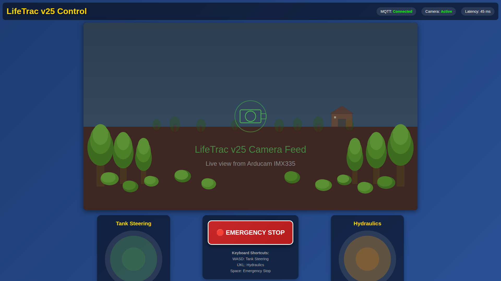

# LifeTrac v25 - Remote Control System

LifeTrac v25 features a comprehensive remote control system with multiple control modes including WiFi/MQTT and direct Bluetooth (BLE) communication for hydraulic operation control.

## Machine Design

LifeTrac v25 is a remotely-operated compact utility loader designed as an open-source alternative sized between a Toro Dingo and a Bobcat. Built using parametric OpenSCAD design, it features modular construction following Open Source Ecology principles.

### Design Overview

*3D render of the complete LifeTrac v25 assembly*

*Animation showing loader arm movement range*

### Key Design Features

- **Modular Construction:** Plate steel, square tubing, and angle iron components for easy fabrication and repair
- **Remote Operation:** No operator seat required, optional standing deck for manual operation
- **Hydraulic Power:** 4 independent wheel motors for all-wheel drive, 2 cylinders for arm lift, 2 for bucket tilt
- **Open Source CAD:** Complete OpenSCAD parametric design files for customization and manufacturing

### Technical Specifications

| Specification | Value (mm) | Value (inches) | Value (meters) |
|--------------|------------|----------------|----------------|
| **Overall Width** | 1,200 mm | 47.2" | 1.20 m |
| **Overall Length** | 1,800 mm | 70.9" | 1.80 m |
| **Height to Frame Top** | 1,000 mm | 39.4" | 1.00 m |
| **Ground Clearance** | 150 mm | 5.9" | 0.15 m |
| **Wheel Diameter** | 500 mm | 19.7" | 0.50 m |

### Performance Specifications

| Specification | Value |
|--------------|-------|
| **Hydraulic System Pressure** | 3,000 PSI |
| **Estimated Lift Capacity** | ~1,200 kg (~2,650 lbs) |
| **Drive Configuration** | All-wheel drive (4 hydraulic motors) |
| **Cylinder Bore (Lift)** | 63.5 mm (2.5") |

### Weight Estimate

Machine weight is estimated at **800-1,000 kg (1,760-2,200 lbs)** based on steel construction with:
- 1/4" (6.35mm) plate steel for most components
- 1/2" (12.7mm) plate steel for high-stress areas
- 4"×4"×1/4" square tubing for main frame
- 3"×3"×1/4" square tubing for loader arms

*Note: Weight estimate is a manual calculation based on material specifications. Dimensional specifications in the tables above are automatically extracted from the OpenSCAD design files and updated when the design changes. See [mechanical_design/README.md](mechanical_design/README.md) for complete design documentation.*

## Features

* **Multiple Control Modes:** switch for MQTT/OFF/BLE mode selection (BLE default)
* **BLE Direct Control:** Direct Bluetooth connection to DroidPad app (no WiFi/broker needed)
* **Remote Joystick Control:** Dual joystick setup for tank steering and hydraulic functions
* **DroidPad Compatible:** Native support for DroidPad via BLE or MQTT
* **WiFi Communication:** Reliable wireless control with MQTT protocol
* **ROS2 Integration:** Control LifeTrac from BeagleBone or any ROS2-enabled device
* **Configurable Flow Control:** Choose between single or dual proportional flow valves via jumper
  - Single valve: Simpler setup, all functions share flow rate (flow is limited by the minimum non-zero joystick input)
  - Dual valve: Independent control, advanced maneuvering with variable turning radius
* **Proportional Flow Control:** Speed regulation based on joystick input intensity
* **Safety Features:** Emergency stop, communication timeout, and fail-safe operation
* **Status Monitoring:** Real-time system status and diagnostics

## Control Scheme

### Tank Steering
- **Left Joystick Y-axis:** Forward/backward movement for both tracks
- **Left Joystick X-axis:** Differential steering (left/right turns)

### Hydraulic Functions  
- **Right Joystick Y-axis:** Arms up/down control
- **Right Joystick X-axis:** Bucket up/down control

### Speed Control
- **Proportional Flow Valve:** Automatically adjusts system speed based on maximum joystick input
- **Deadzone:** 10% deadzone prevents unwanted movements from joystick drift

# Hardware Bill of Materials

## Onboard Controller (LifeTrac)

### Hydraulic Components

| Qty | Item | Description | Unit Price | Total |
|-----|------|-------------|------------|-------|
| 4   | Parker Hydraulic Directional Solenoid Valve (D1VW001CNKW) | 21.1 gpm Max Flow Rate, D03 NFPA Size, Three Positions, 12V DC, Closed Center | $314.84  | $1,259.36   |
|     | **Purchase:** [Grainger](https://www.grainger.com/product/PARKER-Hydraulic-Directional-Valve-2NMU7) |  |  |  |
|     | **Manual:** [Parker D1VW Series Manuals](https://www.manualslib.com/products/Parker-D-1vw-Series-11678625.html) \| [Product Info](https://ph.parker.com/ca/en/product/directional-control-valve-series-d1vw-d1vw-ee/d1vw001cnkw) |  |  |  |
| 8   | Hirschmann DIN Connector (5100-1080000)                   | Standard hydraulic valve connectors | $7.95    | $63.60      |
|     | **Purchase:** [Surplus Center](https://www.surpluscenter.com/Hydraulics/Hydraulic-Valves/Solenoid-Valves/Hirschmann-Connector-5100-1080000-11-2457.axd) |  |  |  |
|     |  |  | **Subtotal:** | **$1,322.96** |

### Manifold Subplates

**Option A - For dual proportional valve setup:**

| Qty | Item | Description | Unit Price | Total |
|-----|------|-------------|------------|-------|
| 2 | 2 Station D03 Parallel CC Manifold Subplate | For dual valve configuration | $90.00 | $180.00 |
| | | **Purchase:** [Surplus Center](https://www.surpluscenter.com/Hydraulics/Hydraulic-Adapters-Fittings/Subplates-Cover-Plates-Manifolds/2-Station-D03-Parallel-CC-Manifold-Subplate-SFP-10002-9-4070-2.axd) | | |
| | | | **Subtotal:** | **$180.00** |

**Option B - For single and no proportional valve setup:**

| Qty | Item | Description | Unit Price | Total |
|-----|------|-------------|------------|-------|
| 1 | 4 Station D03 Parallel CC Manifold Subplate | For single or no valve configuration | $183.00 | $183.00 |
| | | **Purchase:** [Surplus Center](https://www.surpluscenter.com/Hydraulics/Hydraulic-Adapters-Fittings/Subplates-Cover-Plates-Manifolds/4-Station-D03-Parallel-CC-Manifold-Subplate-SFP10004-9-4070-4.axd) | | |
| | | | **Subtotal:** | **$183.00** |

### Flow Control Valves

**Option A - Single Valve Configuration (Basic):**

| Qty | Item | Description | Unit Price | Total |
|-----|------|-------------|------------|-------|
| 1 | Brand Hydraulics PEFC12-20 Electronically Adjustable Proportional Flow Control Valve | 0-20 GPM, 3000 PSI. For basic configuration | $449.99 | $449.99 |
| | | **Purchase:** [Northern Tool](https://www.northerntool.com/products/brand-hydraulics-electronically-adjustable-flow-control-valve-0-20-gpm-3-000-psi-model-pefc12-20-12-20166) \| [Motion](https://www.motion.com/products/sku/11364850) | | |
| | | **Manual:** [Installation & User Guide (PDF)](https://www.brand-hyd.com/wfdata/files/install/valves/EFC-Installation-Sheet-09-24.pdf) \| [Product Info](https://www.brand-hyd.com/Products/Valves/Flow_Controls/EFC/) | | |
| 1 | Burkert 8605 Type 316532 Flow Valve Controller | PWM control electronics for proportional valves | $319.50 | $319.50 |
| | | **Purchase:** [Valves Direct](https://www.valves-direct.com/burkert-new-products/114143-burkert-316532-type-8605-g-kl-e-f-00-q-b.html) \| [RS Components](https://us.rs-online.com/product/burkert-fluid-control-systems/316532/74474892/) | | |
| | | **Manual:** [Type 8605 Manual (PDF)](https://www.burkert.com/en/content/download/287474/file/MA8605-Manual-EU-EN.pdf) \| [Product Info](https://www.burkert.com/en/products/316532) | | |
| | | | **Subtotal:** | **$769.49** |

**Option B - Dual Valve Configuration (Advanced Maneuvering):**

| Qty | Item | Description | Unit Price | Total |
|-----|------|-------------|------------|-------|
| 2 | Brand Hydraulics PEFC12-20 Electronically Adjustable Proportional Flow Control Valve | 0-20 GPM, 3000 PSI. For advanced maneuvering with independent flow control | $449.99 | $899.98 |
| | | **Purchase:** [Northern Tool](https://www.northerntool.com/products/brand-hydraulics-electronically-adjustable-flow-control-valve-0-20-gpm-3-000-psi-model-pefc12-20-12-20166) \| [Motion](https://www.motion.com/products/sku/11364850) | | |
| | | **Manual:** [Installation & User Guide (PDF)](https://www.brand-hyd.com/wfdata/files/install/valves/EFC-Installation-Sheet-09-24.pdf) \| [Product Info](https://www.brand-hyd.com/Products/Valves/Flow_Controls/EFC/) | | |
| 2 | Burkert 8605 Type 316532 Flow Valve Controller | PWM control electronics for proportional valves | $319.50 | $639.00 |
| | | **Purchase:** [Valves Direct](https://www.valves-direct.com/burkert-new-products/114143-burkert-316532-type-8605-g-kl-e-f-00-q-b.html) \| [RS Components](https://us.rs-online.com/product/burkert-fluid-control-systems/316532/74474892/) | | |
| | | **Manual:** [Type 8605 Manual (PDF)](https://www.burkert.com/en/content/download/287474/file/MA8605-Manual-EU-EN.pdf) \| [Product Info](https://www.burkert.com/en/products/316532) | | |
| | | | **Subtotal:** | **$1,538.98** |

*Note: See FLOW_VALVE_CONFIGURATION.md for single vs dual valve configuration details*

### Arduino Controllers

| Qty | Item | Description | Unit Price | Total |
|-----|------|-------------|------------|-------|
| 1 | Arduino Opta WiFi | Main controller board | $199.00 | $199.00 |
| | | **Purchase:** [Arduino Store](https://store.arduino.cc/products/opta-wifi) | | |
| | | **Documentation:** [Arduino Opta Docs](https://docs.arduino.cc/hardware/opta) | | |
| 1 | Arduino Pro Opta Ext D1608S | Digital I/O expansion (16 digital inputs, 8 solid state outputs) | $151.00 | $151.00 |
| | | **Purchase:** [Arduino Store](https://store.arduino.cc/products/opta-ext-d1608s) | | |
| 1 | Arduino Pro Opta Ext A0602 | Analog I/O expansion (6 analog inputs, 2 analog outputs) | $229.00 | $229.00 |
| | | **Purchase:** [Arduino Store](https://store.arduino.cc/products/opta-ext-a0602) | | |
| | | | **Subtotal:** | **$579.00** |

## Remote Control Unit

| Qty | Item | Description | Unit Price | Total |
|-----|------|-------------|------------|-------|
| 2 | SparkFun Qwiic Joystick (COM-15168) | Dual joystick controllers with I2C interface | $12.50 | $25.00 |
| | | **Purchase:** [SparkFun](https://www.sparkfun.com/products/15168) \| [DigiKey](https://www.digikey.com/en/products/detail/sparkfun-electronics/15168/9953917) | | |
| | | **Guide:** [Hookup Guide](https://learn.sparkfun.com/tutorials/qwiic-joystick-hookup-guide) | | |
| 1 | SparkFun Thing Plus - ESP32 WROOM (USB-C) (DEV-20168) | Remote control microcontroller with WiFi/BLE | $33.73 | $33.73 |
| | | **Purchase:** [SparkFun](https://www.sparkfun.com/products/20168) \| [DigiKey](https://www.digikey.com/en/products/detail/sparkfun-electronics/20168/16688100) | | |
| | | **Guide:** [Product Documentation](https://learn.sparkfun.com/tutorials/sparkfun-thing-plus-esp32-wroom-usb-c-hookup-guide) | | |
| 1 | Enclosure for handheld remote control | Custom or off-the-shelf enclosure | $35.00 | $35.00 |
| 1 | Li-Po battery pack with charging circuit | 3.7V Li-Po battery with USB charging | $20.00 | $20.00 |
| | | | **Subtotal:** | **$113.73** |

## MQTT Broker & Web Controller Infrastructure

| Qty | Item | Description | Unit Price | Total |
|-----|------|-------------|------------|-------|
| 1 | Raspberry Pi 4 Model B (4GB) | 4GB+ RAM recommended for Mosquitto MQTT broker and web interface | $55.00 | $55.00 |
| | | **Purchase:** [PiShop](https://www.pishop.us/product/raspberry-pi-4-model-b-4gb/) \| [Authorized Resellers](https://www.raspberrypi.com/products/raspberry-pi-4-model-b/) | | |
| | | **Software:** [Mosquitto MQTT Broker](https://github.com/eclipse-mosquitto/mosquitto) | | |
| 1 | SanDisk Ultra MicroSD Card (32GB) | Class 10, minimum 32GB recommended | $8.99 | $8.99 |
| | | **Purchase:** [Amazon](https://www.amazon.com/micro-sd-card-32gb/s?k=micro+sd-card+32gb) | | |
| 1 | eero 6 Dual-Band Mesh Wi-Fi 6 Router | WiFi 6 mesh router with coverage up to 1,500 sq ft | $89.99 | $89.99 |
| | | **Purchase:** [Best Buy](https://www.bestbuy.com/product/eero-6-dual-band-mesh-wi-fi-6-router-1-pack-white/J39QV832QV) \| [Amazon](https://www.amazon.com/Amazon-eero-6-mesh-Wi-Fi-6-router/dp/B085VM9ZDD) | | |
| | | **Alternative:** [eero 6+ (faster, $139.99)](https://www.amazon.com/Amazon-eero-Wi-Fi-router-newest/dp/B08ZK39NSL) | | |
| 1 | Arducam IMX335 Camera Module (5MP) | Low-light camera for web interface live feed | $33.99 | $33.99 |
| | | **Purchase:** [Amazon](https://www.amazon.com/Arducam-Raspberry-15-15pin-15-22pin-Included/dp/B0FG6W8HC9) \| [RobotShop](https://www.robotshop.com/products/arducam-imx335-mipi-camera-module-rpi) | | |
| | | **Documentation:** [Arducam IMX335 Docs](https://docs.arducam.com/Raspberry-Pi-Camera/Native-camera/5MP-IMX335) | | |
| 1 | Camera cable | 15-pin to 15-pin or 15-pin to 22-pin (included with Arducam) | Included | $0.00 |
| | | | **Subtotal:** | **$187.97** |

---

### Grand Total

| Configuration | Components | Total |
|--------------|------------|-------|
| **Base System** (without flow valves, remote, or web infrastructure) | Hydraulic Components + Manifold + Arduino Controllers | **$2,081.96** (Option A) or **$2,084.96** (Option B) |
| **Base + Single Flow Valve** | Base System + 1 Flow Control Valve + 1 Controller | **$2,851.45** (Option A) or **$2,854.45** (Option B) |
| **Base + Dual Flow Valves** | Base System + 2 Flow Control Valves + 2 Controllers | **$3,620.94** (Option A) or **$3,623.94** (Option B) |
| **Complete - Single Valve** | Base + Single Flow Valve + Remote Unit + Infrastructure | **$3,153.15** (Option A) or **$3,156.15** (Option B) |
| **Complete - Dual Valves** | Base + Dual Flow Valves + Remote Unit + Infrastructure | **$3,922.64** (Option A) or **$3,925.64** (Option B) |

**Configuration Notes:**
- **Option A (Manifold)**: 2-station manifold for dual proportional valve setup ($180.00)
- **Option B (Manifold)**: 4-station manifold for single/no proportional valve setup ($183.00)
- **Single Valve**: Basic configuration suitable for most applications
- **Dual Valves**: Advanced maneuvering with independent flow control and variable turning radius

*Note: Prices are subject to change. Check vendor websites for current pricing. Total does not include shipping, taxes, or additional hardware like hydraulic hoses, fittings, and mounting hardware.*

# Software Components

## Arduino Code
- **arduino_opta_controller/**: Main controller code for Arduino Opta
- **esp32_remote_control/**: Remote control code for ESP32

## Raspberry Pi Web Controller
- **raspberry_pi_web_controller/**: Browser-based control with live video feed
  - Live camera streaming from Arducam IMX335 using libcamera
  - Touch-enabled on-screen joysticks for phone/tablet control
  - Keyboard shortcuts for desktop control
  - WebSocket for real-time communication
  - See [raspberry_pi_web_controller/README.md](raspberry_pi_web_controller/README.md) for setup

*Browser-based control interface with live camera feed and on-screen joysticks*

## ROS2 Integration
- **ros2_bridge/**: ROS2 packages for BeagleBone control via MQTT
  - **lifetrac_msgs/**: Custom ROS2 message definitions
  - **lifetrac_mqtt_bridge/**: Bridge node using mqtt_client package
  - See [ros2_bridge/README.md](ros2_bridge/README.md) for complete ROS2 setup

## Configuration Files
- **config/**: MQTT broker and WiFi configuration files
- **arduino_libraries.txt**: Required Arduino libraries

## Documentation
- **INSTALLATION_GUIDE.md**: Complete setup and installation instructions
- **FLOW_VALVE_CONFIGURATION.md**: Proportional flow valve configuration (single vs dual valve)
- **DROIDPAD_INTEGRATION.md**: Guide for DroidPad integration via BLE or MQTT
- **DROIDPAD_BLE_SETUP.md**: Step-by-step BLE direct control setup for DroidPad
- **MODE_SWITCH_WIRING.md**: Hardware switch wiring for MQTT/OFF/BLE selection
- **WIRING_DIAGRAM.md**: Detailed wiring and connection diagrams
- **HYDRAULIC_DIAGRAM.md**: ASCII hydraulic system diagram showing component layout
- **ros2_bridge/README.md**: ROS2 integration and BeagleBone setup guide
- **raspberry_pi_web_controller/README.md**: Web interface setup and usage guide

## Testing Tools
- **test_scripts/**: MQTT testing and debugging utilities

# Quick Start

## Option 1: DroidPad via BLE (Simplest - Recommended for Mobile)
1. **Program Arduino Opta:** Upload controller code with BLE support
2. **Set Mode:** Set mode switch to BLE position (or leave switch uninstalled for default BLE)
3. **Connect DroidPad:** Open DroidPad app, scan for "LifeTrac-v25" via Bluetooth
4. **Configure:** Set up BLE characteristics using provided UUIDs
5. **Control:** Start controlling immediately - no WiFi/network needed!

For detailed instructions, see [DROIDPAD_BLE_SETUP.md](DROIDPAD_BLE_SETUP.md).

## Option 2: Raspberry Pi Web Controller (Best for Fixed Installation)
1. **Set up MQTT Broker:** Install Mosquitto on Raspberry Pi using config/mosquitto.conf
2. **Program Arduino Opta:** Upload controller code
3. **Set Mode:** Set mode switch to MQTT position
4. **Install Web Controller:** Run `sudo ./install.sh` in raspberry_pi_web_controller/
5. **Connect Camera:** Attach Arducam IMX335 to Raspberry Pi
6. **Access Interface:** Open `http://<raspberry-pi-ip>:5000` in any browser

For detailed instructions, see [raspberry_pi_web_controller/README.md](raspberry_pi_web_controller/README.md).

## Option 3: ESP32 Handheld Remote Control
1. **Set up MQTT Broker:** Install Mosquitto on Raspberry Pi using config/mosquitto.conf
2. **Program Controllers:** Upload Arduino code to Opta and ESP32 boards
3. **Set Mode:** Set mode switch to MQTT position
4. **Configure Network:** Update WiFi credentials and MQTT settings in code
5. **Wire System:** Follow WIRING_DIAGRAM.md for all connections
6. **Test System:** Use test_scripts/mqtt_test.py for validation

For detailed instructions, see [INSTALLATION_GUIDE.md](INSTALLATION_GUIDE.md).

## Option 4: ROS2 Control from BeagleBone
1. **Set up MQTT Broker:** Same as above
2. **Program Arduino Opta:** Upload controller code
3. **Set Mode:** Set mode switch to MQTT position
4. **Install ROS2 on BeagleBone:** Follow ROS2 installation guide
5. **Build ROS2 packages:** Build lifetrac_msgs and lifetrac_mqtt_bridge
6. **Launch bridge:** `ros2 launch lifetrac_mqtt_bridge lifetrac_bridge.launch.py`

For detailed ROS2 instructions, see [ros2_bridge/README.md](ros2_bridge/README.md).

# Safety Features

- **Communication Timeout:** All movement stops if no commands received within 1 second
- **Emergency Stop:** Serial command or communication loss triggers immediate stop
- **Fail-Safe Operation:** Valves return to neutral position on power loss
- **Status Monitoring:** Real-time diagnostics and connection status

# Development Status

✅ **Completed:**
- Arduino Opta controller code with MQTT integration
- ESP32 remote control with dual joystick support  
- Proportional flow control implementation
- Safety systems and emergency stop functionality
- Complete installation and wiring documentation
- MQTT test utilities for debugging
- ROS2 integration packages for BeagleBone control
- Custom ROS2 message definitions for control commands
- Bridge using mqtt_client for ROS2-MQTT communication
- **Raspberry Pi web controller with live video feed and browser-based joysticks**

🔄 **In Progress:**
- Field testing and calibration

# External Links

- [Arduino Opta Documentation](https://docs.arduino.cc/hardware/opta)
- [SparkFun Qwiic Joystick Guide](https://learn.sparkfun.com/tutorials/qwiic-joystick-hookup-guide)
- [Eclipse Mosquitto MQTT Broker](https://mosquitto.org/)
- [Arducam IMX335 Documentation](https://docs.arducam.com/Raspberry-Pi-Camera/Native-camera/5MP-IMX335)
- [Raspberry Pi libcamera Guide](https://www.raspberrypi.com/documentation/computers/camera_software.html)
