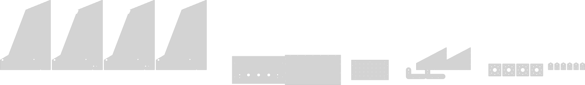

# LifeTrac v25 - Mechanical Design

This directory contains the complete mechanical design for the LifeTrac v25 compact utility loader, created using OpenSCAD for parametric, open-source CAD.

## Overview

The LifeTrac v25 is a remotely-operated compact utility loader designed to be sized between a Toro Dingo and a Bobcat. It features:

- **Structural Design:** Plate steel, angle iron, and square tubing construction
- **Modular Design:** Based on Open Source Ecology principles
- **Remote Operation:** No operator seat, optional standing deck
- **Hydraulic Power:** 2 cylinders for arm lift, 2 for bucket tilt, 4 hydraulic wheel motors
- **Size:** ~1200mm wide × 1800mm long × 1000mm tall (frame)

## Directory Structure

```
mechanical_design/
├── assembly.png           # 3D render of complete assembly (auto-generated)
├── cnclayout.svg          # 2D CNC cutting layout (auto-generated)
├── cnclayout.scad         # OpenSCAD file for CNC layout generation
├── openscad/              # Main OpenSCAD design files
│   └── lifetrac_v25.scad  # Main assembly file
├── modules/               # Reusable OpenSCAD modules
│   ├── plate_steel.scad   # Plate steel components with rounded corners
│   ├── structural_steel.scad  # Square tubing and angle iron
│   ├── fasteners.scad     # Hex bolts, nuts, washers
│   ├── hydraulics.scad    # Hydraulic cylinders and motors
│   └── wheels.scad        # Wheel and axle assemblies
├── output/                # Generated files (DXF, PNG)
│   ├── dxf/              # CNC cutting layouts
│   └── renders/          # Rendered images
├── documentation/         # Design documentation
│   ├── PARTS_LIST.md     # Complete parts catalog
│   └── ASSEMBLY.md       # Assembly instructions
└── AI_DESIGN_PROGRESS.md # AI design session tracker
```

## Key Files

### assembly.png


A 3D rendered view of the complete LifeTrac v25 assembly (1024×768px). This image is automatically generated by GitHub Actions whenever the OpenSCAD files are updated. It provides a quick visual reference of the overall design.

### cnclayout.svg

A 2D vector layout of all plate steel parts organized for CNC plasma cutting. Parts are:
- Color-coded by thickness (blue = 1/4", red = 1/2")
- Labeled with part numbers and descriptions
- Laid out with proper spacing for cutting
- All corners pre-rounded to 6.35mm radius

This file can be imported into CAM software (SheetCAM, etc.) for generating G-code.

## Quick Start

### Prerequisites

1. **OpenSCAD** - Download from [openscad.org](https://openscad.org/)
   - Version 2021.01 or newer recommended

2. **Optional Tools:**
   - FreeCAD for DXF editing
   - Python 3 for automation scripts

### Viewing the Design

1. Open OpenSCAD
2. Load `openscad/lifetrac_v25.scad`
3. Press F5 for preview or F6 for full render
4. Use the animation controls (View → Animate) to see moving parts

### Animation

The design includes animation for:
- Loader arm lift (0-60 degrees)
- Bucket tilt (0-90 degrees)
- Wheel rotation

Enable animation: View → Animate → FPS: 10, Steps: 100

### Customization

Edit parameters at the top of `lifetrac_v25.scad`:

```openscad
// Display options
show_wheels = true;
show_hydraulics = true;
show_frame = true;
show_loader_arms = true;
show_bucket = true;
show_standing_deck = true;
exploded_view = false;

// Machine dimensions (in mm)
MACHINE_WIDTH = 1200;
MACHINE_LENGTH = 1800;
WHEEL_DIAMETER = 500;
// ... and more
```

## Design Modules

### plate_steel.scad
Standard plate steel components with rounded corners:
- `plate_steel()` - Basic rectangular plate
- `circular_plate()` - Round plate
- `plate_with_holes()` - Plate with mounting holes
- `gusset_plate()` - Triangular reinforcement
- `plate_with_center_hole()` - Plate with centered hole

### structural_steel.scad
Structural steel shapes:
- `square_tubing()` - Square tubing sections
- `rectangular_tubing()` - Rectangular tubing
- `angle_iron()` - L-shaped angle iron
- `flat_bar()` - Flat bar stock
- `round_tube()` - Round tube sections

### fasteners.scad
Hardware components:
- `hex_bolt()` - Hex head bolt
- `hex_nut()` - Hex nut
- `washer()` - Washer
- `bolt_assembly()` - Complete bolt with nut and washers
- `bolt_hole()` - Hole for difference operations
- `bolt_hole_pattern()` - Array of holes

### hydraulics.scad
Hydraulic system components:
- `hydraulic_cylinder()` - Hydraulic cylinder with customizable mounting
- `hydraulic_motor()` - Hydraulic motor
- `hydraulic_pump()` - Hydraulic pump
- `hydraulic_hose()` - Hose connections
- `hydraulic_valve()` - Valve blocks

### wheels.scad
Wheel and axle components:
- `wheel()` - Complete wheel with tire
- `powered_wheel()` - Wheel with hydraulic motor
- `modular_wheel_unit()` - Complete modular wheel assembly
- `axle()` - Axle shaft with keyway
- `bearing_housing()` - Bearing housing
- `complete_wheel_assembly()` - Full assembly with bearings

## Manufacturing Outputs

### DXF Export (CNC Cutting)

For 2D parts (plates), export individual parts:

```bash
openscad -o output/dxf/wheel_mounting_plate.dxf modules/plate_steel.scad
```

Or use the batch export script:

```bash
./export_all_cnc_parts.sh
```

### PNG Rendering

```bash
openscad -o output/renders/lifetrac_v25.png --camera=2000,2000,1500,0,0,0 \
         --imgsize=1920,1080 openscad/lifetrac_v25.scad
```

## Automated Workflows

GitHub Actions automatically:
1. Validates OpenSCAD syntax on every commit
2. Generates assembly.png (3D render of complete assembly)
3. Generates cnclayout.svg (2D layout for CNC cutting)
4. Renders preview images from multiple angles
5. Generates assembly animations

See `.github/workflows/openscad-render.yml` for details.

## Part Numbering System

- **A** - Frame and Structural Components
  - A1: Base Frame Assembly
  - A2: Wheel Mounting Plates
- **B** - Wheel Assemblies (B1-B4)
- **C** - Loader Arm System
  - C1: Loader Arm Structure
  - C2: Bucket Attachment Interface
- **D** - Hydraulic Cylinders (D1-D4)
- **E** - Bucket Assembly (E1)
- **F** - Optional Components
  - F1: Standing Deck
- **G** - Electronics Housing (G1)

See `documentation/PARTS_LIST.md` for complete details.

## Materials

### Plate Steel
- **1/4" (6.35mm):** Standard thickness for most plates, bucket, deck
- **1/2" (12.7mm):** High-stress areas, wheel mounts, pivots
- **Corner Radius:** 6.35mm (1/4") standard on all plates

### Structural Steel
- **4"×4"×1/4" Square Tubing:** Main frame (OSE standard)
- **3"×3"×1/4" Square Tubing:** Loader arms
- **2"×2"×1/4" Square Tubing:** Secondary supports
- **Angle Iron:** Optional reinforcement

### Fasteners
- **1" Hex Bolts:** Frame connections, pivot pins
- **1/2" Hex Bolts:** General assembly, plate mounting

## Design Philosophy

Following Open Source Ecology principles:

1. **Modularity:** Components can be replaced independently
2. **Standardization:** Common sizes, off-the-shelf parts
3. **Simplicity:** Minimize complexity, maximize reliability
4. **Manufacturability:** Designed for common tools (plasma cutter, welder, drill press)
5. **Open Source:** Fully documented, modifiable, shareable

## Integration with Electronics

This mechanical design integrates with the LifeTrac v25 electronic control system located in the parent directory. The control housing (G1) is sized to accommodate:

- Arduino Opta WiFi controller
- Arduino Opta extensions
- Hydraulic valve controllers
- Wiring and connections

See `../README.md` for electronics documentation.

## References

### Historical LifeTrac Designs
- [LifeTrac v17.10](https://wiki.opensourceecology.org/wiki/LifeTrac_v17.10)
- [LifeTrac Wiki](https://wiki.opensourceecology.org/wiki/LifeTrac)
- [OSE Main Site](https://www.opensourceecology.org/)

### Design Inspiration
- [OSE CEB Press](https://github.com/OpenSourceEcology/CEB-Press)
- [FabricRack OpenSCAD](https://github.com/dorkmo/FabricRack-OpenSCAD)

### Tools and Resources
- [OpenSCAD Documentation](https://openscad.org/documentation.html)
- [OpenSCAD Cheat Sheet](https://openscad.org/cheatsheet/)
- [OSE Wiki](https://wiki.opensourceecology.org/)

## Contributing

Contributions are welcome! Please:

1. Follow existing code style and structure
2. Add comments explaining design decisions
3. Update documentation for any changes
4. Test renders before committing
5. Update AI_DESIGN_PROGRESS.md with significant changes

## License

This design is released under the GNU General Public License v3.0, consistent with Open Source Ecology's licensing.

You are free to:
- Use for any purpose
- Study and modify
- Share and distribute
- Manufacture and sell

With the requirement to:
- Share alike (same license)
- Attribute source
- Document changes

## Support

For questions or issues:
- Open an issue on GitHub
- Visit [Open Source Ecology Forums](https://forum.opensourceecology.org/)
- Join the OSE community

---

**Version:** 1.0  
**Last Updated:** 2025-12-06  
**Status:** Initial Design Complete

## CNC Cutting Layout

### Combined Layout (All Parts)


The combined CNC layout includes all 23 sheet metal parts with complete manufacturing details:
- Mounting holes with proper clearances
- Pivot holes for arm and cylinder connections
- Arc slots for cross beam clearance (inner panels)
- Lightening holes for weight reduction
- Anti-slip hole patterns (standing deck)
- All parts properly spaced for efficient cutting

**Material Specifications:**
- Half-inch (1/2") plate parts: 14 parts total
- Quarter-inch (1/4") plate parts: 9 parts total


## Individual Part SVGs

2D CNC cutting layouts for each individual plate part:

### Half-Inch (1/2") Plate Parts
- [Side Panel Outer](output/svg/parts/side_panel_outer.svg) - 2× needed
- [Side Panel Inner](output/svg/parts/side_panel_inner.svg) - 2× needed
- [Wheel Mount](output/svg/parts/wheel_mount.svg) - 4× needed
- [Cylinder Lug](output/svg/parts/cylinder_lug.svg) - 6× needed
- [Rear Crossmember](output/svg/parts/rear_crossmember.svg) - 1× needed

### Quarter-Inch (1/4") Plate Parts
- [Standing Deck](output/svg/parts/standing_deck.svg) - 1× needed
- [Bucket Bottom](output/svg/parts/bucket_bottom.svg) - 1× needed
- [Bucket Side](output/svg/parts/bucket_side.svg) - 2× needed (mirror for opposite)

Total: 23 parts from 8 unique designs
