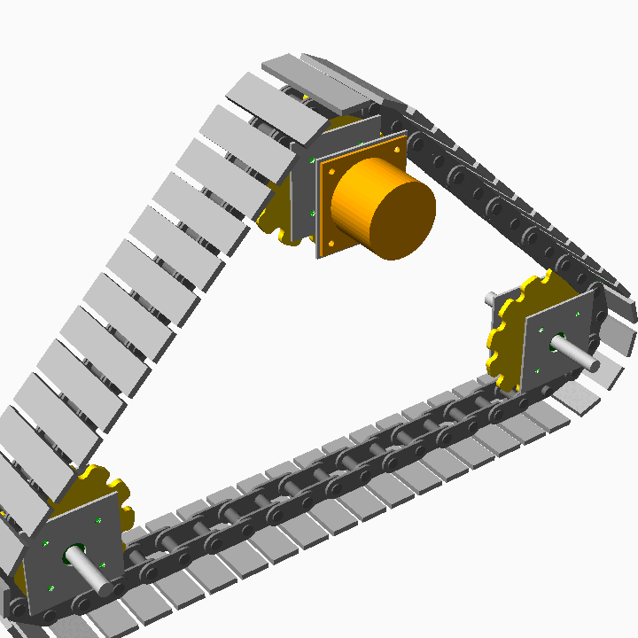

# Universal Track Unit (UTU)

The Universal Track Unit (UTU) is an interchangeable traction module designed to work interchangeably with the Universal Wheel Unit (UWU).

## References
- [Universal Track Unit Wiki](https://wiki.opensourceecology.org/wiki/Universal_Track_Unit)

## Integration
We want to have the option to use either the UWU or UTU for the LifeTrac v25.

The design goal is to be able to give a coordinate on any future machine and define the three plates and the unit size, so that the UWU or UTU can be adopted for use in place.

## UTU v25 Specifications

The v25 iteration of the UTU is designed with the following parameters (Source: `UTU-v25/utu_v25.scad`):

### Layout
- **Topology:** 3-axis triangular system (configurable via `num_axes`).
- **Bottom Idlers:** 2 idler axes, 4 feet apart (`idler_spacing = 48"`).
- **Drive Axis:** 1 powered axis, 2 feet above idlers, centered horizontally.
- **Front Idler Adjustment:** Automatically shifts along X to make total chain length an integer multiple of chain pitch.

### Structure (shared with UWU)
- **Plates:** 8" x 8" x 0.25" Steel Plates.
- **Bearing Spacing:** 4.0" between bearing plates.
- **Motor Mount to Bearing:** 3.0" spacing.

### Bearing Mounts
- **Bearing Type:** 4-bolt Flange Bearing.
- **Housing:** Ø2.5", 0.75" protrusion, 0.5" flange.
- **Mounting Pattern:** 4-bolt, Ø6.19" BCD, 45° orientation.
- **Center Clearance:** Ø2.00".

### Motor Mount (Drive Axis)
- **Motor Body:** Ø6.0" x 5.0".
- **Motor Flange:** 7.5" x 7.5" Square, 0.5" thick.
- **Motor Shaft:** Ø1.0" x 1.5".
- **Mounting Pattern:** 4-bolt, Ø8.25" BCD, 45° orientation.
- **Coupling:** Ø2.0" x 2.0".

### Drivetrain
- **Shaft:** Ø1.25" x 14.0" length.
- **Shaft Collars:** Ø2.0" x 0.75", sandwiching each sprocket.

### Track Chain
- **Style:** Chainsaw-chain staggered links (alternating inner/outer connector plates).
- **Track Bars (Feet):** 2.5" x 0.5" x 10" steel bar.
- **Connecting Rods:** Ø1.0" steel rods.
- **Chain Pitch:** 3.0" (bar width + 0.5" gap).
- **Rod Hole Clearance:** 1 mm diametral.

### Connector Plates
- **Height:** 2.0" above bar surface.
- **Thickness:** 0.25".
- **Width:** One chain pitch (3.0").
- **Inner Plate Offset:** Derived from 2.0" face-to-face gap.
- **Outer Plate Offset:** Derived from inner offset + 1/8" stagger gap.
- **Rod Pads:** Circular pads (union) at each rod hole location.

### Sprocket
- **Type:** Custom chain sprocket with filleted tooth roots.
- **Teeth:** 12.
- **Pitch Radius:** Derived from chain pitch via `P / (2 × sin(180/N))`.
- **Root Circle:** Sized to sit on track bar surface.
- **Tip Radius:** Pitch radius + rod seat radius.
- **Thickness:** 0.5".
- **Fillets:** Rod radius at tooth roots (offset-based).
- **Phase:** Per-sprocket rotation computed from chain path geometry.

### Chain Path (Parametric)
- **Total Length:** Automatically computed (straight spans + sprocket arc wraps).
- **Link Count:** Rounded to nearest integer (`num_chain_links`).
- **Front Idler Adjustment:** Newton-method shift so chain = integer × pitch.
- **Path Function:** `chain_point(s)` returns `[x, z, angle]` for any cumulative position.
- **Wrap Angles:** Computed per-sprocket from tangent contact geometry.

### CAD Files
- **OpenSCAD:** `UTU-v25/utu_v25.scad` (Parametric source).
- **Gear Library:** `UTU-v25/gears.scad` (chrisspen/gears, CC BY-NC-SA).
